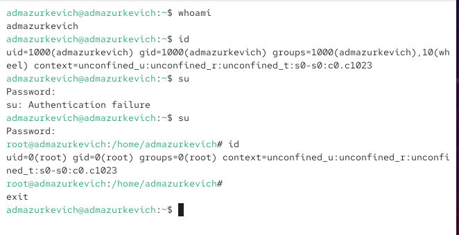
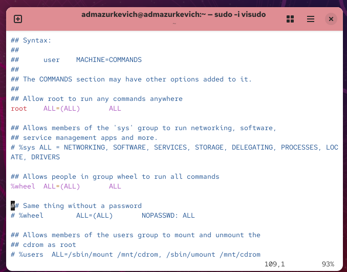
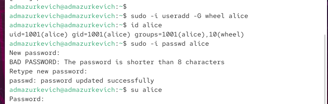
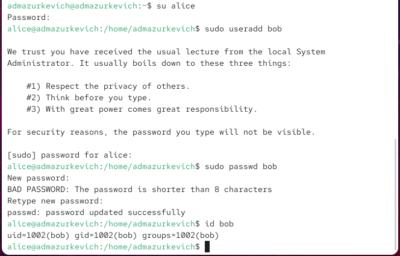
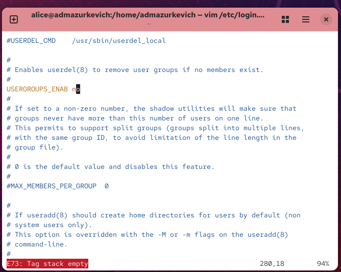
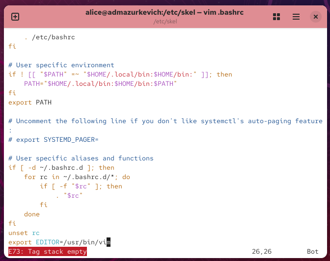
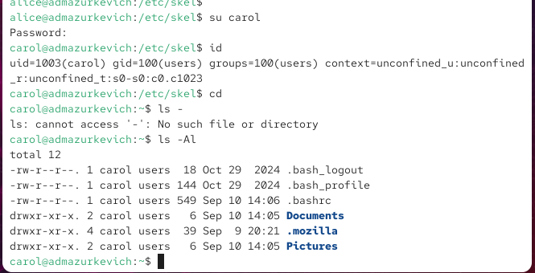
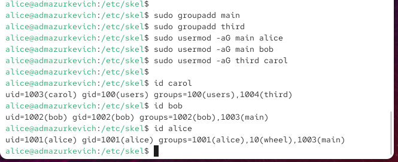

---
## Front matter
lang: ru-RU
title: Лабораторная работа №1
subtitle: Управление пользователями и группами
author:
  - Анастасия Мазуркевич
institute:
  - Российский университет дружбы народов, Москва, Россия
date: 10 сентября 2025

## i18n babel
babel-lang: russian
babel-otherlangs: english

## Formatting pdf
toc: false
slide_level: 2
aspectratio: 169
section-titles: true
theme: metropolis
header-includes:
 - \metroset{progressbar=frametitle,sectionpage=progressbar,numbering=fraction}
---

# Цель работы

## Цель лабораторной работы

Закрепить навыки администрирования учётных записей пользователей и управления группами в ОС семейства Linux.

# Ход выполнения

## Смена учётных записей

{ #fig:001 width=70% }

## Смена учётных записей

{ #fig:002 width=70% }

## Создание пользователей

{ #fig:003 width=70% }

## Создание пользователей

{ #fig:004 width=70% }

## Настройка параметров по умолчанию

{ #fig:005 width=70% }

## Настройка параметров по умолчанию

{ #fig:006 width=70% }

## Создание пользователя carol

{ #fig:007 width=70% }

## Создание пользователя carol

{ #fig:008 width=70% }

## Управление группами

{ #fig:009 width=70% }

# Выводы по проделанной работе

## Вывод

В ходе работы были выполнены:  
- проверка текущего пользователя и переход в режим root;  
- создание новых пользователей и назначение паролей;  
- настройка `/etc/login.defs` и шаблонов `/etc/skel`;  
- изменение политики паролей с помощью `chage`;  
- работа с группами и распределение пользователей.  

Полученные навыки позволили освоить управление учётными записями и группами в Linux и закрепить основы администрирования многопользовательской системы.
