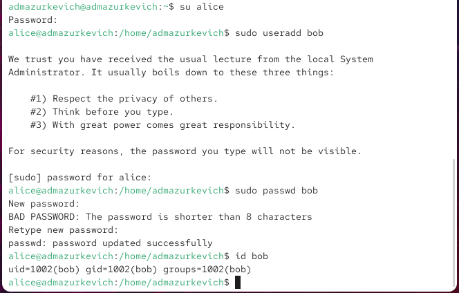

---
## Front matter
title: "Отчёт по лабораторной работе №2"
subtitle: "Управление пользователями и группами"
author: "Анастасия Мазуркевич"

## Generic otions
lang: ru-RU
toc-title: "Содержание"

## Bibliography
bibliography: bib/cite.bib
csl: pandoc/csl/gost-r-7-0-5-2008-numeric.csl

## Pdf output format
toc: true
toc-depth: 2
lof: true
lot: true
fontsize: 12pt
linestretch: 1.5
papersize: a4
documentclass: scrreprt
## I18n polyglossia
polyglossia-lang:
  name: russian
  options:
    - spelling=modern
    - babelshorthands=true
polyglossia-otherlangs:
  name: english
## I18n babel
babel-lang: russian
babel-otherlangs: english
## Fonts
mainfont: IBM Plex Serif
romanfont: IBM Plex Serif
sansfont: IBM Plex Sans
monofont: IBM Plex Mono
mathfont: STIX Two Math
mainfontoptions: Ligatures=Common,Ligatures=TeX,Scale=0.94
romanfontoptions: Ligatures=Common,Ligatures=TeX,Scale=0.94
sansfontoptions: Ligatures=Common,Ligatures=TeX,Scale=MatchLowercase,Scale=0.94
monofontoptions: Scale=MatchLowercase,Scale=0.94,FakeStretch=0.9
mathfontoptions:
## Biblatex
biblatex: true
biblio-style: "gost-numeric"
biblatexoptions:
  - parentracker=true
  - backend=biber
  - hyperref=auto
  - language=auto
  - autolang=other*
  - citestyle=gost-numeric
## Pandoc-crossref LaTeX customization
figureTitle: "Рис."
tableTitle: "Таблица"
listingTitle: "Листинг"
lofTitle: "Список иллюстраций"
lotTitle: "Список таблиц"
lolTitle: "Листинги"
## Misc options
indent: true
header-includes:
  - \usepackage{indentfirst}
  - \usepackage{float}
  - \floatplacement{figure}{H}
---

# Цель работы

Закрепить навыки администрирования учётных записей пользователей и управления группами в ОС семейства Linux.

# Ход выполнения

## Смена учётных записей

После входа в систему была открыта консоль, где с помощью команды `whoami` определена текущая учётная запись — **admazurkevich**.  
Команда `id` вывела дополнительные сведения: uid=1000, gid=1000 и список групп, среди которых — **wheel**, предоставляющая повышенные права.  
Также отобразился контекст SELinux с уровнем безопасности.

{ #fig:001 width=70% }

Для перехода в режим администратора использовалась команда `su`. После ввода пароля удалось войти под **root**, что подтвердил результат `id` (uid=0, gid=0).  
Возврат к обычному пользователю выполнен командой `exit`.  

Затем через `visudo` был открыт файл `/etc/sudoers`. Этот способ гарантирует проверку синтаксиса при сохранении и предотвращает ошибки.  

В файле присутствовала строка `%wheel ALL=(ALL) ALL`, что означает: любой пользователь, входящий в группу **wheel**, получает доступ ко всем командам через sudo.

{ #fig:002 width=70% }

Далее был создан новый пользователь **alice**, сразу добавленный в группу wheel. Проверка через `id alice` подтвердила её членство в нужных группах. Для неё был задан пароль, после чего выполнено переключение с помощью `su alice`.

Уже под alice был добавлен ещё один пользователь — **bob**, которому тоже назначили пароль (несмотря на предупреждение о его простоте). Проверка показала uid=1002 и gid=1002, а bob входил только в свою одноимённую группу, не обладая административными правами.

{ #fig:003 width=70% }

{ #fig:004 width=70% }

## Создание новых учётных записей

Открыв файл `/etc/login.defs`, были внесены изменения:
- `CREATE_HOME yes` — автоматическое создание домашнего каталога для нового пользователя;
- `USERGROUPS_ENAB no` — отключение формирования одноимённой группы и использование общей группы *users*.

{ #fig:005 width=70% }

В каталоге `/etc/skel`, применяемом как шаблон для новых пользователей, были добавлены папки *Pictures* и *Documents*. Теперь они появляются автоматически в домашнем каталоге каждого вновь созданного аккаунта.

В файл `/etc/skel/.bashrc` была внесена настройка текстового редактора по умолчанию — *vim*. Это позволяет использовать его при системном редактировании.

{ #fig:006 width=70% }

Будучи под пользователем *alice*, был создан пользователь *carol*. После входа под ним проверено:  
- он принадлежит группе *users*;  
- в домашнем каталоге присутствуют *Documents* и *Pictures*, созданные автоматически.

{ #fig:007 width=70% }

Далее для carol были изменены параметры пароля:  
- минимальный срок действия — 30 дней,  
- общий срок — 90 дней,  
- предупреждение — за 3 дня.  

Запись в `/etc/shadow` подтвердила корректность изменений.

Проверка файлов `/etc/passwd`, `/etc/shadow` и `/etc/group` подтвердила наличие правильных записей для пользователей alice и carol.

{ #fig:008 width=70% }

## Управление группами

Под учётной записью *alice* были созданы новые группы: *main* и *third*.  

{ #fig:009 width=70% }

Распределение пользователей:  
- alice добавлена в *main*;  
- bob включён в *main*;  
- carol назначен в *third*.  

Команда `id` показала:  
- carol — основная группа *users*, дополнительная *third*;  
- alice — основная группа *alice*, вторичные *wheel* и *main*;  
- bob — основная группа *bob*, дополнительная *main*.

# Контрольные вопросы

**1. Как узнать UID пользователя и список его групп?**  
Для этого применяются команды `id`, `groups` или просмотр содержимого `/etc/passwd`.  
- `id` показывает UID, GID и перечень всех групп;  
- `groups` выводит только список групп.

**2. Какой UID закреплён за root и как его определить?**  
UID суперпользователя всегда равен 0.  
Пример: `id root` выведет UID=0.

**3. Чем отличаются su и sudo?**  
- `su` переключает на другую учётную запись, требуя её пароль.  
- `sudo` запускает конкретную команду от имени администратора, запрашивая пароль текущего пользователя.

**4. Где задаются параметры работы sudo?**  
В конфигурационном файле `/etc/sudoers`.

**5. Как безопасно редактировать файл sudoers?**  
Использовать `visudo`, так как он проверяет правильность синтаксиса перед сохранением.

**6. В какую группу нужно включить пользователя для работы со всеми административными командами через sudo?**  
В дистрибутивах Red Hat это группа `wheel`, а в Debian/Ubuntu — `sudo`.

**7. Какие файлы и каталоги отвечают за параметры новых пользователей?**  
- `/etc/login.defs` — общие настройки (например, `CREATE_HOME`, `PASS_MAX_DAYS`);  
- `/etc/skel` — шаблонные файлы и папки, копируемые в домашний каталог (например, `.bashrc`, каталоги *Documents* и *Pictures*).

**8. Где хранятся сведения о группах?**  
- Первичная группа указывается в `/etc/passwd`;  
- дополнительные — в `/etc/group`.  
Пример: у alice основная группа *alice*, а во вторичных она состоит в *wheel* и *main*.

**9. Какие команды изменяют параметры пароля?**  
- `passwd` (например, `passwd -x 90 -n 30 -w 7 user`);  
- `chage` (например, `chage -M 90 user` для задания срока действия).

**10. Как безопасно редактировать файл /etc/group?**  
При помощи `vigr`. Он открывает файл в режиме проверки, предотвращая повреждения системных данных.

# Заключение

В процессе лабораторной работы были освоены основные приёмы администрирования пользователей и групп в Linux: создание и настройка учётных записей, редактирование параметров паролей, работа с sudo и назначение групповых прав. Эти навыки формируют базу для эффективного управления системой.
