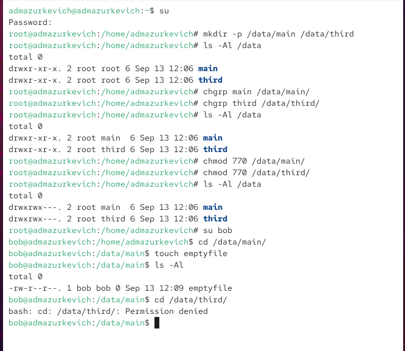
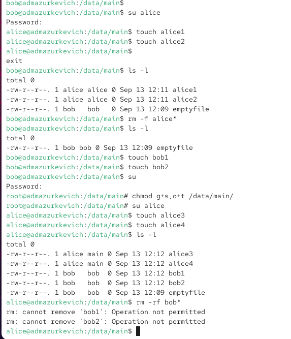
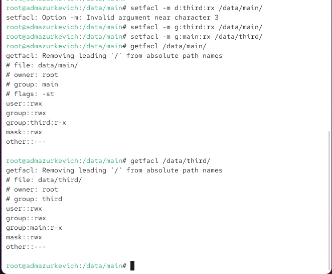
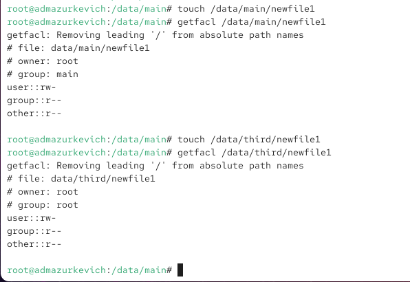
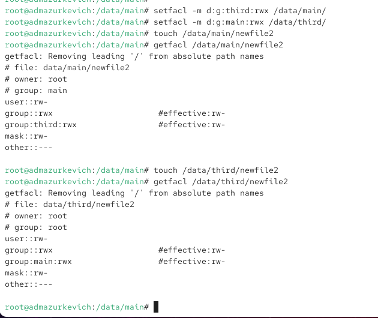
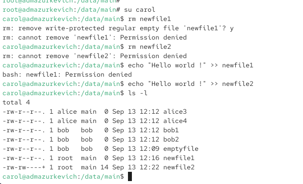

---
## Front matter
lang: ru-RU
title: Лабораторная работа №3
subtitle: Настройка прав доступа
author:
  - Анастасия Мазуркевич
institute:
  - Российский университет дружбы народов, Москва, Россия
date: 13 сентября 2025

## i18n babel
babel-lang: russian
babel-otherlangs: english

## Formatting pdf
toc: false
slide_level: 2
aspectratio: 169
section-titles: true
theme: metropolis
header-includes:
 - \metroset{progressbar=frametitle,sectionpage=progressbar,numbering=fraction}
---

# Цель работы

## Цель лабораторной работы

Получение навыков настройки базовых и специальных прав доступа для групп пользователей в ОС Linux, включая использование ACL.

# Ход выполнения

## Управление базовыми разрешениями

{ #fig:001 width=70% }

## Проверка доступа под пользователем bob

{ #fig:002 width=70% }

## Управление специальными разрешениями

{ #fig:003 width=70% }

## Управление расширенными разрешениями (ACL)

{ #fig:004 width=70% }

## Создание файлов без ACL по умолчанию

{ #fig:005 width=70% }

## Установка ACL по умолчанию

{ #fig:006 width=70% }

## Проверка доступа пользователем carol

{ #fig:007 width=70% }

# Выводы по проделанной работе

## Вывод

В ходе лабораторной работы были освоены:  
- базовые операции управления правами доступа;  
- использование специальных атрибутов (setgid, sticky-бит);  
- настройка расширенных прав доступа через ACL;  
- работа с ACL по умолчанию для наследования разрешений.  
