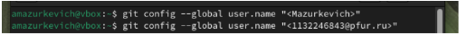

---
## Front matter
title: "Лабораторная работа номер 3"
subtitle: ""
author: "Мазуркевич Анастасия Дмитриевна"

## Generic otions
lang: ru-RU
toc-title: "Содержание"

## Bibliography
bibliography: bib/cite.bib
csl: pandoc/csl/gost-r-7-0-5-2008-numeric.csl

## Pdf output format
toc: true # Table of contents
toc-depth: 2
lof: true # List of figures
lot: true # List of tables
fontsize: 12pt
linestretch: 1.5
papersize: a4
documentclass: scrreprt
## I18n polyglossia
polyglossia-lang:
  name: russian
  options:
	- spelling=modern
	- babelshorthands=true
polyglossia-otherlangs:
  name: english
## I18n babel
babel-lang: russian
babel-otherlangs: english
## Fonts
mainfont: IBM Plex Serif
romanfont: IBM Plex Serif
sansfont: IBM Plex Sans
monofont: IBM Plex Mono
mathfont: STIX Two Math
mainfontoptions: Ligatures=Common,Ligatures=TeX,Scale=0.94
romanfontoptions: Ligatures=Common,Ligatures=TeX,Scale=0.94
sansfontoptions: Ligatures=Common,Ligatures=TeX,Scale=MatchLowercase,Scale=0.94
monofontoptions: Scale=MatchLowercase,Scale=0.94,FakeStretch=0.9
mathfontoptions:
## Biblatex
biblatex: true
biblio-style: "gost-numeric"
biblatexoptions:
  - parentracker=true
  - backend=biber
  - hyperref=auto
  - language=auto
  - autolang=other*
  - citestyle=gost-numeric
## Pandoc-crossref LaTeX customization
figureTitle: "Рис."
tableTitle: "Таблица"
listingTitle: "Листинг"
lofTitle: "Список иллюстраций"
lotTitle: "Список таблиц"
lolTitle: "Листинги"
## Misc options
indent: true
header-includes:
  - \usepackage{indentfirst}
  - \usepackage{float} # keep figures where there are in the text
  - \floatplacement{figure}{H} # keep figures where there are in the text
---

# Цель работы

Освоение процедуры оформления отчетов с помощью легковесного языка разметки Markdown.

# Выполнение лабораторной работы

1. Откройте терминал. Перейдите в каталог курса сформированный при выполнении лабораторной работы №2:

<<<<<<< HEAD
{#fig:001 width=70%}
{#fig:002 width=70%}
{#fig:003 width=70%}
=======

Рис 1.1 переходим в каталог

Обновите локальный репозиторий, скачав изменения из удаленного репозитория с помощью команды. Перейдите в каталог с шаблоном отчета по лабораторной работе № 3. . Проведите компиляцию шаблона с использованием Makefile. .Удалите полученный файлы с использованием Makefile.

Рис 1.2 выполняем действия

Откройте файл report.md c помощью любого текстового редактора, например gedit

Рис 1.3 открываем файл с помощью команды gedit

Заполните отчет и скомпилируйте отчет с использованием Makefile. Проверьте корректность полученных файлов. (Обратите внимание, для корректного отображения скриншотов они должны быть размещены в каталоге image)

Рис 1.4 загружаем фото и проверяем

Рис 1.5 начинаем редактировать отчет 

Загрузите файлы на Github.

Рис 1.6 загружаем файлы на гитхаб

Рис 1.7 проверяем отчет на гитхабе

# Отчет лабораторная работа 2.

1. Базовая настройка git
Сначала сделаем предварительную конфигурацию git. Откройте терминал и введите следующие команды, указав имя и email владельца репозитория:

Рис 1.1 указываем имя

Настроим utf-8 в выводе сообщений git:

Рис 1.2 настраиваем

Зададим имя начальной ветки (будем называть её master):

Рис 1.3 задаем

Параметр autocrlf и safecrlf::

Рис 1.4 делаем параметры

2.Создание SSH ключа

Для последующей идентификации пользователя на сервере репозиториев необходимо сгенерировать пару ключей (приватный и открытый):

Рис 2.1 генерация ключей

Далее необходимо загрузить сгенерённый открытый ключ:

Рис 2.2 открываем ключ

Рис 2.3 загружаем на github

3. Сознание рабочего пространства и репозитория курса на основе шаблона

Откройте терминал и создайте каталог для предмета «Архитектура компьютера»:

Рис 3.1  создаем каталог для предмета

4. Создание репозитория курса на основе шаблона

Репозиторий на основе шаблона можно создать через web-интерфейс github.

Рис 4.1 создаем репозиторий по шаблону

Откройте терминал и перейдите в каталог курса:

Рис 4.2 переходим в каталог курса

Клонируйте созданный репозиторий:

Рис 4.3 клонируем репозиторий с помощью clone

5.Настройка каталога курса

Перейдите в каталог курса, удалите лишние файлы, создайте необходимые каталоги:

Рис 5.1 удаляем файлы и создаем каталоги

Отправьте файлы на сервер:

Рис 5.2 добавляем файлы

Рис 5.3 отправляем на сервер

Рис 5.4 загружаем работу 1 на github
>>>>>>> origin

# Выводы

Освоили процедуры оформления отчетов с помощью легковесного языка разметки Markdown. 

