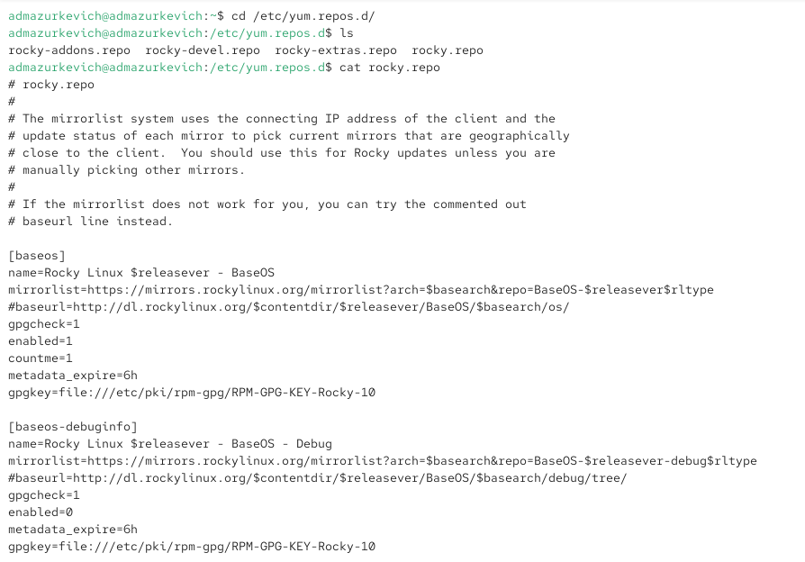
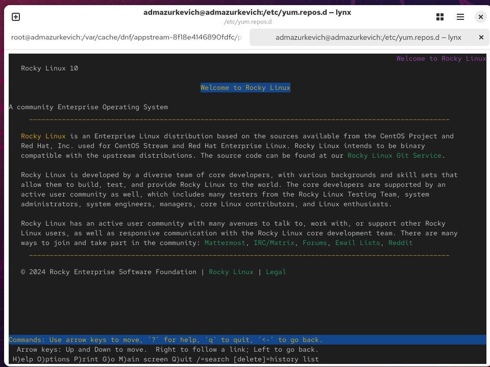

---
## Front matter
lang: ru-RU
title: Лабораторная работа №4
subtitle: Работа с программными пакетами
author:
  - Анастасия Мазуркевич
institute:
  - Российский университет дружбы народов, Москва, Россия
date: 18 сентября 2025

## i18n babel
babel-lang: russian
babel-otherlangs: english

## Formatting pdf
toc: false
slide_level: 2
aspectratio: 169
section-titles: true
theme: metropolis
header-includes:
 - \metroset{progressbar=frametitle,sectionpage=progressbar,numbering=fraction}
---

# Цель работы

## Цель лабораторной работы

Получить навыки работы с репозиториями и менеджерами пакетов в Linux.

# Ход выполнения

## Работа с репозиториями

{ #fig:001 width=70% }

## Работа с репозиториями

{ #fig:002 width=70% }

## Установка пакета nmap

{ #fig:003 width=70% }

## Установка пакета nmap

{ #fig:004 width=70% }

## Удаление пакета nmap

{ #fig:005 width=70% }

## Работа с группами пакетов

{ #fig:006 width=70% }

## Работа с группами пакетов

{ #fig:007 width=70% }

## Работа с группами пакетов

{ #fig:008 width=70% }

## История команд dnf

{ #fig:009 width=70% }

## Использование rpm

{ #fig:010 width=70% }

## Использование rpm

{ #fig:011 width=70% }

## Использование rpm

{ #fig:012 width=70% }

## Использование rpm

{ #fig:013 width=70% }

## Использование rpm

{ #fig:014 width=70% }

## Использование rpm

{ #fig:015 width=70% }

## Использование rpm

{ #fig:016 width=70% }

## Установка пакета dnsmasq

{ #fig:017 width=70% }

## Установка пакета dnsmasq

{ #fig:018 width=70% }

## Установка пакета dnsmasq

{ #fig:019 width=70% }

## Установка пакета dnsmasq

{ #fig:020 width=70% }

## Установка пакета dnsmasq

{ #fig:021 width=70% }

# Выводы по проделанной работе

## Вывод

В ходе работы были освоены:  
- поиск, установка и удаление пакетов с помощью `dnf` и `rpm`;  
- работа с группами пакетов и история команд;  
- анализ содержимого rpm-пакетов (файлы, документация, конфигурация, скрипты).  

Полученные навыки позволяют уверенно администрировать программные пакеты в Linux.
