---
## Front matter
lang: ru-RU
title: Лабораторная работа №5
subtitle: Управление системными службами
author:
  - Анастасия Мазуркевич
institute:
  - Российский университет дружбы народов, Москва, Россия
date: 22 сентября 2025

## i18n babel
babel-lang: russian
babel-otherlangs: english

## Formatting pdf
toc: false
slide_level: 2
aspectratio: 169
section-titles: true
theme: metropolis
header-includes:
 - \metroset{progressbar=frametitle,sectionpage=progressbar,numbering=fraction}
---

# Цель работы

## Цель лабораторной работы

Получить навыки управления системными службами операционной системы посредством systemd.

# Ход выполнения

## Управление сервисами

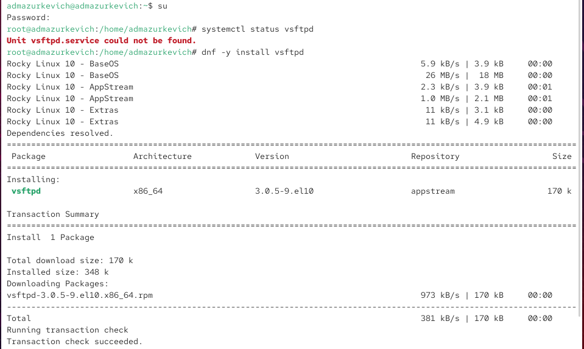{ #fig:001 width=70% }

## Управление сервисами

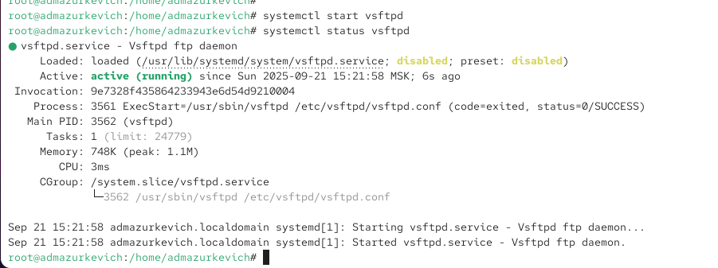{ #fig:002 width=70% }

## Управление сервисами

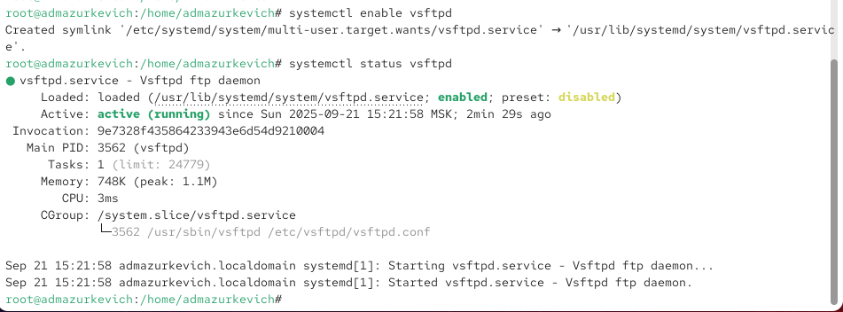{ #fig:003 width=70% }

## Управление сервисами

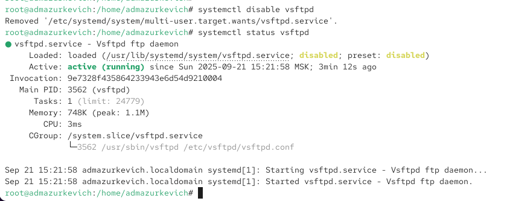{ #fig:004 width=70% }

## Управление сервисами

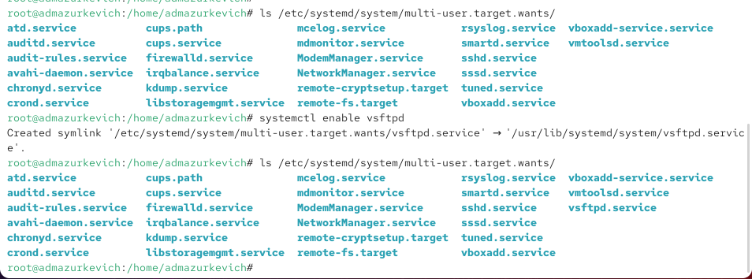{ #fig:005 width=70% }

## Управление сервисами

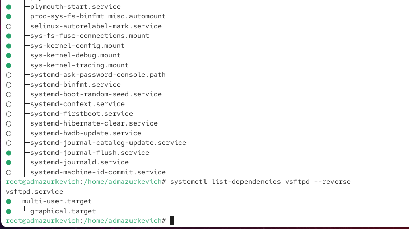{ #fig:006 width=70% }

## Конфликты юнитов

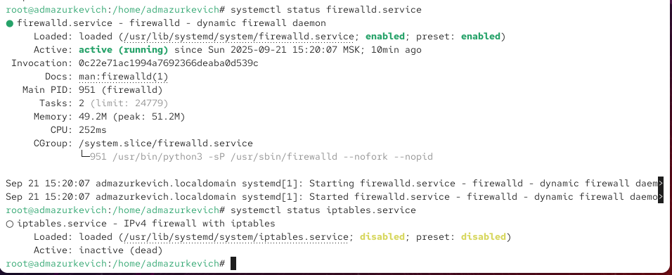{ #fig:007 width=70% }

## Конфликты юнитов

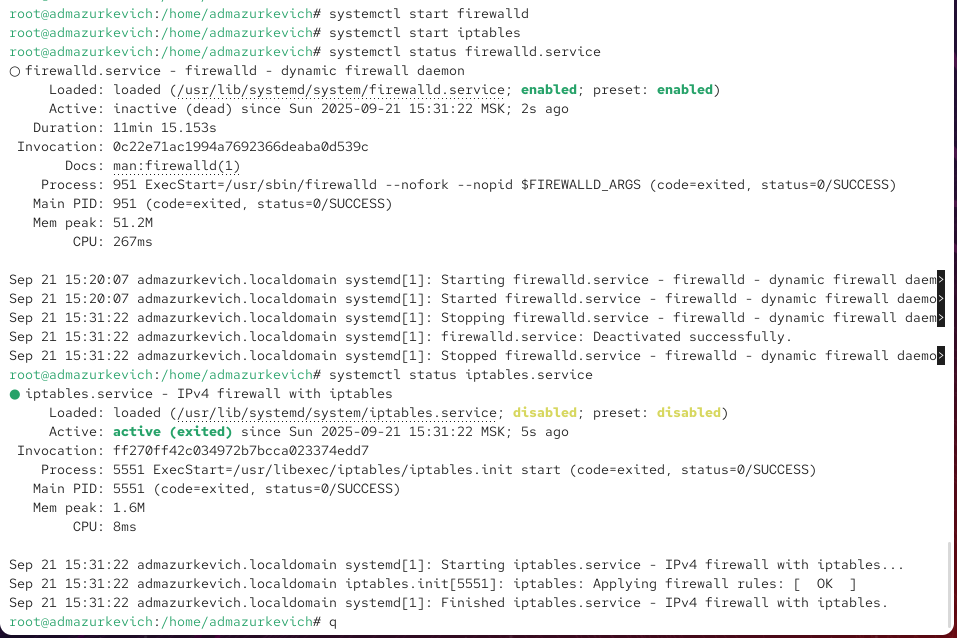{ #fig:008 width=70% }

## Конфликты юнитов

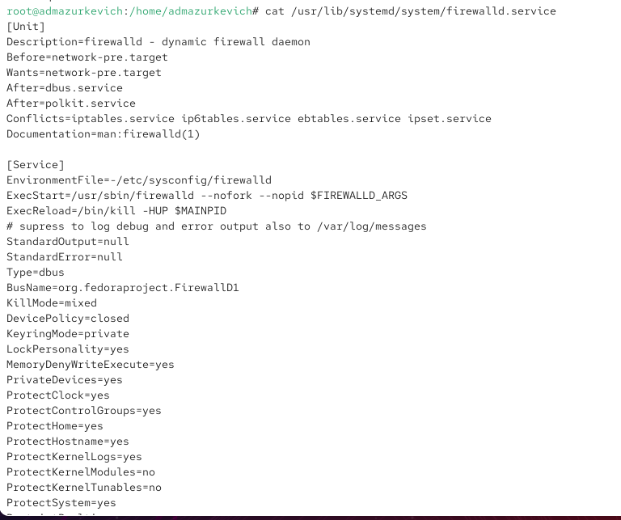{ #fig:009 width=70% }

## Конфликты юнитов

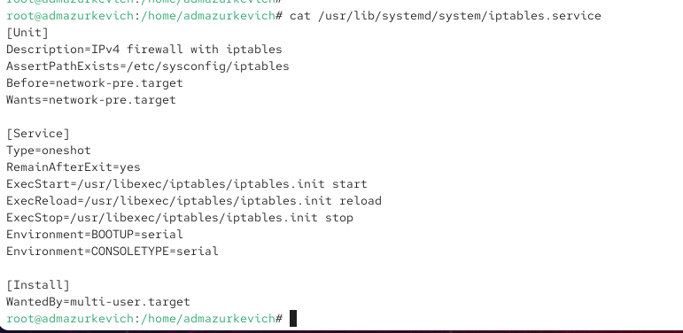{ #fig:010 width=70% }

## Конфликты юнитов

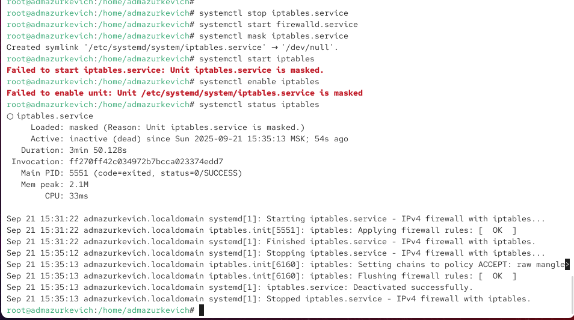{ #fig:011 width=70% }

## Изолируемые цели

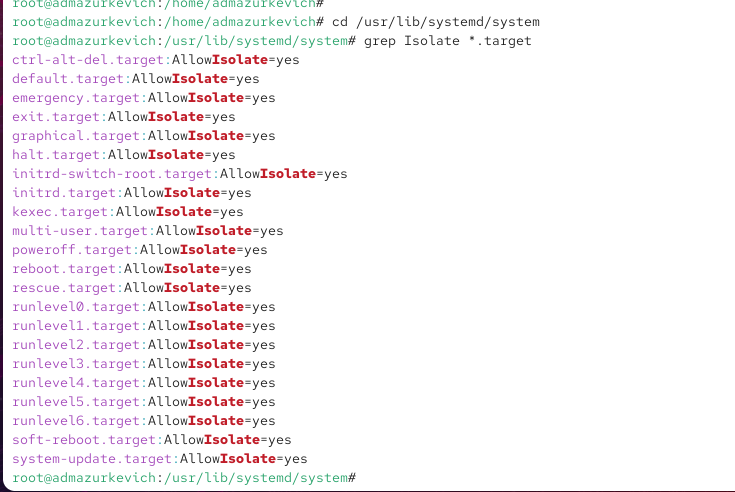{ #fig:012 width=70% }

## Изолируемые цели

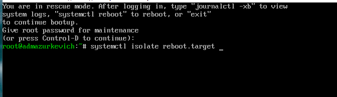{ #fig:013 width=70% }

## Цель по умолчанию

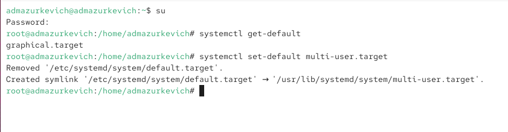{ #fig:014 width=70% }

## Цель по умолчанию

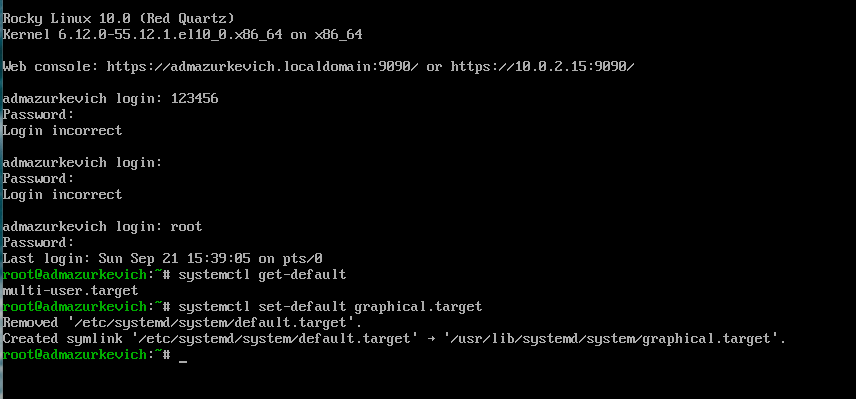{ #fig:015 width=70% }

# Выводы по проделанной работе

## Вывод

В ходе лабораторной работы были изучены механизмы управления сервисами и целями в системе **systemd**:  
- установка и запуск служб;  
- добавление и удаление их из автозагрузки;  
- анализ зависимостей и конфликтов между юнитами;  
- работа с изолируемыми целями и смена цели по умолчанию.  

Полученные навыки позволяют уверенно администрировать процессы и режимы работы операционной системы.
