---
## Front matter
title: "Отчёт по лабораторной работе №5"
subtitle: "Управление системными службами"
author: "Анастасия Мазуркевич"

## Generic otions
lang: ru-RU
toc-title: "Содержание"

## Bibliography
bibliography: bib/cite.bib
csl: pandoc/csl/gost-r-7-0-5-2008-numeric.csl

## Pdf output format
toc: true
toc-depth: 2
lof: true
lot: true
fontsize: 12pt
linestretch: 1.5
papersize: a4
documentclass: scrreprt
## I18n polyglossia
polyglossia-lang:
  name: russian
  options:
    - spelling=modern
    - babelshorthands=true
polyglossia-otherlangs:
  name: english
## I18n babel
babel-lang: russian
babel-otherlangs: english
## Fonts
mainfont: IBM Plex Serif
romanfont: IBM Plex Serif
sansfont: IBM Plex Sans
monofont: IBM Plex Mono
mathfont: STIX Two Math
mainfontoptions: Ligatures=Common,Ligatures=TeX,Scale=0.94
romanfontoptions: Ligatures=Common,Ligatures=TeX,Scale=0.94
sansfontoptions: Ligatures=Common,Ligatures=TeX,Scale=MatchLowercase,Scale=0.94
monofontoptions: Scale=MatchLowercase,Scale=0.94,FakeStretch=0.9
mathfontoptions:
## Biblatex
biblatex: true
biblio-style: "gost-numeric"
biblatexoptions:
  - parentracker=true
  - backend=biber
  - hyperref=auto
  - language=auto
  - autolang=other*
  - citestyle=gost-numeric
## Pandoc-crossref LaTeX customization
figureTitle: "Рис."
tableTitle: "Таблица"
listingTitle: "Листинг"
lofTitle: "Список иллюстраций"
lotTitle: "Список таблиц"
lolTitle: "Листинги"
## Misc options
indent: true
header-includes:
  - \usepackage{indentfirst}
  - \usepackage{float}
  - \floatplacement{figure}{H}
---

# Цель работы

Получить навыки управления системными службами операционной системы посредством systemd.

# Ход выполнения

## Управление сервисами

Сначала были получены полномочия администратора с помощью команды `su -`.  
Проверка статуса службы **Very Secure FTP (vsftpd)** показала, что она отсутствует в системе:  

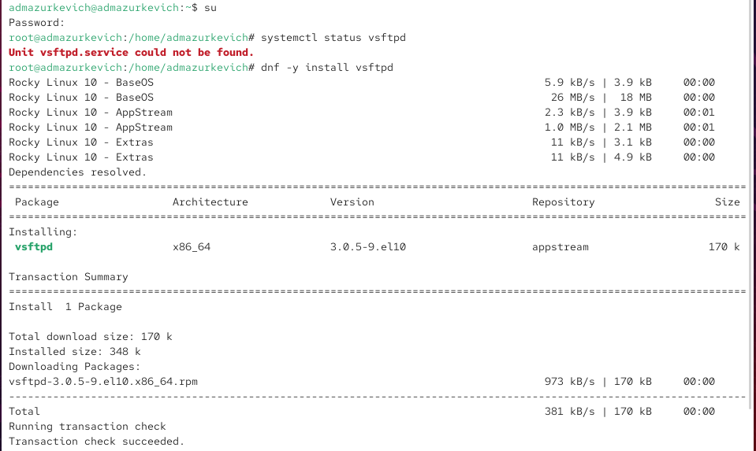{ #fig:001 width=70% }

Для установки использовалась команда:

`dnf -y install vsftpd`

После успешной загрузки пакета служба была установлена в систему.  

Далее был выполнен запуск службы:  

`systemctl start vsftpd`

Повторная проверка показала, что сервис **работает**, однако его состояние оставалось **disabled** (он не запускался бы при старте ОС).  

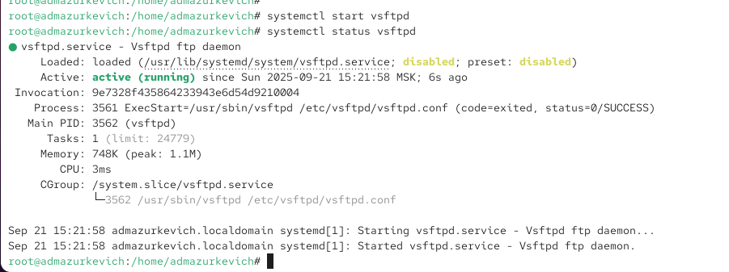{ #fig:002 width=70% }

Для добавления службы в автозагрузку использовалась команда:  

`systemctl enable vsftpd`

Теперь в статусе службы отобразилось состояние **enabled**.  
Затем через команду `systemctl disable vsftpd` демон был исключён из автозапуска, что также подтвердил статус.  

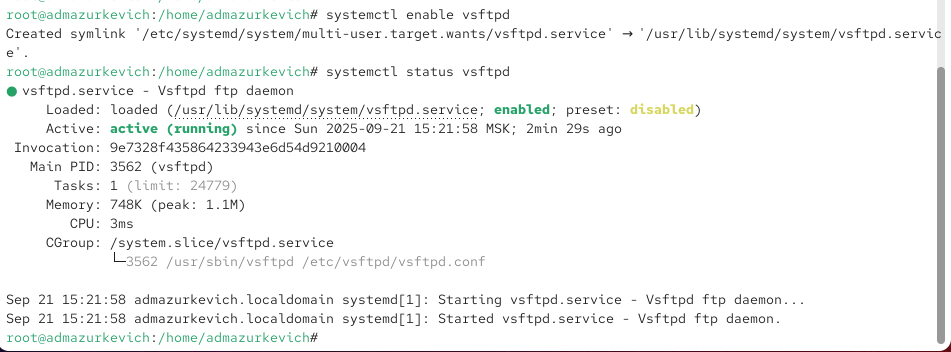{ #fig:003 width=70% }  
{ #fig:004 width=70% }

Символические ссылки, отвечающие за запуск сервисов в режиме multi-user, были просмотрены командой:  

`ls /etc/systemd/system/multi-user.target.wants/`

Изначально ссылка на **vsftpd.service** отсутствовала. После повторного выполнения команды `systemctl enable vsftpd` она появилась в каталоге и указывала на юнит `/usr/lib/systemd/system/vsftpd.service`.  

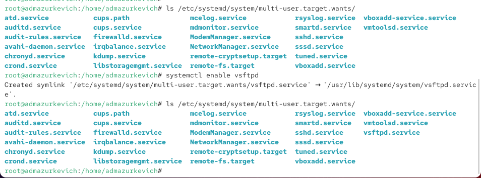{ #fig:005 width=70% }

Дополнительно были изучены зависимости сервиса.  
Команда  

`systemctl list-dependencies vsftpd`

показала, что демон связан с целевым юнитом **multi-user.target**.  

Для просмотра обратных зависимостей использовалась команда:  

`systemctl list-dependencies vsftpd --reverse`

Из вывода видно, что запуск vsftpd включён в состав multi-user.target и, косвенно, graphical.target.  

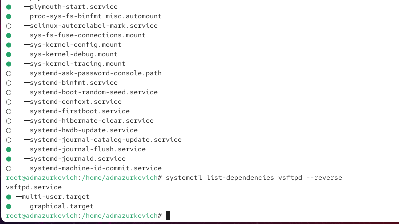{ #fig:006 width=70% }

## Конфликты юнитов

Некоторые сервисы в Linux не могут работать одновременно, так как их функциональность пересекается. Примером являются службы **firewalld** и **iptables**: запуск одной автоматически деактивирует другую.  

После получения полномочий администратора была установлена служба iptables с помощью команды:  

`dnf -y install iptables*`

Проверка статуса показала:  
- **firewalld** был активен и включён в автозагрузку.  
- **iptables** находился в состоянии inactive.  

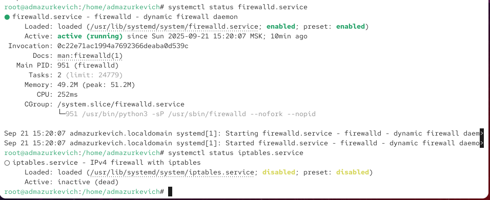{ #fig:007 width=70% }

Попытка запуска обеих служб показала конфликт: при активации **firewalld** демон iptables останавливался и наоборот.  

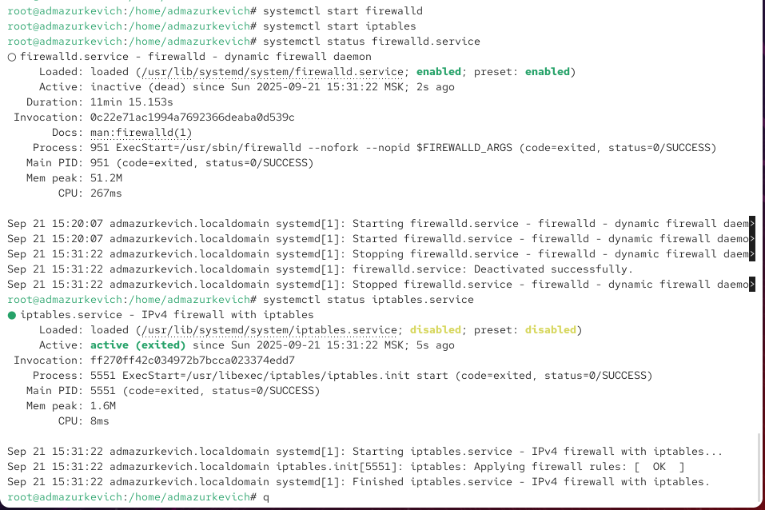{ #fig:008 width=70% }

Просмотр конфигурационных файлов юнитов подтвердил наличие конфликта.  
Файл `firewalld.service` содержит строку:  

`Conflicts=iptables.service ip6tables.service ebtables.service ipset.service`

Это означает, что запуск **firewalld** несовместим с перечисленными сервисами.  

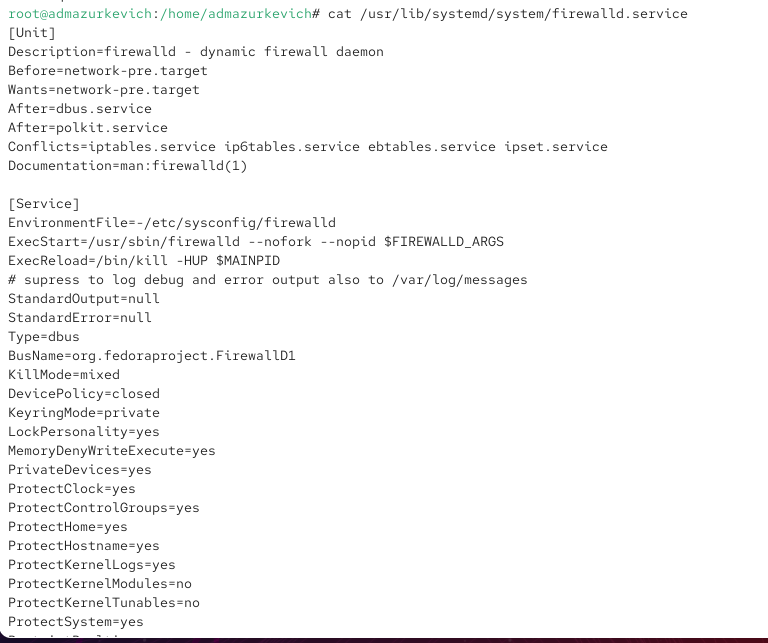{ #fig:009 width=70% }

Файл `iptables.service` не содержит явных конфликтов, однако запускается в том же целевом окружении `multi-user.target`, что и firewalld, что приводит к конкуренции при работе.  

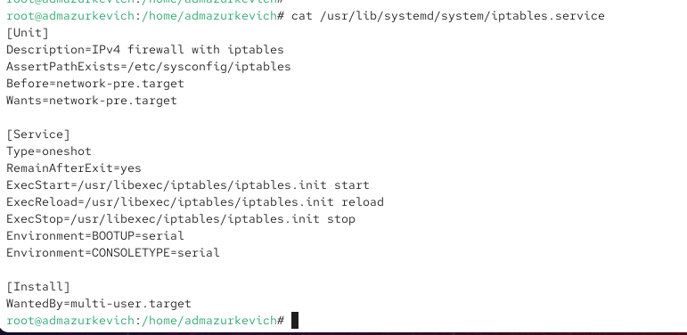{ #fig:010 width=70% }

Для корректной работы был остановлен iptables (`systemctl stop iptables`) и запущен firewalld. Чтобы исключить случайный запуск iptables, использовалась команда:  

`systemctl mask iptables`

В результате для `/etc/systemd/system/iptables.service` была создана символическая ссылка на `/dev/null`, что полностью блокирует запуск данного сервиса.  

Попытка запуска iptables после маскирования привела к ошибке, указывающей, что юнит замаскирован. Аналогично, при добавлении его в автозапуск (`systemctl enable iptables`) система сообщила, что запуск невозможен.  

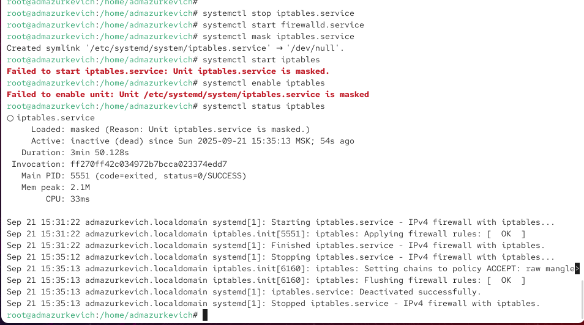{ #fig:011 width=70% }

## Изолируемые цели

В системе **systemd** некоторые цели (targets) могут быть изолированы. Это означает, что система переключается в данную цель вместе со всеми её зависимостями. Такие цели могут быть установлены и как цель по умолчанию.  

После получения полномочий администратора был выполнен поиск всех целей с параметром `AllowIsolate=yes`:

`grep Isolate *.target`

Среди них: `multi-user.target`, `graphical.target`, `rescue.target`, `reboot.target`, `poweroff.target` и другие.  

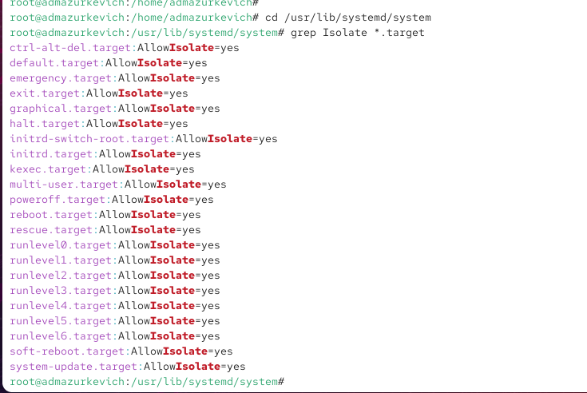{ #fig:012 width=70% }

Далее система была переведена в режим восстановления с помощью:

`systemctl isolate rescue.target`

Для продолжения работы потребовался пароль суперпользователя.  

Затем система была перезапущена командой:  

`systemctl isolate reboot.target`

{ #fig:013 width=70% }

## Цель по умолчанию

Определение текущей цели по умолчанию выполнялось командой:  

`systemctl get-default`

Изначально это был `graphical.target`.  

Затем цель по умолчанию была изменена на многопользовательский текстовый режим:  

`systemctl set-default multi-user.target`

После перезапуска ОС система загрузилась без графической оболочки.  

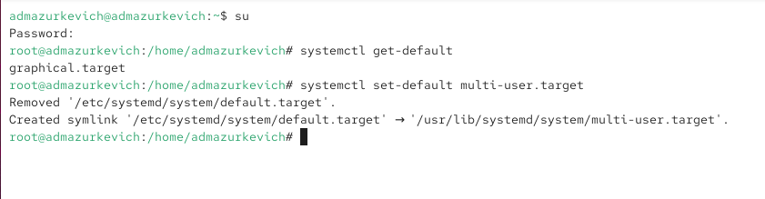{ #fig:014 width=70% }

Для возврата графической оболочки использовалась команда:  

`systemctl set-default graphical.target`

После очередного перезапуска система загрузилась в графическом режиме.  

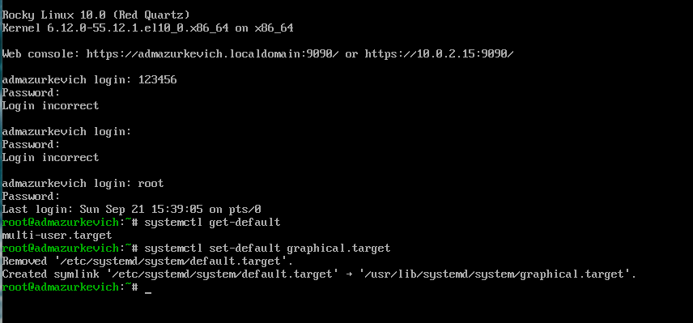{ #fig:015 width=70% }

# Контрольные вопросы

**1. Что такое юнит (unit)? Приведите примеры.**  
Юнит (unit) — это объект в системе **systemd**, который описывает управляемый ресурс: службу, точку монтирования, устройство или цель.  
Примеры:  
- сервис: `sshd.service`, `vsftpd.service`;  
- цель: `multi-user.target`, `graphical.target`;  
- точка монтирования: `home.mount`;  
- сокет: `cups.socket`.  

**2. Какая команда позволяет вам убедиться, что цель больше не входит в список автоматического запуска при загрузке системы?**  
Для этого используется команда:  
`systemctl disable <имя_юнита>`  
После отключения можно проверить отсутствие символьной ссылки в каталоге `/etc/systemd/system/multi-user.target.wants/`.  

**3. Какую команду вы должны использовать для отображения всех сервисных юнитов, которые в настоящее время загружены?**  
Команда:  
`systemctl list-units --type=service`  

**4. Как создать потребность (wants) в сервисе?**  
Необходимо добавить символическую ссылку на юнит в каталог `wants` соответствующей цели.  
Пример:  
`systemctl enable <имя_сервиса>`  
Эта команда автоматически создаёт ссылку в каталоге `/etc/systemd/system/<цель>.wants/`.  

**5. Как переключить текущее состояние на цель восстановления (rescue target)?**  
Используется команда:  
`systemctl isolate rescue.target`  

**6. Поясните причину получения сообщения о том, что цель не может быть изолирована.**  
Если юнит-цель не содержит параметра `AllowIsolate=yes` в своём описании, то systemd запрещает её изоляцию.  

**7. Вы хотите отключить службу systemd, но, прежде чем сделать это, вы хотите узнать, какие другие юниты зависят от этой службы. Какую команду вы бы использовали?**  
Для просмотра зависимостей используется команда:  
`systemctl list-dependencies --reverse <имя_сервиса>`  
Она показывает все юниты, которые зависят от указанного.  

# Заключение

В ходе лабораторной работы были изучены механизмы управления сервисами и целями в системе **systemd**: установка и запуск служб, добавление и удаление их из автозагрузки, анализ зависимостей и конфликтов между юнитами. Также были рассмотрены изолируемые цели и изменение цели по умолчанию. Полученные навыки позволяют уверенно администрировать процессы и режимы работы операционной системы.
