---
## Front matter
<<<<<<< HEAD
title: "Шаблон отчёта по лабораторной работе"
subtitle: "Простейший вариант"
author: "Мазуркевич Анастасия Дмитриевна"
=======
title: "Лабораторная работа 5"
subtitle: " "
author: "Мазуркевич Анастасия"
>>>>>>> origin/master

## Generic otions
lang: ru-RU
toc-title: "Содержание"

## Bibliography
bibliography: bib/cite.bib
csl: pandoc/csl/gost-r-7-0-5-2008-numeric.csl

## Pdf output format
toc: true # Table of contents
toc-depth: 2
lof: true # List of figures
lot: true # List of tables
fontsize: 12pt
linestretch: 1.5
papersize: a4
documentclass: scrreprt
## I18n polyglossia
polyglossia-lang:
  name: russian
  options:
	- spelling=modern
	- babelshorthands=true
polyglossia-otherlangs:
  name: english
## I18n babel
babel-lang: russian
babel-otherlangs: english
## Fonts
mainfont: IBM Plex Serif
romanfont: IBM Plex Serif
sansfont: IBM Plex Sans
monofont: IBM Plex Mono
mathfont: STIX Two Math
mainfontoptions: Ligatures=Common,Ligatures=TeX,Scale=0.94
romanfontoptions: Ligatures=Common,Ligatures=TeX,Scale=0.94
sansfontoptions: Ligatures=Common,Ligatures=TeX,Scale=MatchLowercase,Scale=0.94
monofontoptions: Scale=MatchLowercase,Scale=0.94,FakeStretch=0.9
mathfontoptions:
## Biblatex
biblatex: true
biblio-style: "gost-numeric"
biblatexoptions:
  - parentracker=true
  - backend=biber
  - hyperref=auto
  - language=auto
  - autolang=other*
  - citestyle=gost-numeric
## Pandoc-crossref LaTeX customization
figureTitle: "Рис."
tableTitle: "Таблица"
listingTitle: "Листинг"
lofTitle: "Список иллюстраций"
lotTitle: "Список таблиц"
lolTitle: "Листинги"
## Misc options
indent: true
header-includes:
  - \usepackage{indentfirst}
  - \usepackage{graphicx}
  - usepackage{amsmath}
  - \usepackage{float} # keep figures where there are in the text
  - \floatplacement{figure}{H} # keep figures where there are in the text
---

# Цель работы

Приобретение практических навыков работы в Midnight Commander. Освоение инструкций
языка ассемблера mov и int.

# Выполнение лабораторной работы

Откройте Midnight Commander

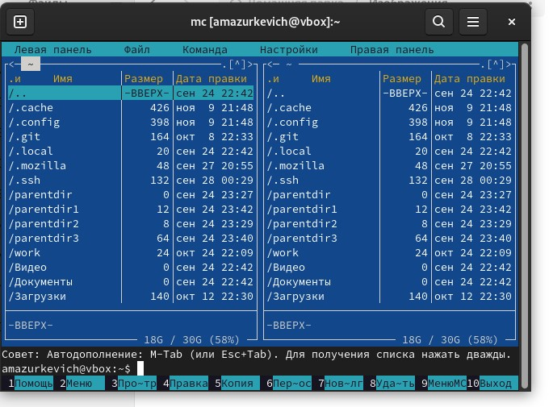{#fig:001 width=70%}

перейдите в каталог ~/work/arch-pc созданный при выполнении лабораторной работы №4

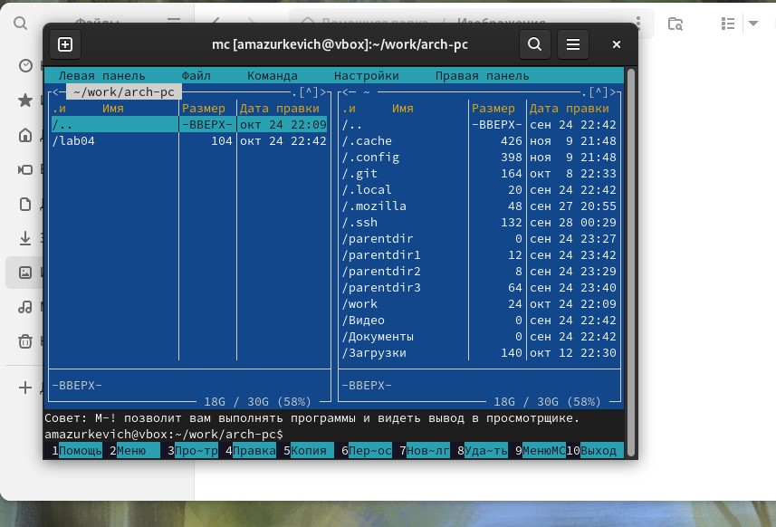{#fig:002 width=70%}

создайте папку lab05 (рис. 5.3) и перейдите в созданный каталог.

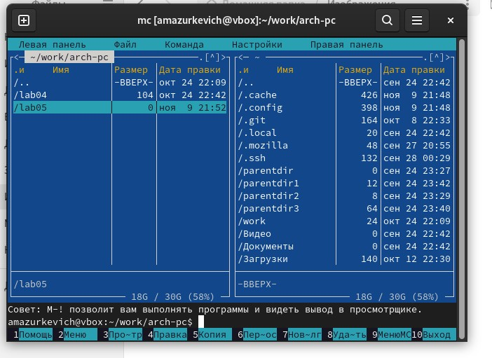{#fig:003 width=70%}

Пользуясь строкой ввода и командой touch создайте файл lab5-1.asm

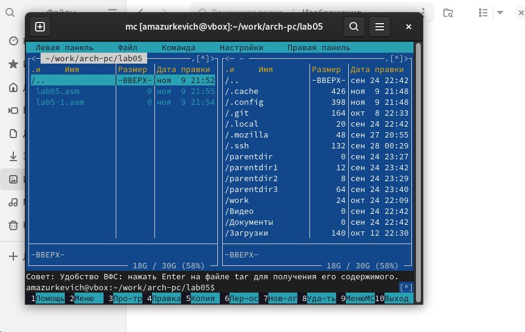{#fig:004 width=70%}

откройте файл lab5-1.asm для редактирования во встроенном редакторе

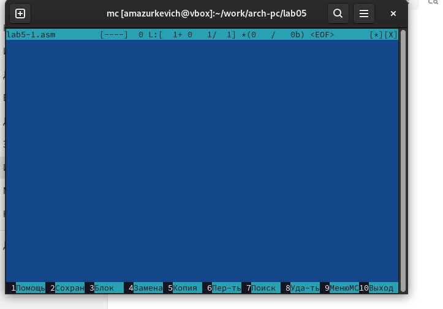{#fig:005 width=70%}

Введите текст программы из листинга 5.1 

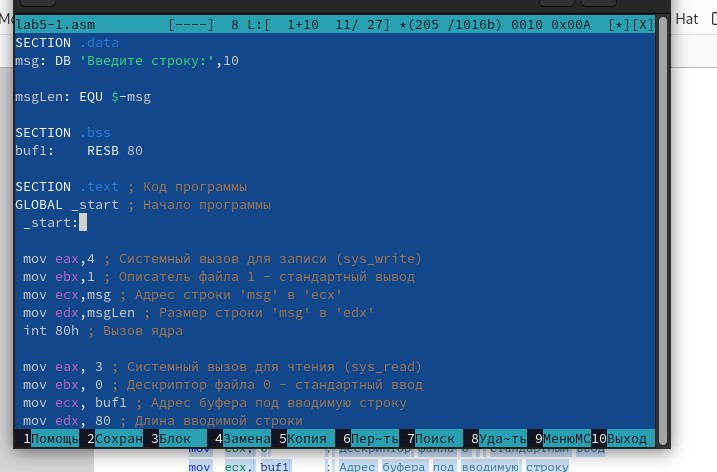{#fig:006 width=70%}

откройте файл lab5-1.asm для просмотра. Убедитесь, что файл содержит текст программы.

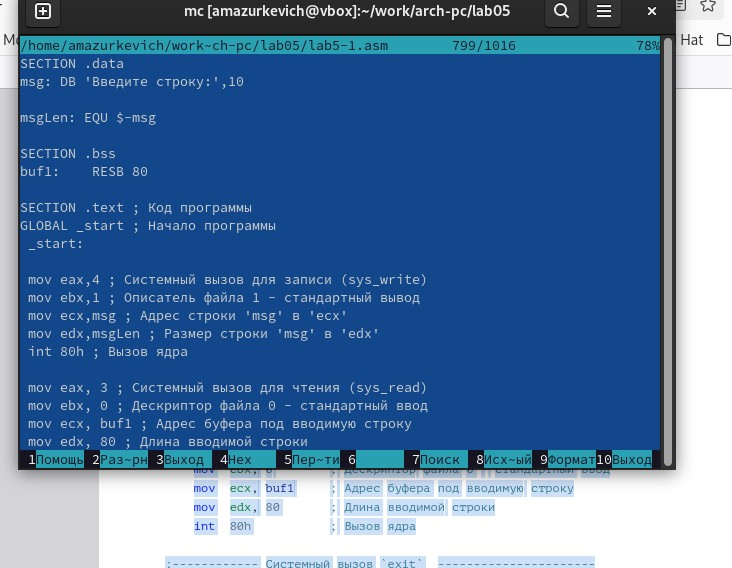{#fig:007 width=70%}

Оттранслируйте текст программы lab5-1.asm в объектный файл. Выполните компоновку объектного файла и запустите получившийся исполняемый файл

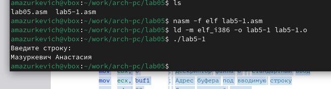{#fig:008 width=70%}

Подключаемый файл in_out.asm должен лежать в том же каталоге, что и файл с программой, в которой он используется

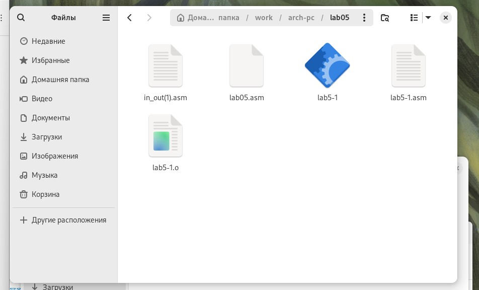{#fig:009 width=70%}

С помощью функциональной клавиши F6 создайте копию файла lab5-1.asm с именем lab5-2.asm. 

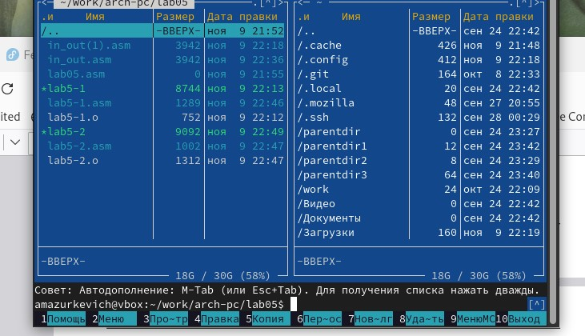{#fig:010 width=70%}

Исправьте текст программы в файле lab5-2.asm с использование подпрограмм из
внешнего файла in_out.asm

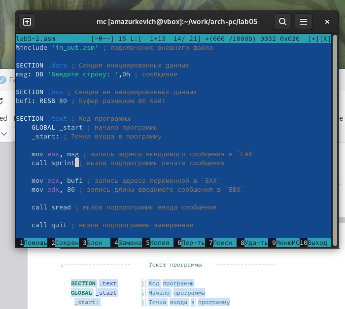{#fig:011 width=70%}

Создайте исполняемый файл и проверьте его работу.

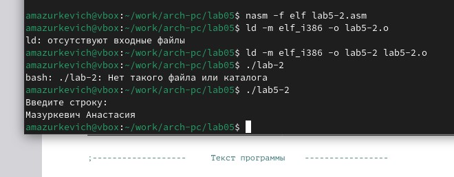{#fig:012 width=70%}

В файле lab5-2.asm замените подпрограмму sprintLF на sprint. Создайте исполняемый файл и проверьте его работу. В чем разница?
разница в переносе строки

{#fig:013 width=70%}

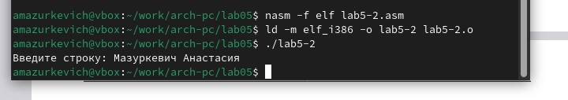{#fig:014 width=70%}

Задание для самостоятельной работы

Создайте копию файла lab5-1.asm. Внесите изменения в программу

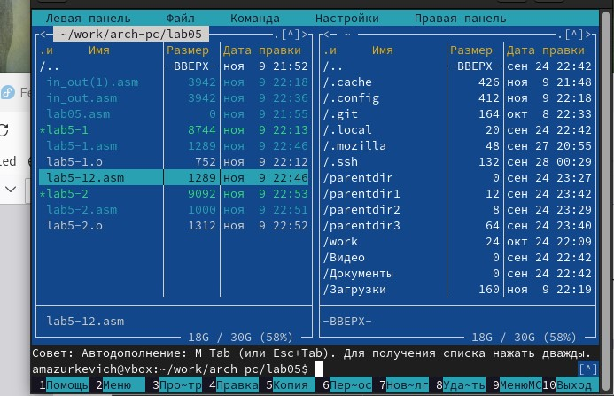{#fig:015 width=70%}

Получите исполняемый файл и проверьте его работу. На приглашение ввести строку
введите свою фамилию.

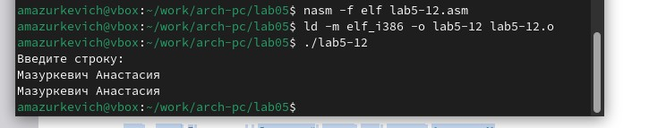{#fig:016 width=70%}

Создайте копию файла lab5-2.asm.

{#fig:017 width=70%}

Создайте исполняемый файл и проверьте его работу

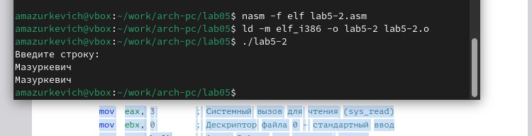{#fig:018 width=70%}

# Выводы

Приобрели навыки работы в Midnight Commander. Освоение инструкций
языка ассемблера mov и int.

# Список литературы{.unnumbered}

::: {#refs}
:::
