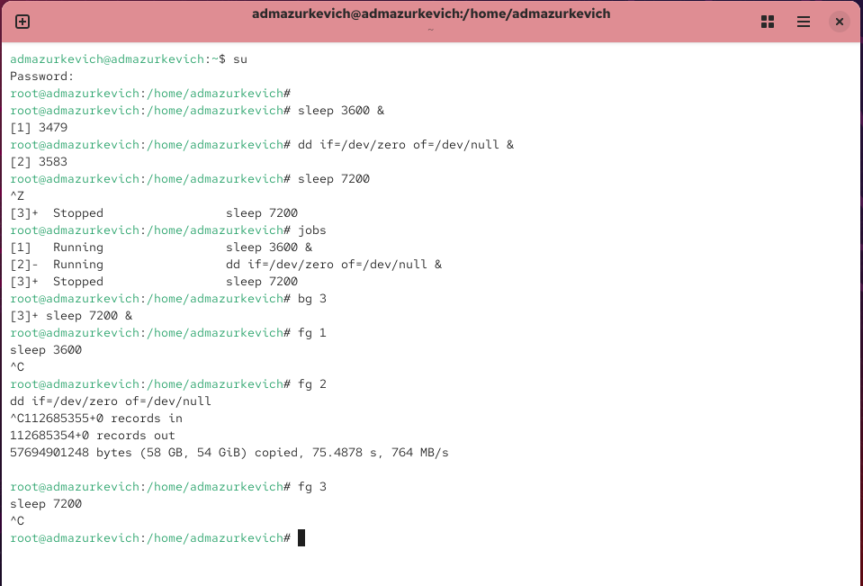
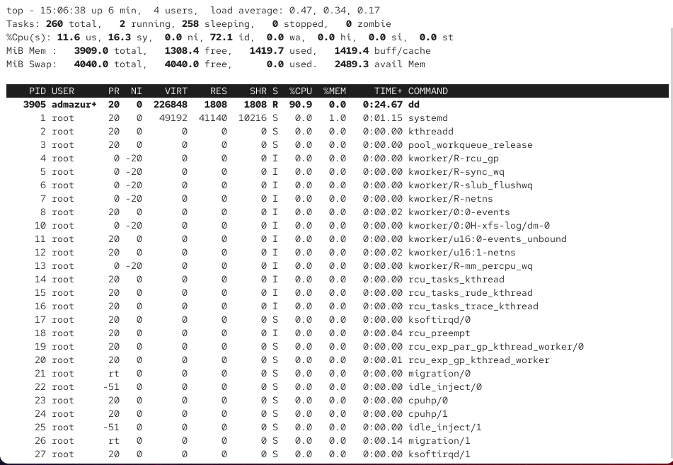
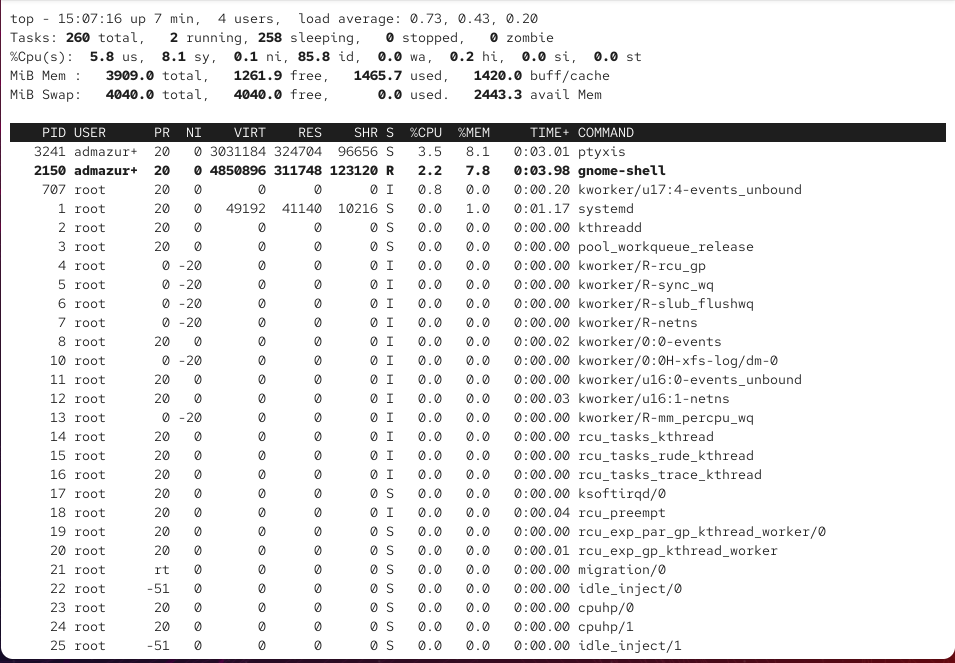
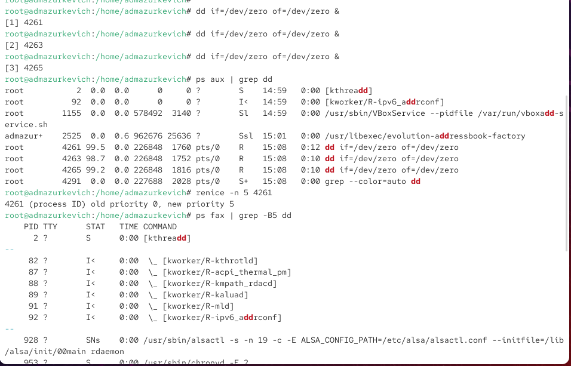
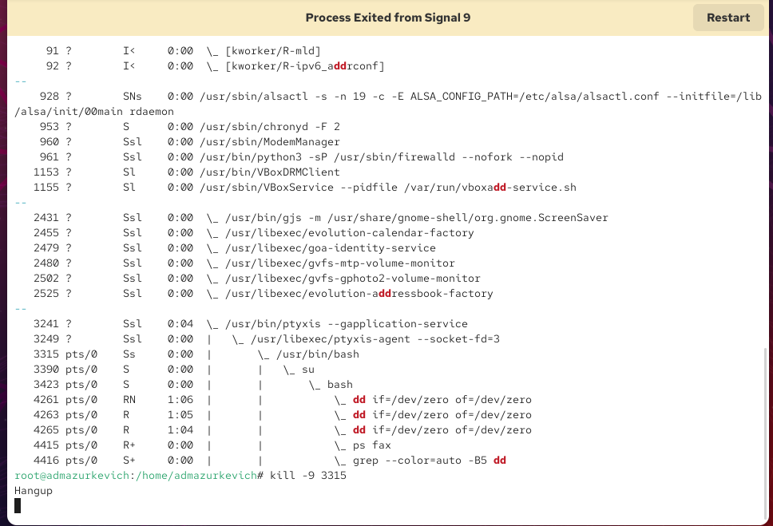
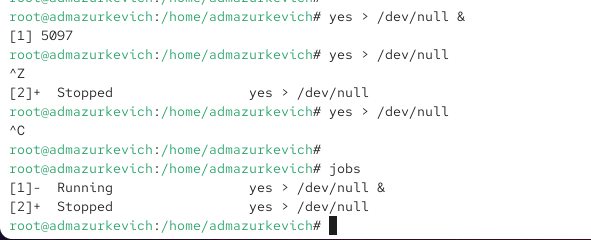
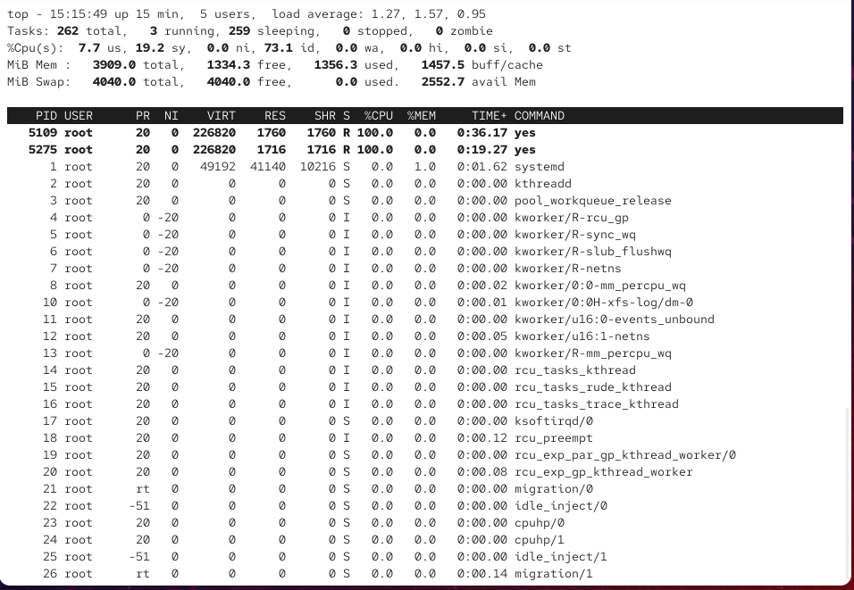
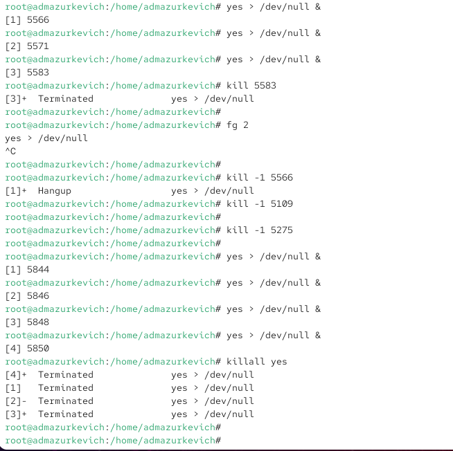
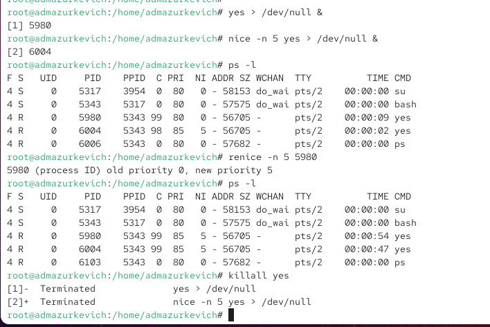

---
## Front matter
lang: ru-RU
title: Лабораторная работа №6
subtitle: Управление процессами
author:
  - Анастасия Мазуркевич
institute:
  - Российский университет дружбы народов, Москва, Россия
date: 27 сентября 2025

## i18n babel
babel-lang: russian
babel-otherlangs: english

## Formatting pdf
toc: false
slide_level: 2
aspectratio: 169
section-titles: true
theme: metropolis
header-includes:
 - \metroset{progressbar=frametitle,sectionpage=progressbar,numbering=fraction}
---

# Цель работы

## Цель лабораторной работы

Получить навыки управления процессами операционной системы Linux.

# Ход выполнения

## Управление заданиями

{ #fig:001 width=70% }

## Управление заданиями

{ #fig:002 width=70% }

## Управление заданиями

{ #fig:003 width=70% }

## Управление процессами

{ #fig:004 width=70% }

## Управление процессами

{ #fig:005 width=70% }

## Задание 1

{ #fig:006 width=70% }

## Задание 2

{ #fig:007 width=70% }

## Задание 2

{ #fig:008 width=70% }

## Задание 2

{ #fig:009 width=70% }

## Задание 2

{ #fig:010 width=70% }

## Задание 2

{ #fig:011 width=70% }

# Выводы по проделанной работе

## Вывод

В ходе лабораторной работы были освоены:  
- управление заданиями и процессами в Linux;  
- использование `jobs`, `fg`, `bg`, `kill`, `killall`, `ps`, `top`;  
- изменение приоритетов процессов с помощью `nice` и `renice`;  
- применение `nohup` для независимого запуска процессов.  

Полученные навыки формируют основу администрирования процессов и позволяют эффективно управлять ресурсами системы.
