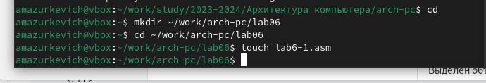
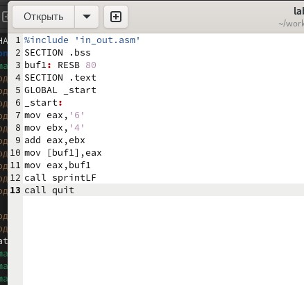
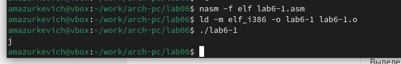
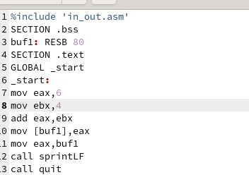
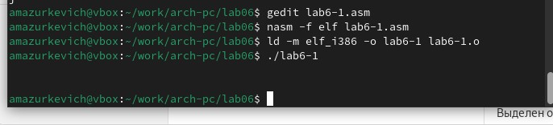
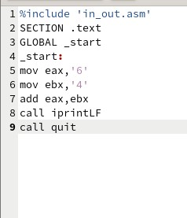
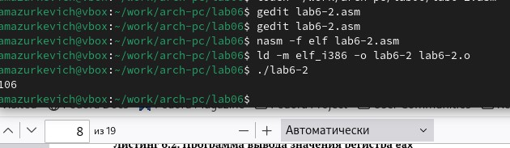
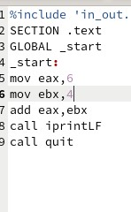
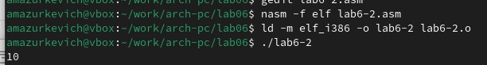

---
## Front matter
title: "Лабораторная работа 6"
subtitle: ""
author: "Мазуркевич Анастасия Дмитриевна"

## Generic otions
lang: ru-RU
toc-title: "Содержание"

## Bibliography
bibliography: bib/cite.bib
csl: pandoc/csl/gost-r-7-0-5-2008-numeric.csl

## Pdf output format
toc: true # Table of contents
toc-depth: 2
lof: true # List of figures
lot: true # List of tables
fontsize: 12pt
linestretch: 1.5
papersize: a4
documentclass: scrreprt
## I18n polyglossia
polyglossia-lang:
  name: russian
  options:
	- spelling=modern
	- babelshorthands=true
polyglossia-otherlangs:
  name: english
## I18n babel
babel-lang: russian
babel-otherlangs: english
## Fonts
mainfont: IBM Plex Serif
romanfont: IBM Plex Serif
sansfont: IBM Plex Sans
monofont: IBM Plex Mono
mathfont: STIX Two Math
mainfontoptions: Ligatures=Common,Ligatures=TeX,Scale=0.94
romanfontoptions: Ligatures=Common,Ligatures=TeX,Scale=0.94
sansfontoptions: Ligatures=Common,Ligatures=TeX,Scale=MatchLowercase,Scale=0.94
monofontoptions: Scale=MatchLowercase,Scale=0.94,FakeStretch=0.9
mathfontoptions:
## Biblatex
biblatex: true
biblio-style: "gost-numeric"
biblatexoptions:
  - parentracker=true
  - backend=biber
  - hyperref=auto
  - language=auto
  - autolang=other*
  - citestyle=gost-numeric
## Pandoc-crossref LaTeX customization
figureTitle: "Рис."
tableTitle: "Таблица"
listingTitle: "Листинг"
lofTitle: "Список иллюстраций"
lotTitle: "Список таблиц"
lolTitle: "Листинги"
## Misc options
indent: true
header-includes:
  - \usepackage{indentfirst}
  - \usepackage{float} # keep figures where there are in the text
  - \floatplacement{figure}{H} # keep figures where there are in the text
---

# Цель работы

Освоение арифметических инструкций языка ассемблера NASM.

# Задание

# Выполнение лабораторной работы

1. Создайте каталог для программам лабораторной работы № 6, перейдите в него и
создайте файл lab6-1.asm:

{#fig:001 width=70%}

Введите в файл lab6-1.asm текст программы из листинга 6.1

{#fig:002 width=70%}

Создайте исполняемый файл и запустите его.

{#fig:003 width=70%}

Далее изменим текст программы и вместо символов, запишем в регистры числа. Исправьте текст программы (Листинг 6.1) следующим образом: замените строки

{#fig:004 width=70%}

Создайте исполняемый файл и запустите его. Отображается ли символ? Нет, не отображается

{#fig:005 width=70%}

Создайте файл lab6-2.asm в каталоге ~/work/arch-pc/lab06 и введите в него текст программы из листинга 6.2.

{#fig:006 width=70%}

{#fig:007 width=70%}

Создайте исполняемый файл и запустите его.

{#fig:008 width=70%}

{#fig:009 width=70%}

{#fig:010 width=70%}

# Выводы

Здесь кратко описываются итоги проделанной работы.

# Список литературы{.unnumbered}

::: {#refs}
:::
