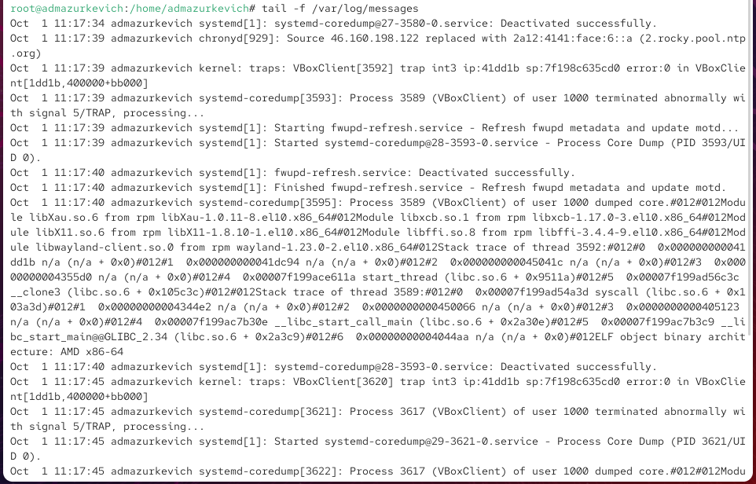
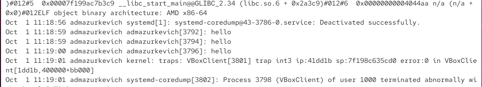
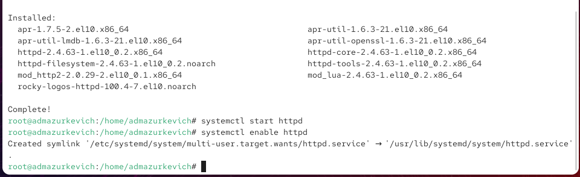
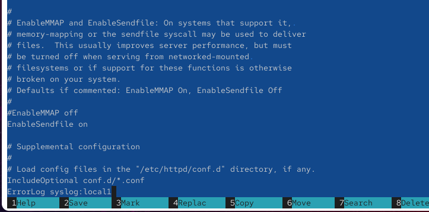
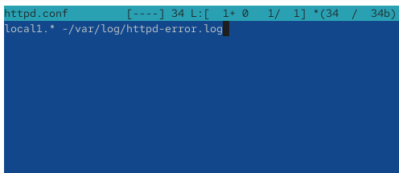
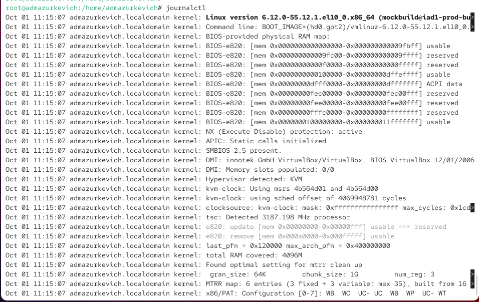
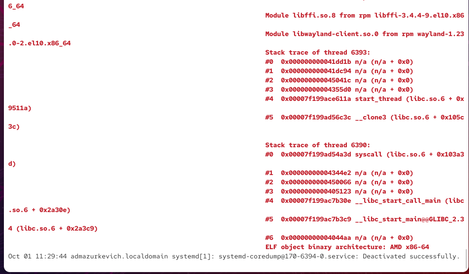
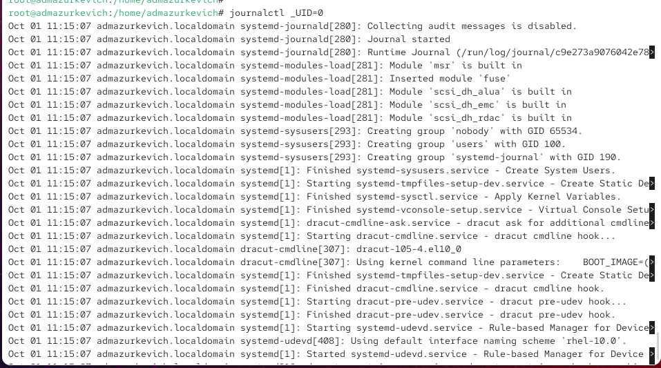

---
## Front matter
lang: ru-RU
title: Лабораторная работа №7
subtitle: Управление журналами событий в системе
author:
  - Анастасия Мазуркевич
institute:
  - Российский университет дружбы народов, Москва, Россия
date: 15 октября 2025

## i18n babel
babel-lang: russian
babel-otherlangs: english

## Formatting pdf
toc: false
slide_level: 2
aspectratio: 169
section-titles: true
theme: metropolis
header-includes:
 - \metroset{progressbar=frametitle,sectionpage=progressbar,numbering=fraction}
---

# Цель работы

## Цель лабораторной работы

Получить навыки работы с системными журналами и их конфигурацией в Linux, научиться использовать rsyslog и journalctl для анализа событий.

# Ход выполнения

## Мониторинг системных сообщений

{ #fig:001 width=70% }

## Ошибка при вводе пароля

{ #fig:002 width=70% }

## Использование logger

{ #fig:003 width=70% }

## Просмотр secure

{ #fig:004 width=70% }

## Установка и запуск Apache

{ #fig:005 width=70% }

## Журнал ошибок Apache

{ #fig:006 width=70% }

## Перенаправление логов Apache

{ #fig:007 width=70% }

## Создание правила rsyslog

{ #fig:008 width=70% }

## Конфигурация отладочного журнала

{ #fig:009 width=70% }

## Проверка отладочного сообщения

{ #fig:010 width=70% }

## Просмотр системного журнала

{ #fig:011 width=70% }

## Режим реального времени

{ #fig:012 width=70% }

## Фильтрация параметров

{ #fig:013 width=70% }

## События UID=0

{ #fig:014 width=70% }

## Последние строки журнала

{ #fig:015 width=70% }

## Сообщения об ошибках

{ #fig:016 width=70% }

## Сообщения со вчерашнего дня

{ #fig:017 width=70% }

## Ошибки со вчерашнего дня

{ #fig:018 width=70% }

## Детализированный вывод

{ #fig:019 width=70% }

## Журнал работы SSHD

{ #fig:020 width=70% }

## Постоянное хранение журналов

{ #fig:021 width=70% }

# Выводы по проделанной работе

## Вывод

В ходе лабораторной работы были освоены приёмы работы с системными журналами Linux.  
Была выполнена настройка перенаправления логов веб-сервера Apache в отдельные файлы, создан отладочный журнал, а также освоены фильтрация и просмотр событий через `journalctl`.  
Полученные навыки позволяют эффективно контролировать работу системы и администрировать сервисы.
