---
## Front matter
title: "Лабораторная работа 7"
subtitle: " Команды безусловного и условного переходов в Nasm. Программирование ветвлений."
author: "Мазуркевич Анастасия"

## Generic otions
lang: ru-RU
toc-title: "Содержание"

## Bibliography
bibliography: bib/cite.bib
csl: pandoc/csl/gost-r-7-0-5-2008-numeric.csl

## Pdf output format
toc: true # Table of contents
toc-depth: 2
lof: true # List of figures
lot: true # List of tables
fontsize: 12pt
linestretch: 1.5
papersize: a4
documentclass: scrreprt
## I18n polyglossia
polyglossia-lang:
  name: russian
  options:
	- spelling=modern
	- babelshorthands=true
polyglossia-otherlangs:
  name: english
## I18n babel
babel-lang: russian
babel-otherlangs: english
## Fonts
mainfont: IBM Plex Serif
romanfont: IBM Plex Serif
sansfont: IBM Plex Sans
monofont: IBM Plex Mono
mathfont: STIX Two Math
mainfontoptions: Ligatures=Common,Ligatures=TeX,Scale=0.94
romanfontoptions: Ligatures=Common,Ligatures=TeX,Scale=0.94
sansfontoptions: Ligatures=Common,Ligatures=TeX,Scale=MatchLowercase,Scale=0.94
monofontoptions: Scale=MatchLowercase,Scale=0.94,FakeStretch=0.9
mathfontoptions:
## Biblatex
biblatex: true
biblio-style: "gost-numeric"
biblatexoptions:
  - parentracker=true
  - backend=biber
  - hyperref=auto
  - language=auto
  - autolang=other*
  - citestyle=gost-numeric
## Pandoc-crossref LaTeX customization
figureTitle: "Рис."
tableTitle: "Таблица"
listingTitle: "Листинг"
lofTitle: "Список иллюстраций"
lotTitle: "Список таблиц"
lolTitle: "Листинги"
## Misc options
indent: true
header-includes:
  - \usepackage{indentfirst}
  - \usepackage{float} # keep figures where there are in the text
  - \floatplacement{figure}{H} # keep figures where there are in the text
---

# Цель работы

Изучение команд условного и безусловного переходов. Приобретение навыков написания программ с использованием переходов. Знакомство с назначением и структурой файла
листинга.

# Задание

Написать программы для решения заданий

# Выполнение лабораторной работы
##Реализация переходов в NASM

Создайте каталог для программам лабораторной работы № 7. Перейдите в него и создайте файл lab7-1.asm(рис. [-@fig:001]).

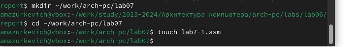{#fig:001 width=70%}

Введите в файл lab7-1.asm текст программы из листинга 7.1.(рис. [-@fig:002]).

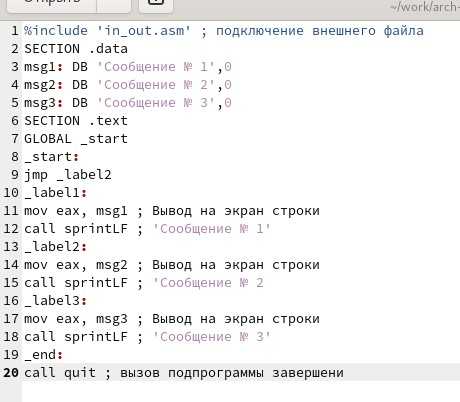{#fig:002 width=70%}

Создайте исполняемый файл и запустите его(рис. [-@fig:003]).

{#fig:003 width=70%}

 Измените текст программы в соответствии с листингом 7.2.(рис. [-@fig:004]).

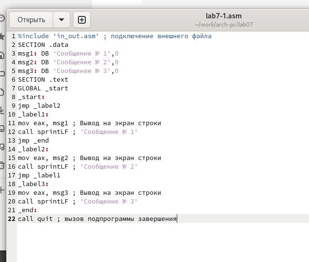{#fig:004 width=70%}

Создайте исполняемый файл и проверьте его работу.(рис. [-@fig:005]).

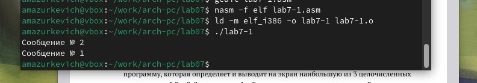{#fig:005 width=70%}

Измените текст программы добавив или изменив инструкции jmp(рис. [-@fig:006]).

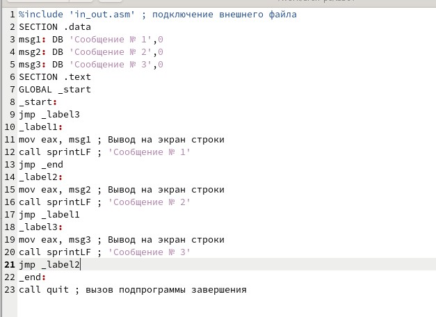{#fig:006 width=70%}

Проверьте работу файла(рис. [-@fig:007]).

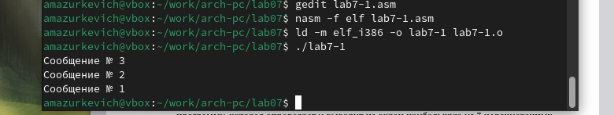{#fig:007 width=70%}

Создайте файл lab7-2.asm в каталоге ~/work/arch-pc/lab07. Внимательно изучите текст программы из листинга 7.3 и введите в lab7-2.asm.(рис. [-@fig:008]).

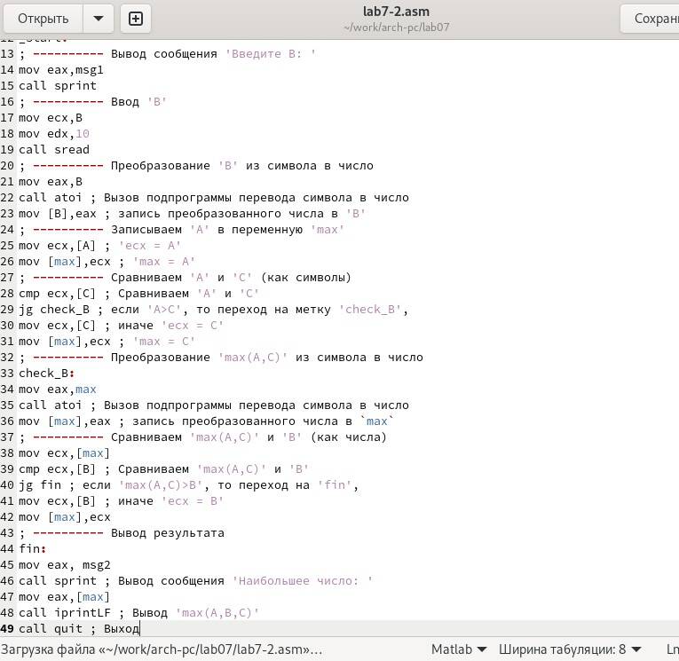{#fig:008 width=70%}

Создайте исполняемый файл и проверьте его работу для разных значений B(рис. [-@fig:009]).

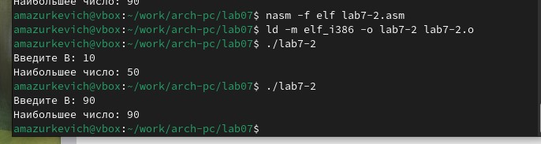{#fig:009 width=70%}

##Изучение структуры файлы листинга

Создайте файл листинга для программы из файла lab7-2.asm(рис. [-@fig:010]).

{#fig:010 width=70%}

Откройте файл листинга lab7-2.lst с помощью любого текстового редактора(рис. [-@fig:011]).

{#fig:011 width=70%}

Внимательно ознакомиться с его форматом и содержимым. Подробно объяснить содержимое трёх строк файла листинга по выбору.

Строка 5: 00000001 адрес в сегменте кода, 89с3 машинный код, mov ebx,eax присвоить eax значение ebx
Строка 10: 00000008 адрес в сегменте кода, 40 машинный код, inc eax считывает значение eax и добавляет кнему 1, записывая обратнов eax
Строка 14: 0000000В адрес в сегменте кода, 29D8 машинный код, sub eax,ebx вычитает (eax-ebx) и записывает значение в eax

Откройте файл с программой lab7-2.asm и в любой инструкции с двумя операндами удалить один операнд(рис. [-@fig:012]).

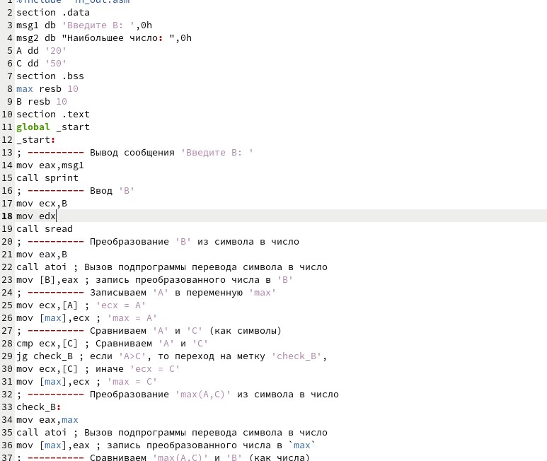{#fig:012 width=70%}

Выполните трансляцию с получением файла листинга:(рис. [-@fig:013]).

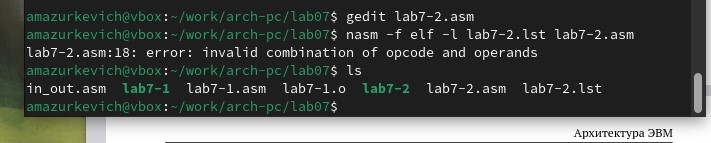{#fig:013 width=70%}

Выдается ошибка, но через ls видим, что создаются lab7-2 и lab7-2.asm

Смотрим файл(рис. [-@fig:014]).

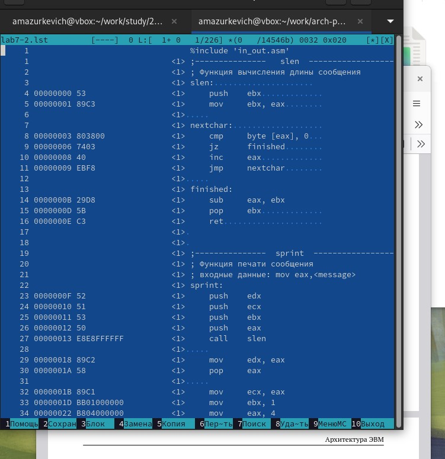{#fig:014 width=70%}

## Задание для самостоятельной работы

ВАРИАНТ 4

Напишите программу нахождения наименьшей из 3 целочисленных переменных 𝑎,𝑏 и .
Значения переменных выбрать из табл. 7.5 в соответствии с вариантом, полученным
при выполнении лабораторной работы № 7. Создайте исполняемый файл и проверьте
его работу

Создадим для этого lab7-3.asm(рис. [-@fig:015]).

{#fig:015 width=70%}

Напишите программу нахождения наименьшей из 3 целочисленных переменных 𝑎,𝑏 и .(рис. [-@fig:016]).

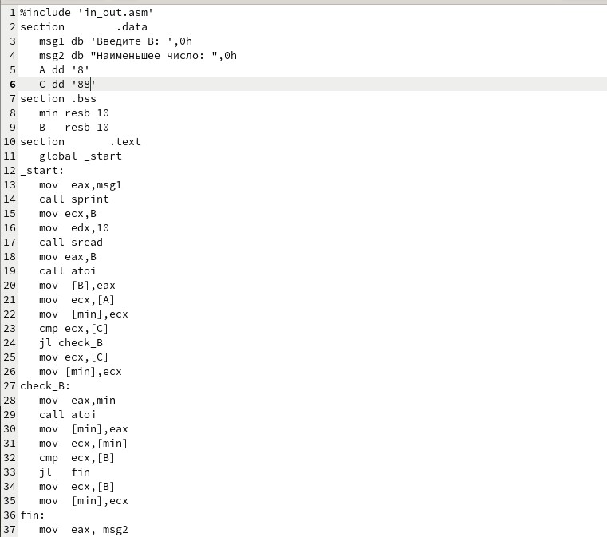{#fig:016 width=70%}

Создадим файл и проверим его работу(рис. [-@fig:017]).

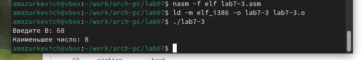{#fig:017 width=70%}

Напишите программу, которая для введенных с клавиатуры значений 𝑥 и 𝑎 вычисляет
значение заданной функции 𝑓(𝑥) и выводит результат вычислений. Вид функции 𝑓(𝑥)
выбрать из таблицы 7.6 вариантов заданий в соответствии с вариантом, полученным
при выполнении лабораторной работы № 7. Создайте исполняемый файл и проверьте
его работу для значений 𝑥 и 𝑎 из 7.6.

Создадим для этого lab7-4.asm и откроем его, пропишем программу для нахождения функций(рис. [-@fig:018]).

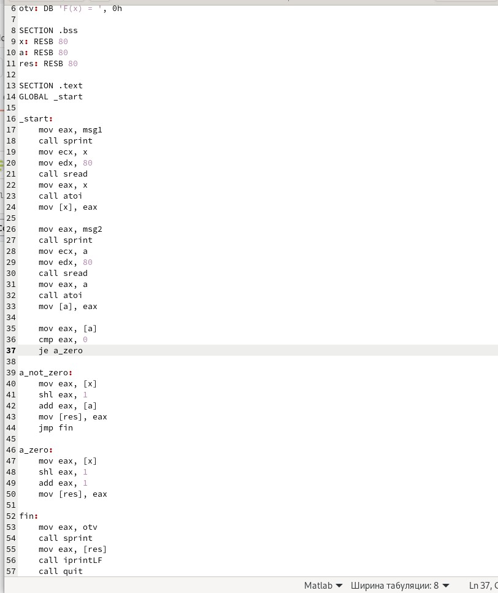{#fig:018 width=70%}

Создаем файл и проверяем для х=3 а=0(рис. [-@fig:019]).

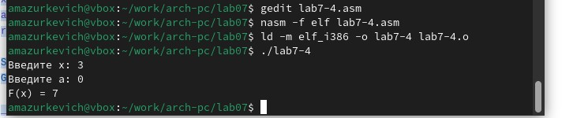{#fig:019 width=70%}

Проверяем для х=3 а=2(рис. [-@fig:020]).

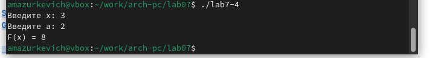{#fig:020 width=70%}

# Выводы

Изучили команды условного и безусловного переходов. Приобрели навыки написания программ с использованием переходов. Познакомились с назначением и структурой файла
листинга.

# Список литературы{.unnumbered}

::: {#refs}
:::
