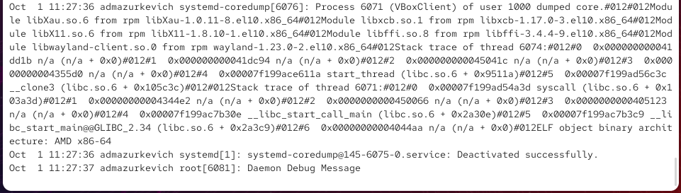

---
## Front matter
title: "Отчёт по лабораторной работе №7"
subtitle: "Управление журналами событий в системе"
author: "Анастасия Мазуркевич"

## Generic otions
lang: ru-RU
toc-title: "Содержание"

## Bibliography
bibliography: bib/cite.bib
csl: pandoc/csl/gost-r-7-0-5-2008-numeric.csl

## Pdf output format
toc: true
toc-depth: 2
lof: true
lot: true
fontsize: 12pt
linestretch: 1.5
papersize: a4
documentclass: scrreprt
## I18n polyglossia
polyglossia-lang:
  name: russian
  options:
    - spelling=modern
    - babelshorthands=true
polyglossia-otherlangs:
  name: english
## I18n babel
babel-lang: russian
babel-otherlangs: english
## Fonts
mainfont: IBM Plex Serif
romanfont: IBM Plex Serif
sansfont: IBM Plex Sans
monofont: IBM Plex Mono
mathfont: STIX Two Math
mainfontoptions: Ligatures=Common,Ligatures=TeX,Scale=0.94
romanfontoptions: Ligatures=Common,Ligatures=TeX,Scale=0.94
sansfontoptions: Ligatures=Common,Ligatures=TeX,Scale=MatchLowercase,Scale=0.94
monofontoptions: Scale=MatchLowercase,Scale=0.94,FakeStretch=0.9
mathfontoptions:
## Biblatex
biblatex: true
biblio-style: "gost-numeric"
biblatexoptions:
  - parentracker=true
  - backend=biber
  - hyperref=auto
  - language=auto
  - autolang=other*
  - citestyle=gost-numeric
## Pandoc-crossref LaTeX customization
figureTitle: "Рис."
tableTitle: "Таблица"
listingTitle: "Листинг"
lofTitle: "Список иллюстраций"
lotTitle: "Список таблиц"
lolTitle: "Листинги"
## Misc options
indent: true
header-includes:
  - \usepackage{indentfirst}
  - \usepackage{float}
  - \floatplacement{figure}{H}
---

# Цель работы

Получить навыки работы с журналами мониторинга различных событий в системе.

# Ход выполнения

## Мониторинг журнала системных событий в реальном времени

Для начала в трёх вкладках терминала были получены полномочия администратора с помощью команды **su -**.  

Во второй вкладке был запущен мониторинг системных событий в реальном времени: **tail -f /var/log/messages**.  

В логе фиксировались события, связанные с работой сервисов, ядра и пользователями. В частности, при работе виртуальной машины VirtualBox неоднократно появлялись ошибки клиента **VBoxClient**, сопровождаемые дампами памяти.  

{ #fig:001 width=70% }

В третьей вкладке, после возврата к своей учётной записи, была предпринята попытка получить права администратора через **su**, но пароль был введён неверно.  
Во второй вкладке с мониторингом это зафиксировалось сообщением: **FAILED SU (to root) admazurkevich on pts/2**.  

А также сопровождалось формированием дампа памяти для завершившегося процесса.  

{ #fig:002 width=70% }

Под учётной записью пользователя была выполнена команда **logger hello**.  

Событие сразу же появилось в окне мониторинга и было записано в файл **/var/log/messages**.  
Таким образом, через logger можно добавлять произвольные заметки в системные логи.  

{ #fig:003 width=70% }

После остановки мониторинга (**Ctrl + C**) был просмотрен файл с сообщениями безопасности — вывод последних 20 строк: **tail -n 20 /var/log/secure**.  

В журнале зафиксированы успешные и неуспешные попытки входа в систему, а также ошибки авторизации при вводе неправильного пароля для root. Здесь отразились все действия, связанные с командами **su** и проверками пароля.  

{ #fig:004 width=70% }

## Изменение правил rsyslog.conf

В первой вкладке терминала была выполнена установка пакета Apache:  
**dnf -y install httpd**  

После завершения процесса веб-служба была запущена и добавлена в автозагрузку:  

- **systemctl start httpd**  
- **systemctl enable httpd**

{ #fig:005 width=70% }

Во второй вкладке терминала был запущен просмотр сообщений об ошибках веб-сервера в реальном времени:  

**tail -f /var/log/httpd/error_log**

Здесь фиксировались события запуска Apache, активация SELinux-политики и переход службы в рабочий режим.  

{ #fig:006 width=70% }

В конфигурационный файл **/etc/httpd/conf/httpd.conf** была добавлена строка:  

**ErrorLog syslog:local1**  

Это позволило отправлять ошибки Apache в системный журнал через объект **local1**.  

{ #fig:007 width=70% }

В каталоге **/etc/rsyslog.d** был создан файл **httpd.conf**, в который добавлено правило:  

**local1.* -/var/log/httpd-error.log**

Таким образом, все сообщения от Apache через **local1** стали фиксироваться в отдельном файле **/var/log/httpd-error.log**.  

{ #fig:008 width=70% }

После этого были перезапущены службы:  

- **systemctl restart rsyslog.service**  
- **systemctl restart httpd**

В том же каталоге **/etc/rsyslog.d** был создан новый файл **debug.conf**, куда добавлено правило:  

**\*.debug /var/log/messages-debug**

Таким образом, все отладочные сообщения перенаправляются в отдельный лог-файл.  

{ #fig:009 width=70% }

Во второй вкладке был запущен мониторинг файла **/var/log/messages-debug** командой:  

**tail -f /var/log/messages-debug**

Затем в третьей вкладке было выполнено:  

**logger -p daemon.debug "Daemon Debug Message"**

В мониторинге появилось сообщение отладки, что подтвердило успешную настройку.  

{ #fig:010 width=70% }

## Использование journalctl

Для просмотра журнала с момента загрузки системы была использована команда:  
**journalctl**  

Отображаются все события ядра и сервисов, начиная с инициализации оборудования и запуска служб.  

{ #fig:011 width=70% }

Чтобы вывести содержимое журнала без использования постраничного просмотра, была выполнена команда:  
**journalctl --no-pager**  

{ #fig:012 width=70% }

Для анализа новых сообщений в режиме онлайн применялась команда:  
**journalctl -f**  

Мониторинг можно прервать сочетанием клавиш **Ctrl + C**.  

{ #fig:013 width=70% }

После ввода команды **journalctl** и двойного нажатия клавиши **Tab** отобразился список доступных параметров фильтрации: по UID, PID, системным полям и сервисам.  

{ #fig:014 width=70% }

Для вывода записей, связанных с пользователем root, была применена команда:  
**journalctl _UID=0**  

{ #fig:015 width=70% }

Команда **journalctl -n 20** вывела последние 20 строк системного журнала.  

{ #fig:016 width=70% }

С помощью команды:  
**journalctl -p err**  

были отображены только записи уровня ошибки. Здесь фиксируются проблемы с драйверами, службами и падения приложений.  

{ #fig:017 width=70% }

Для анализа сообщений со вчерашнего дня была выполнена команда:  
**journalctl --since yesterday**

{ #fig:018 width=70% }

Для просмотра только ошибок со вчерашнего дня использовалась команда:  
**journalctl --since yesterday -p err**

{ #fig:019 width=70% }

Для получения расширенной информации по каждому событию была использована команда:  
**journalctl -o verbose**  

В выводе указываются дополнительные параметры: идентификатор загрузки, имя хоста, приоритет события, источник и другие метаданные.  

{ #fig:020 width=70% }

Для анализа работы службы **sshd** была использована команда:  
**journalctl _SYSTEMD_UNIT=sshd.service**

В выводе отобразились события, связанные с запуском и работой SSH-сервера: сообщения об окружении и прослушивание порта 22 (как IPv4, так и IPv6).  

{ #fig:021 width=70% }

## Создание каталога для хранения журналов

Для организации хранения журналов был создан каталог **/var/log/journal**, в который затем перенаправлены данные systemd-journald.  

Выполненные действия:  
- создание каталога: **mkdir -p /var/log/journal**  
- назначение прав доступа: **chmod 2755 /var/log/journal**  
- перезапуск службы systemd-journald сигналом: **killall -USR1 systemd-journald**

После этого команда **journalctl -b** показала системные сообщения с момента последней загрузки ядра.  

{ #fig:022 width=70% }

# Контрольные вопросы

**1. Какой файл используется для настройки rsyslogd?**  
Основной конфигурационный файл — `/etc/rsyslog.conf`.  
Дополнительно правила могут храниться в каталоге `/etc/rsyslog.d/`.

**2. В каком файле журнала rsyslogd содержатся сообщения, связанные с аутентификацией?**  
Сообщения об аутентификации фиксируются в файле `/var/log/secure`.

**3. Если вы ничего не настроите, то сколько времени потребуется для ротации файлов журналов?**  
По умолчанию ротация выполняется раз в неделю с использованием утилиты `logrotate`.

**4. Какую строку следует добавить в конфигурацию для записи всех сообщений с приоритетом info в файл /var/log/messages.info?**  
Необходимо добавить правило:  `*.info /var/log/messages.info`

**5. Какая команда позволяет вам видеть сообщения журнала в режиме реального времени?**  
Для этого используется команда:  
`journalctl -f`

**6. Какая команда позволяет вам видеть все сообщения журнала, которые были написаны для PID 1 между 9:00 и 15:00?**  
`journalctl _PID=1 --since "09:00" --until "15:00"`

**7. Какая команда позволяет вам видеть сообщения journald после последней перезагрузки системы?**  
`journalctl -b`

**8. Какая процедура позволяет сделать журнал journald постоянным?**  
Необходимо создать каталог для хранения журналов и назначить ему права:  
- `mkdir -p /var/log/journal`  
- `chmod 2755 /var/log/journal`  
- перезапустить службу: `systemctl restart systemd-journald`  

После этого журнал будет сохраняться в постоянном виде даже после перезагрузки системы.

# Заключение

В ходе лабораторной работы были изучены основы управления системными журналами в Linux с использованием **rsyslog** и **systemd-journald**.  
Была проведена настройка перенаправления сообщений веб-сервера Apache в отдельные файлы, реализовано хранение отладочной информации, а также рассмотрены способы фильтрации и просмотра логов через `journalctl`.  
