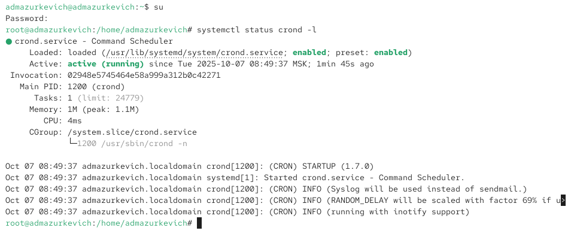
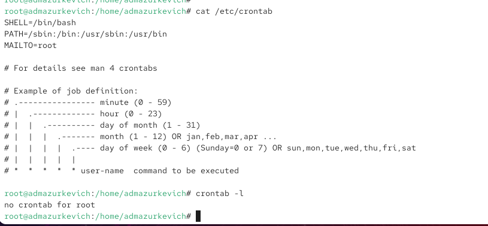
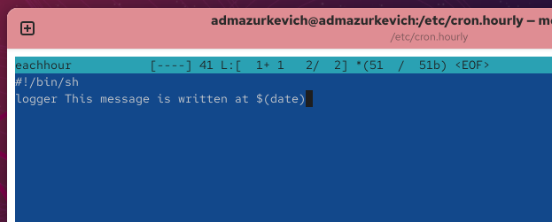
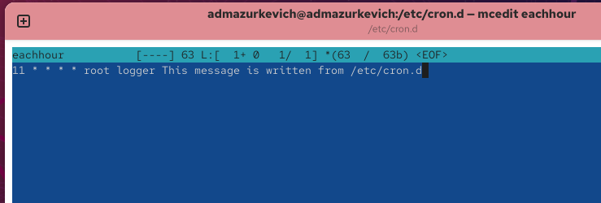
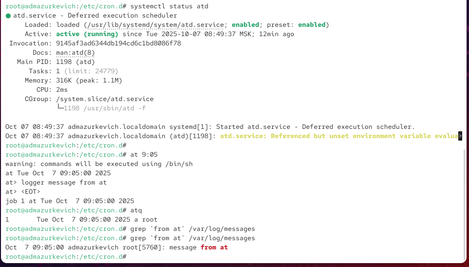

---
## Front matter
lang: ru-RU
title: Лабораторная работа №8
subtitle: Планировщики событий
author:
  - Анастасия Мазуркевич
institute:
  - Российский университет дружбы народов, Москва, Россия
date: 13 октября 2025

## i18n babel
babel-lang: russian
babel-otherlangs: english

## Formatting pdf
toc: false
slide_level: 2
aspectratio: 169
section-titles: true
theme: metropolis
header-includes:
 - \metroset{progressbar=frametitle,sectionpage=progressbar,numbering=fraction}
---

# Цель работы

## Цель лабораторной работы

Получение практических навыков планирования выполнения заданий с использованием планировщиков **cron** и **at** в Linux.

# Ход выполнения

## Просмотр конфигурации crontab

{ #fig:001 width=70% }

## Добавление задания в cron

{ #fig:002 width=70% }

## Проверка выполнения задания

{ #fig:003 width=70% }

## Создание сценария eachhour

{ #fig:004 width=70% }

## Добавление задания в /etc/cron.d

{ #fig:005 width=70% }

## Проверка выполнения cron-заданий

{ #fig:006 width=70% }

## Планирование задания через at

{ #fig:007 width=70% }

# Выводы по проделанной работе

## Вывод

В ходе лабораторной работы были изучены и применены на практике средства планирования заданий в Linux.  
Планировщик **cron** позволил создать периодические задачи, а служба **atd** — одноразовые задания.  
Все эксперименты завершились успешно, что подтверждено записями в системном журнале.
