---
## Front matter
title: "Лабораторная работа 8"
subtitle: ""
author: "Мазуркевич Анастасия Дмитриевна"

## Generic otions
lang: ru-RU
toc-title: "Содержание"

## Bibliography
bibliography: bib/cite.bib
csl: pandoc/csl/gost-r-7-0-5-2008-numeric.csl

## Pdf output format
toc: true # Table of contents
toc-depth: 2
lof: true # List of figures
lot: true # List of tables
fontsize: 12pt
linestretch: 1.5
papersize: a4
documentclass: scrreprt
## I18n polyglossia
polyglossia-lang:
  name: russian
  options:
	- spelling=modern
	- babelshorthands=true
polyglossia-otherlangs:
  name: english
## I18n babel
babel-lang: russian
babel-otherlangs: english
## Fonts
mainfont: IBM Plex Serif
romanfont: IBM Plex Serif
sansfont: IBM Plex Sans
monofont: IBM Plex Mono
mathfont: STIX Two Math
mainfontoptions: Ligatures=Common,Ligatures=TeX,Scale=0.94
romanfontoptions: Ligatures=Common,Ligatures=TeX,Scale=0.94
sansfontoptions: Ligatures=Common,Ligatures=TeX,Scale=MatchLowercase,Scale=0.94
monofontoptions: Scale=MatchLowercase,Scale=0.94,FakeStretch=0.9
mathfontoptions:
## Biblatex
biblatex: true
biblio-style: "gost-numeric"
biblatexoptions:
  - parentracker=true
  - backend=biber
  - hyperref=auto
  - language=auto
  - autolang=other*
  - citestyle=gost-numeric
## Pandoc-crossref LaTeX customization
figureTitle: "Рис."
tableTitle: "Таблица"
listingTitle: "Листинг"
lofTitle: "Список иллюстраций"
lotTitle: "Список таблиц"
lolTitle: "Листинги"
## Misc options
indent: true
header-includes:
  - \usepackage{indentfirst}
  - \usepackage{float} # keep figures where there are in the text
  - \floatplacement{figure}{H} # keep figures where there are in the text
---

# Цель работы

Приобретение навыков написания программ с использованием циклов и обработкой аргументов командной строки.

# Выполнение лабораторной работы
## Реализация циклов в NASM

Создайте каталог для программам лабораторной работы № 8, перейдите в него и создайте файл lab8-1.asm: (рис. [-@fig:001]).

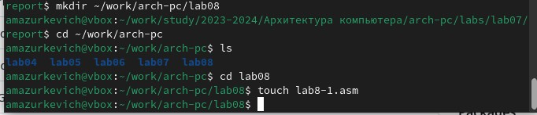{#fig:001 width=70%}

Введите в файл lab8-1.asm текст программы из листинга 8.1. 

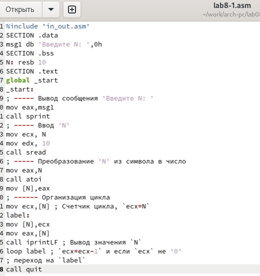{#fig:002 width=70%}

Создайте исполняемый файл и проверьте его работу

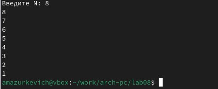{#fig:003 width=70%}

Измените текст программы добавив изменение значение регистра ecx в цикле:

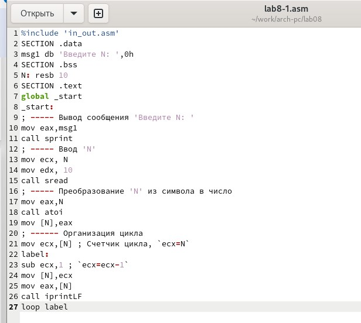{#fig:004 width=70%}

Создайте исполняемый файл и проверьте его работу. Какие значения принимает регистр ecx в цикле? Соответствует ли число проходов цикла значению 𝑁 введенному с клавиатуры? Принимает значения 7 5 3 1 и число проходов не равно N

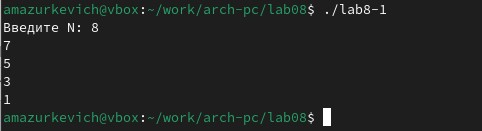{#fig:005 width=70%}

Внесите изменения в текст программы добавив команды push и pop (добавления в стек и извлечения из стека) для сохранения значения счетчика цикла loop:

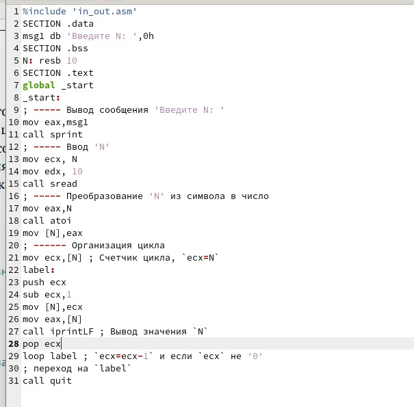{#fig:006 width=70%}

Создайте исполняемый файл и проверьте его работу. Соответствует ли в данном случае число проходов цикла значению 𝑁 введенному с клавиатуры? Да, число проходов равно числу N

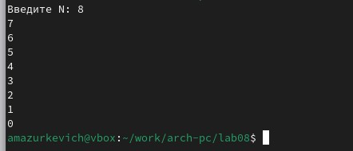{#fig:007 width=70%}

## Обработка аргументов командной строки

Создайте файл lab8-2.asm в каталоге ~/work/arch-pc/lab08 и введите в него текст программы из листинга 8.2

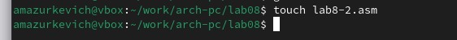{#fig:008 width=70%}

Пишем программу из листинга

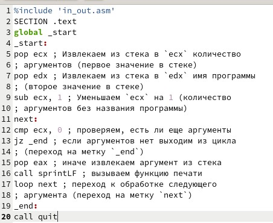{#fig:009 width=70%}

Создайте исполняемый файл и запустите его, указав аргументы. Программа обработала 3 аргумента

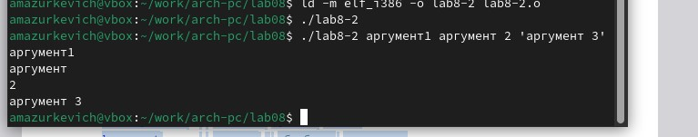{#fig:010 width=70%}

Создайте файл lab8-3.asm в каталоге ~/work/archpc/lab08 и введите в него текст программы из листинга 8.3.

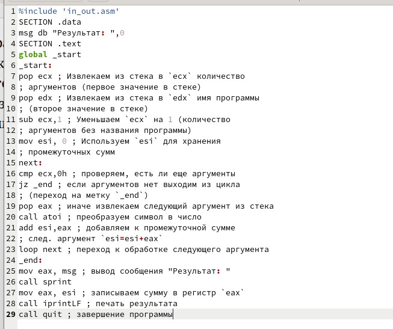{#fig:011 width=70%}

Создайте исполняемый файл и запустите его, указав аргументы.

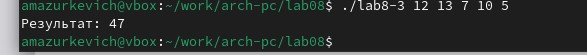{#fig:012 width=70%}

Измените текст программы из листинга 8.3 для вычисления произведения аргументов командной строки.

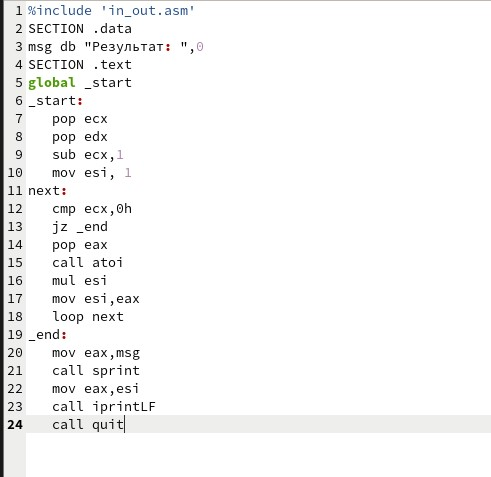{#fig:013 width=70%}

Проверяем работу, все верно

{#fig:014 width=70%}

## Задание для самостоятельной работы

Создаем файл

{#fig:015 width=70%}

Пишем программу

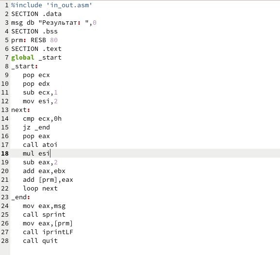{#fig:016 width=70%}

Создаем файл и запускаем

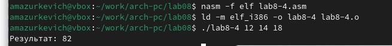{#fig:017 width=70%}

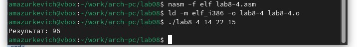{#fig:018 width=70%}

# Выводы
Приобрели навыки написания программ с использованием циклов и обработкой аргументов командной строки.
