---
## Front matter
title: "Отчёт по лабораторной работе №9"
subtitle: "Управление SELinux"
author: "Анастасия Мазуркевич"

## Generic otions
lang: ru-RU
toc-title: "Содержание"

## Bibliography
bibliography: bib/cite.bib
csl: pandoc/csl/gost-r-7-0-5-2008-numeric.csl

## Pdf output format
toc: true
toc-depth: 2
lof: true
lot: true
fontsize: 12pt
linestretch: 1.5
papersize: a4
documentclass: scrreprt
## I18n polyglossia
polyglossia-lang:
  name: russian
  options:
    - spelling=modern
    - babelshorthands=true
polyglossia-otherlangs:
  name: english
## I18n babel
babel-lang: russian
babel-otherlangs: english
## Fonts
mainfont: IBM Plex Serif
romanfont: IBM Plex Serif
sansfont: IBM Plex Sans
monofont: IBM Plex Mono
mathfont: STIX Two Math
mainfontoptions: Ligatures=Common,Ligatures=TeX,Scale=0.94
romanfontoptions: Ligatures=Common,Ligatures=TeX,Scale=0.94
sansfontoptions: Ligatures=Common,Ligatures=TeX,Scale=MatchLowercase,Scale=0.94
monofontoptions: Scale=MatchLowercase,Scale=0.94,FakeStretch=0.9
mathfontoptions:
## Biblatex
biblatex: true
biblio-style: "gost-numeric"
biblatexoptions:
  - parentracker=true
  - backend=biber
  - hyperref=auto
  - language=auto
  - autolang=other*
  - citestyle=gost-numeric
## Pandoc-crossref LaTeX customization
figureTitle: "Рис."
tableTitle: "Таблица"
listingTitle: "Листинг"
lofTitle: "Список иллюстраций"
lotTitle: "Список таблиц"
lolTitle: "Листинги"
## Misc options
indent: true
header-includes:
  - \usepackage{indentfirst}
  - \usepackage{float}
  - \floatplacement{figure}{H}
---

# Цель работы

Получить навыки работы с контекстом безопасности и политиками SELinux.

# Ход выполнения

## Управление режимами SELinux

После входа в систему были получены права администратора с помощью команды `su -`.  
Для проверки состояния SELinux использована команда `sestatus -v`.  
Вывод показал, что SELinux **включён (enabled)**, политика — **targeted**, режим работы — **enforcing**.  
Это означает, что система применяет политику безопасности к большинству процессов.  
В отчёте также отображены контексты безопасности для процессов (`Init`, `sshd`) и системных файлов, включая `/etc/passwd`, `/etc/shadow`, `/bin/bash` и другие.

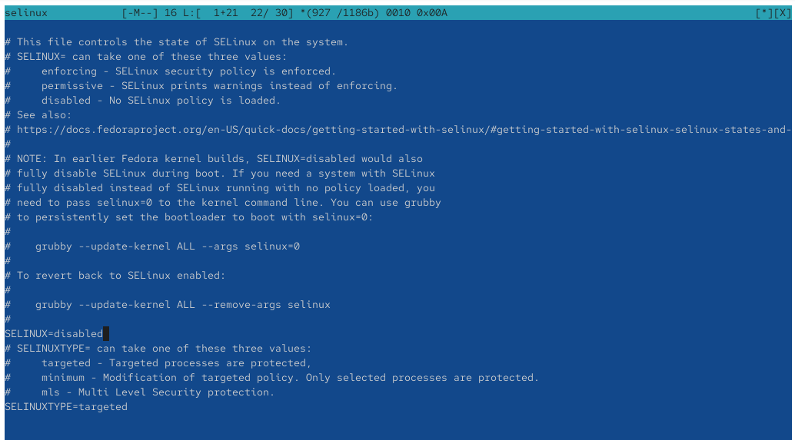{ #fig:001 width=70% }

Команда `getenforce` подтвердила режим **Enforcing** — принудительное применение правил безопасности.  
Далее режим SELinux был временно изменён на **Permissive** командой `setenforce 0`, что позволило регистрировать нарушения без их блокировки.  
Повторная проверка через `getenforce` показала, что изменения вступили в силу.

В файле `/etc/sysconfig/selinux` значение параметра `SELINUX` было изменено на `disabled`, что полностью отключает SELinux после перезагрузки.  

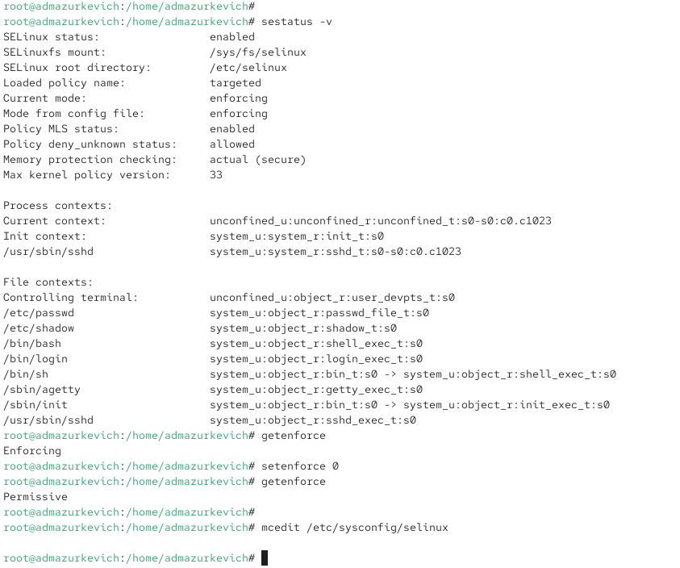{ #fig:002 width=70% }

После перезагрузки команда `getenforce` показала, что SELinux теперь **отключён**.  
Попытка вернуть режим с помощью `setenforce 1` завершилась сообщением о невозможности включения SELinux без перезагрузки, так как он был отключён на уровне конфигурации.  

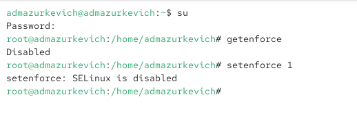{ #fig:003 width=70% }

Для повторного включения SELinux параметр `SELINUX` был изменён на `enforcing`.  

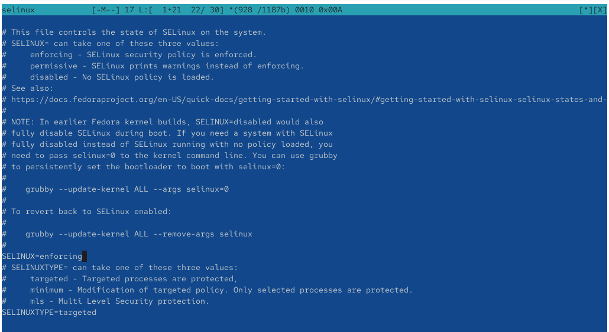{ #fig:004 width=70% }

Во время загрузки система выдала предупреждение о необходимости восстановления меток безопасности, после чего начался процесс **relabeling** — переназначения контекстов безопасности.  

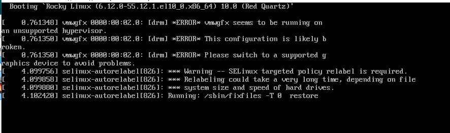{ #fig:005 width=70% }

После завершения загрузки повторная проверка командой `sestatus -v` показала, что SELinux снова работает в режиме **enforcing**, а политика безопасности успешно загружена.  

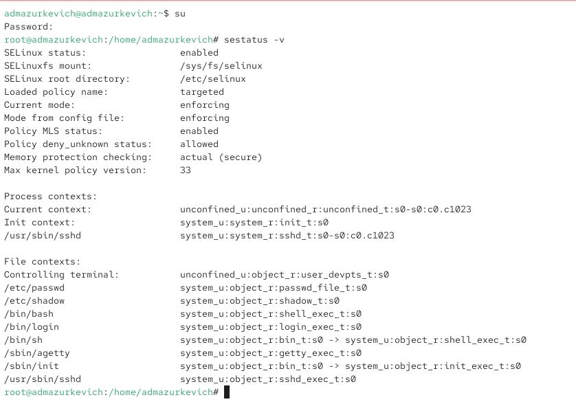{ #fig:006 width=70% }

## Использование restorecon для восстановления контекста безопасности

Была проверена метка безопасности файла `/etc/hosts` с помощью `ls -Z /etc/hosts`.  
Тип контекста имел значение **net_conf_t**, что соответствует системным сетевым конфигурационным файлам.

Далее файл `/etc/hosts` был скопирован в домашний каталог.  
При проверке команды `ls -Z ~/hosts` стало видно, что копия получила контекст **admin_home_t**, так как была создана в пользовательской директории.  

Затем файл из домашнего каталога был перемещён обратно в `/etc` с перезаписью оригинала.  
После этого контекст остался прежним — **admin_home_t**, что не соответствует политике SELinux.  

Для восстановления корректного контекста использовалась команда `restorecon -v /etc/hosts`.  
SELinux автоматически изменил метку безопасности на **net_conf_t**, соответствующую системному каталогу `/etc`.  

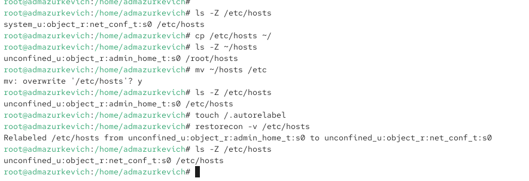{ #fig:007 width=70% }

Для массового восстановления всех контекстов безопасности в системе был создан файл `.autorelabel` командой `touch /.autorelabel`.  
После перезагрузки система провела автоматическую процедуру **перемаркировки** всех файлов.  

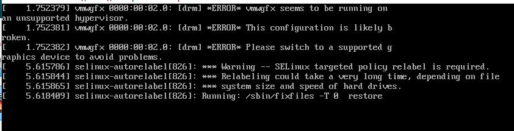{ #fig:008 width=70% }

## Настройка контекста безопасности для нестандартного расположения файлов веб-сервера

После входа в систему были получены права администратора.  
Для установки необходимого ПО выполнена установка пакетов **httpd** и **lynx**, необходимых для запуска веб-сервера Apache и проверки его работы через текстовый браузер.

Создан новый каталог для веб-контента `/web`, в который был добавлен файл `index.html` с текстом «Welcome to my web-server».  

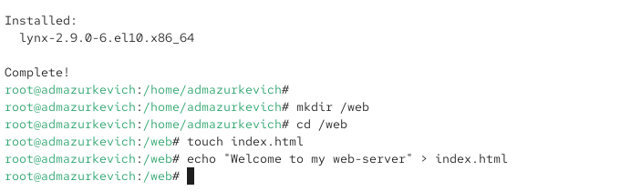{ #fig:009 width=70% }

В конфигурационном файле `/etc/httpd/conf/httpd.conf` закомментирована стандартная строка  
`DocumentRoot "/var/www/html"` и добавлена новая — `DocumentRoot "/web"`.  
Также был изменён раздел доступа.

Эти изменения позволяют серверу Apache использовать новый каталог как корневой для веб-документов.

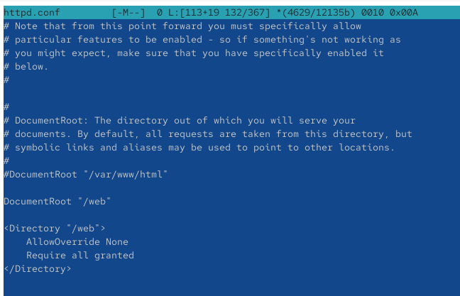{ #fig:010 width=70% }

После запуска службы `httpd` командами `systemctl start httpd` и `systemctl enable httpd`, при обращении к веб-серверу через `lynx http://localhost` отобразилась стандартная страница Rocky Linux, что свидетельствует о некорректных правах SELinux для нового каталога.

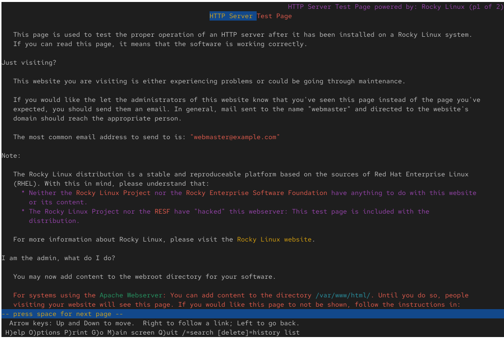{ #fig:011 width=70% }

Для разрешения доступа Apache к каталогу `/web` была создана новая метка контекста безопасности.  
Команда `semanage fcontext -a -t httpd_sys_content_t "/web(/.*)?"` назначила каталогу и его содержимому тип `httpd_sys_content_t`.  
Далее команда `restorecon -R -v /web` применила эту метку на практике.

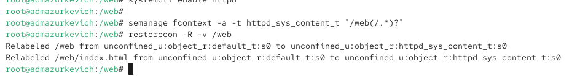{ #fig:012 width=70% }

После этого при повторном обращении к `http://localhost` в браузере **lynx** отобразилась пользовательская страница с текстом **«Welcome to my web-server»**, что подтверждает корректную настройку SELinux и Apache.

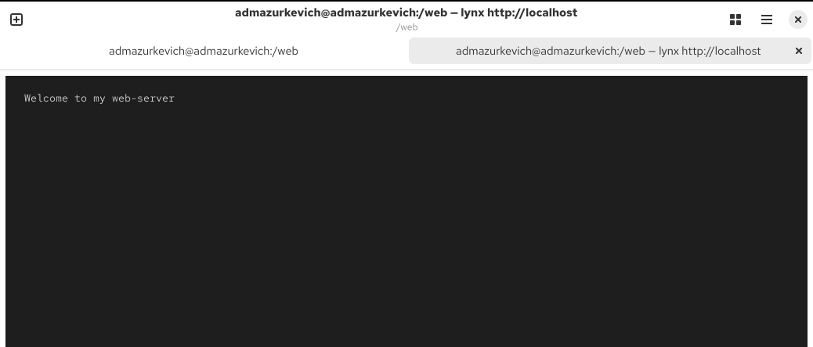{ #fig:013 width=70% }

## Работа с переключателями SELinux

Для управления поведением SELinux относительно служб FTP была проведена настройка переключателей (boolean-параметров).  
Команда `getsebool -a | grep ftp` показала список параметров, связанных с FTP, включая `ftpd_anon_write`, значение которого по умолчанию — **off**.  
Далее с помощью `semanage boolean -l | grep ftpd_anon` были получены пояснения по назначению этих параметров.

Затем параметр `ftpd_anon_write` был активирован командой `setsebool ftpd_anon_write on`, что изменило состояние на уровне выполнения.  
Команда `getsebool ftpd_anon_write` подтвердила его включение.  
Однако при повторной проверке через `semanage boolean -l` было видно, что настройка активна только временно.  

Для постоянного включения параметра применена команда `setsebool -P ftpd_anon_write on`.  
Повторная проверка показала, что теперь `ftpd_anon_write` включён как во времени выполнения, так и в постоянной конфигурации.  

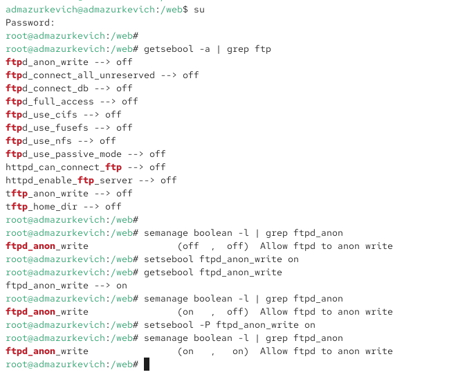{ #fig:014 width=70% }

Параметр `ftpd_anon_write` имеет значение **on (on, on)**, что означает — разрешена анонимная запись для службы FTP как временно, так и на постоянной основе.
  
# Контрольные вопросы

**1. Вы хотите временно поставить SELinux в разрешающем режиме. Какую команду вы используете?**  
Для временного перевода SELinux в режим **Permissive** применяется команда:  
`setenforce 0`  
Чтобы вернуть принудительный режим (**Enforcing**), используется команда:  
`setenforce 1`.

**2. Вам нужен список всех доступных переключателей SELinux. Какую команду вы используете?**  
Для просмотра всех доступных переключателей (boolean-параметров) SELinux используется команда:  
`getsebool -a`.

**3. Каково имя пакета, который требуется установить для получения легко читаемых сообщений журнала SELinux в журнале аудита?**  
Для анализа сообщений SELinux в удобочитаемом виде необходимо установить пакет:  
`setroubleshoot`.

**4. Какие команды вам нужно выполнить, чтобы применить тип контекста httpd_sys_content_t к каталогу /web?**  
Применяются две команды:  
1. Назначение нового типа контекста:  
   `semanage fcontext -a -t httpd_sys_content_t "/web(/.*)?"`  
2. Применение изменений:  
   `restorecon -R -v /web`.

**5. Какой файл вам нужно изменить, если вы хотите полностью отключить SELinux?**  
Для полного отключения SELinux редактируется файл конфигурации:  
`/etc/sysconfig/selinux`,  
в котором параметр `SELINUX` устанавливается в значение `disabled`.

**6. Где SELinux регистрирует все свои сообщения?**  
Журнал SELinux хранится в файле:  
`/var/log/audit/audit.log`.

**7. Вы не знаете, какие типы контекстов доступны для службы ftp. Какая команда позволяет получить более конкретную информацию?**  
Чтобы узнать доступные типы контекстов и настройки для службы FTP, используется команда:  
`semanage fcontext -l | grep ftp`  
или для переключателей:  
`semanage boolean -l | grep ftp`.

**8. Ваш сервис работает не так, как ожидалось, и вы хотите узнать, связано ли это с SELinux или чем-то ещё. Какой самый простой способ узнать?**  
Самый простой способ — временно перевести SELinux в разрешающий режим командой:  
`setenforce 0`.  
Если после этого служба начинает работать корректно, значит, проблема была вызвана политиками SELinux.

# Заключение

В ходе лабораторной работы были изучены и practically применены основные механизмы управления системой безопасности SELinux в Linux.  
Выполнены операции по изменению режимов работы SELinux (Enforcing, Permissive, Disabled), редактированию конфигурационного файла `/etc/sysconfig/selinux`, а также проверке состояния системы с помощью команд `sestatus` и `getenforce`.  
Освоены методы восстановления контекстов безопасности командой `restorecon` и массовой перемаркировки файлов через `.autorelabel`.  
Проведена настройка контекста безопасности для нестандартного каталога веб-сервера и работа с переключателями SELinux, управляющими поведением служб (например, `ftpd_anon_write`).  
