---
## Front matter
title: "Лабораторная 9"
subtitle: ""
author: "Мазуркевич Анастасия"

## Generic otions
lang: ru-RU
toc-title: "Содержание"

## Bibliography
bibliography: bib/cite.bib
csl: pandoc/csl/gost-r-7-0-5-2008-numeric.csl

## Pdf output format
toc: true # Table of contents
toc-depth: 2
lof: true # List of figures
lot: true # List of tables
fontsize: 12pt
linestretch: 1.5
papersize: a4
documentclass: scrreprt
## I18n polyglossia
polyglossia-lang:
  name: russian
  options:
	- spelling=modern
	- babelshorthands=true
polyglossia-otherlangs:
  name: english
## I18n babel
babel-lang: russian
babel-otherlangs: english
## Fonts
mainfont: IBM Plex Serif
romanfont: IBM Plex Serif
sansfont: IBM Plex Sans
monofont: IBM Plex Mono
mathfont: STIX Two Math
mainfontoptions: Ligatures=Common,Ligatures=TeX,Scale=0.94
romanfontoptions: Ligatures=Common,Ligatures=TeX,Scale=0.94
sansfontoptions: Ligatures=Common,Ligatures=TeX,Scale=MatchLowercase,Scale=0.94
monofontoptions: Scale=MatchLowercase,Scale=0.94,FakeStretch=0.9
mathfontoptions:
## Biblatex
biblatex: true
biblio-style: "gost-numeric"
biblatexoptions:
  - parentracker=true
  - backend=biber
  - hyperref=auto
  - language=auto
  - autolang=other*
  - citestyle=gost-numeric
## Pandoc-crossref LaTeX customization
figureTitle: "Рис."
tableTitle: "Таблица"
listingTitle: "Листинг"
lofTitle: "Список иллюстраций"
lotTitle: "Список таблиц"
lolTitle: "Листинги"
## Misc options
indent: true
header-includes:
  - \usepackage{indentfirst}
  - \usepackage{float} # keep figures where there are in the text
  - \floatplacement{figure}{H} # keep figures where there are in the text
---

# Цель работы

Приобретение навыков написания программ с использованием подпрограмм. Знакомство
с методами отладки при помощи GDB и его основными возможностями.

# Выполнение лабораторной работы
##  Порядок выполнения лабораторной работы

Создайте каталог для выполнения лабораторной работы № 9, перейдите в него и создайте файл lab09-1.asm:

{#fig:001 width=70%}

Введите в файл lab9-1.asm текст программы из листинга 9.1

{#fig:002 width=70%}

Создайте исполняемый файл и запустите его.

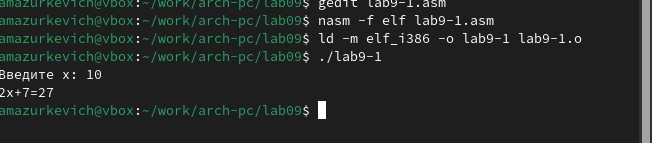{#fig:003 width=70%}

Измените текст программы, добавив подпрограмму _subcalcul в подпрограмму _calcul,
для вычисления выражения 𝑓(𝑔(𝑥)), где 𝑥 вводится с клавиатуры, 𝑓(𝑥) = 2𝑥 + 7, 𝑔(𝑥) =
3𝑥 − 1. Т.е. 𝑥 передается в подпрограмму _calcul из нее в подпрограмму _subcalcul, где
вычисляется выражение 𝑔(𝑥), результат возвращается в _calcul и вычисляется выражение
𝑓(𝑔(𝑥)). Результат возвращается в основную программу для вывода результата на экран.

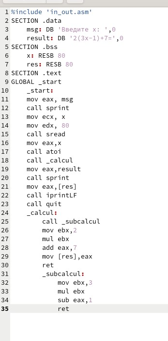{#fig:004 width=70%}

Создайте исполняемый файл и запустите его.

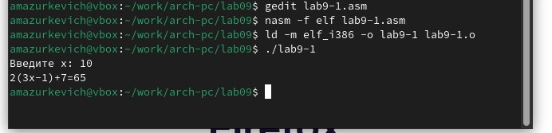{#fig:005 width=70%}

Создайте файл lab09-2.asm с текстом программы из Листинга 9.2. (Программа печати сообщения Hello world!):

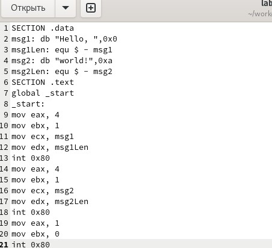{#fig:006 width=70%}

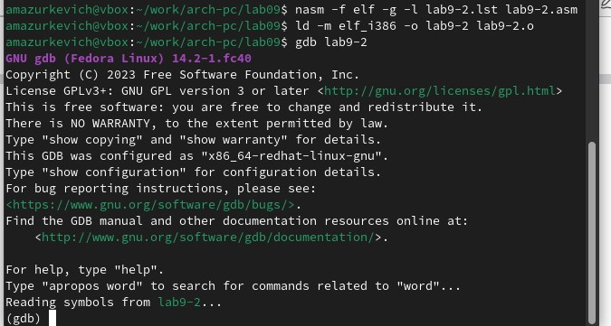{#fig:007 width=70%}

Получите исполняемый файл.Для работы с GDB в исполняемый файл необходимо добавить
отладочную информацию, для этого трансляцию программ необходимо проводить с ключом
‘-g’. Загрузите исполняемый файл в отладчик gdb:

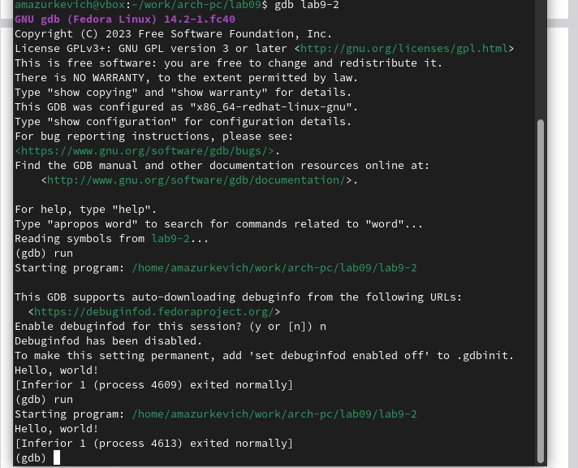{#fig:008 width=70%}

Проверьте работу программы, запустив ее в оболочке GDB с помощью команды run (сокращённо r):

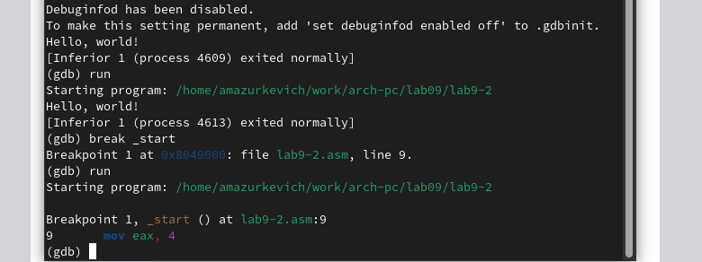{#fig:009 width=70%}

Посмотрите дисассимилированный код программы с помощью команды disassemble
начиная с метки _start.

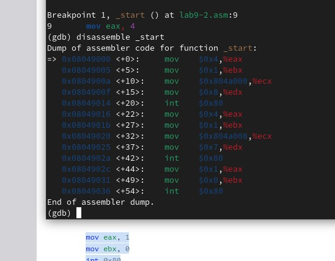{#fig:010 width=70%}

 Переключитесь на отображение команд с Intel’овским синтаксисом, введя команду set
disassembly-flavor intel

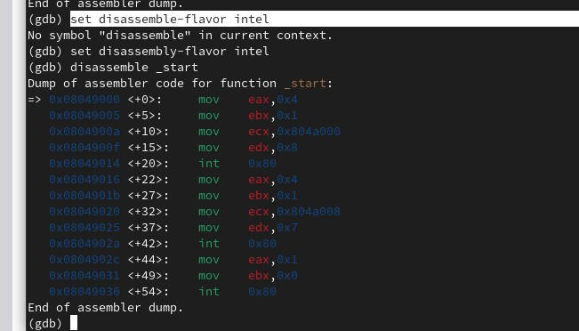{#fig:011 width=70%}

Перечислите различия отображения синтаксиса машинных команд в режимах ATT и Intel.

1. Порядок операндов
2. Синтаксис регистров
3. Синтаксис немедленных значений
4. Синтаксис адресов памяти
5. Команды для переходов и вызовов
6. Комментарии
7. Символы для указания на размер данных

Включите режим псевдографики для более удобного анализа программы (рис. 9.2):

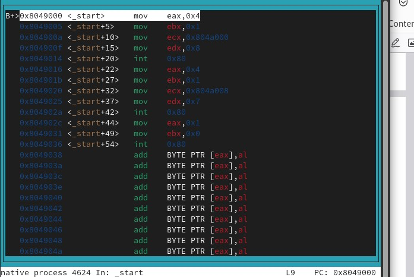{#fig:012 width=70%}

На предыдущих шагах была установлена точка останова по имени метки (_start). Проверьте это с помощью команды info breakpoints (кратко i b)

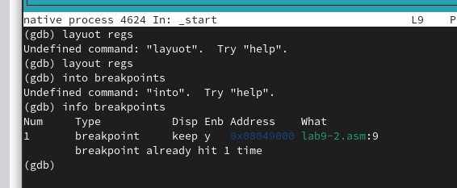{#fig:013 width=70%}

Проверим с помощью i b

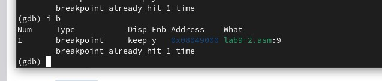{#fig:014 width=70%}

Установим еще одну точку останова по адресу инструкции. Адрес инструкции можно
увидеть в средней части экрана в левом столбце соответствующей инструкции (см. рис. 9.3).
Определите адрес предпоследней инструкции (mov ebx,0x0) и установите точку останова.

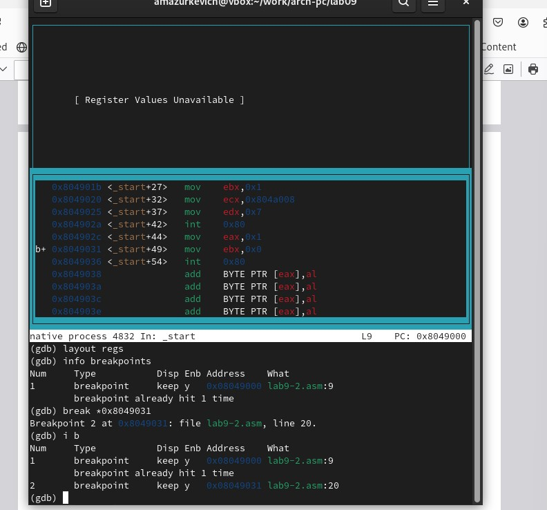{#fig:015 width=70%}

Выполните 5 инструкций с помощью команды stepi (или si) и проследите за изменением
значений регистров. 

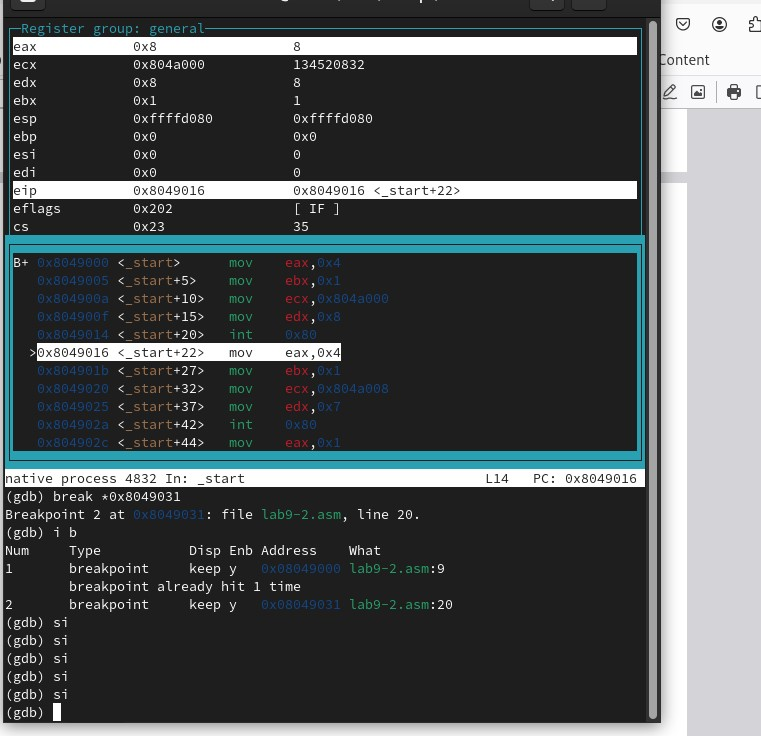{#fig:016 width=70%}

Значения каких регистров изменяются?
Во время выполнения команд менялись регистры: ebx, ecx, edx,eax, eip.

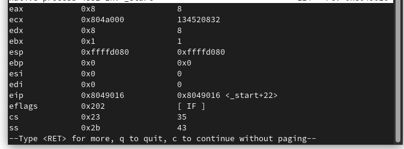{#fig:017 width=70%}

Смотрим msg1

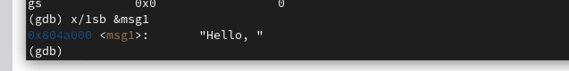{#fig:018 width=70%}

Смотрим msg1

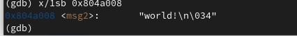{#fig:018 width=70%}

Изменим первые символы

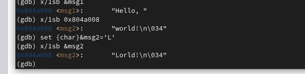{#fig:020 width=70%}

Чтобы посмотреть значения регистров используется команда print /F <val> (перед именем регистра обязательно ставится префикс $) (рис. 9.6):

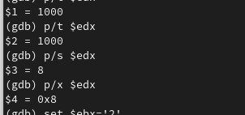{#fig:020 width=70%}

изменяе ebx

Выводится разные значения команда без кавычек присваивает регистру вводимое значение.

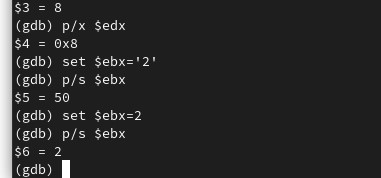{#fig:020 width=70%}

завершаем программу и выходим

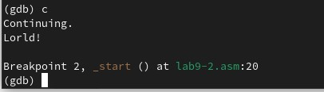{#fig:020 width=70%}

Скопируйте файл lab8-2.asm, созданный при выполнении лабораторной работы №8,
с программой выводящей на экран аргументы командной строки (Листинг 8.2) в файл с
именем lab09-3.asm:

{#fig:020 width=70%}

Создайте исполняемый файл

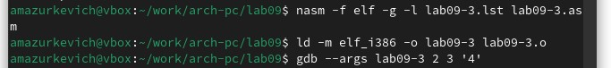{#fig:020 width=70%}

Для начала установим точку останова перед первой инструкцией в программе и запустим
ее.

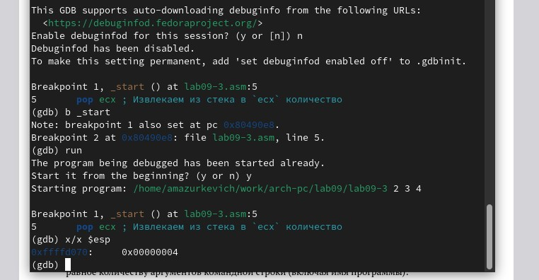{#fig:020 width=70%}

Посмотрите остальные позиции стека – по адесу [esp+4] располагается адрес в памяти
где находиться имя программы, по адесу [esp+8] храниться адрес первого аргумента, по
аресу [esp+12] – второго и т.д.

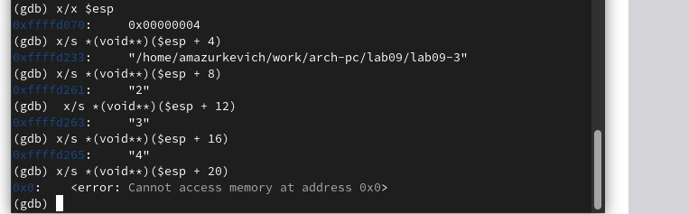{#fig:020 width=70%}

Адресные регистры имеют размерность 32 бита, соответственно 4 байта

 ## Задание для самостоятельной работы

Преобразуйте программу из лабораторной работы №8 (Задание №1 для самостоятельной работы), реализовав вычисление значения функции 𝑓(𝑥) как подпрограмму

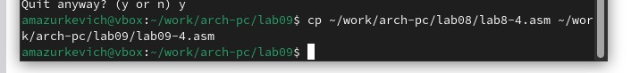{#fig:020 width=70%}

Вводим программу

{#fig:020 width=70%}

Запускаем

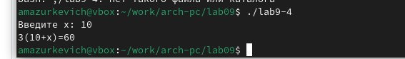{#fig:020 width=70%}

 В листинге 9.3 приведена программа вычисления выражения (3 + 2) ∗ 4 + 5. При запуске
данная программа дает неверный результат. Проверьте это. С помощью отладчика GDB,
анализируя изменения значений регистров, определите ошибку и исправьте ее.

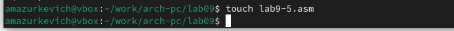{#fig:020 width=70%}

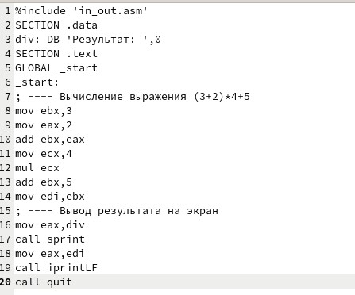{#fig:020 width=70%}

Создаем файл и запускаем

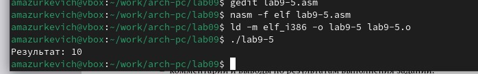{#fig:020 width=70%}

Запускаем его в отладчике GDB и смотрим на изменение решистров командой si

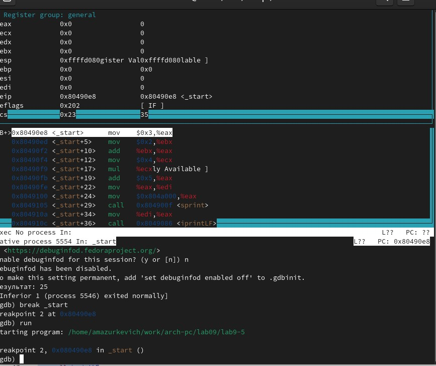{#fig:020 width=70%}

Изменяем программу

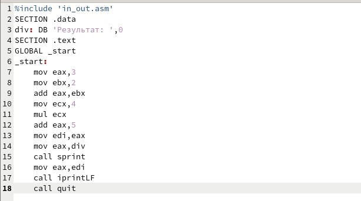{#fig:020 width=70%}

Создаем исполняемый файл и запускаем его

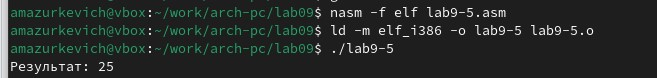{#fig:020 width=70%}

# Выводы

Приобрели навыки написания программ с использованием подпрограмм. Познакомились
с методами отладки при помощи GDB и его основными возможностями.

# Список литературы{.unnumbered}

::: {#refs}
:::
