---
## Front matter
title: "Шаблон отчёта по лабораторной работе"
subtitle: "Простейший вариант"
author: "Дмитрий Сергеевич Кулябов"

## Generic otions
lang: ru-RU
toc-title: "Содержание"

## Bibliography
bibliography: bib/cite.bib
csl: pandoc/csl/gost-r-7-0-5-2008-numeric.csl

## Pdf output format
toc: true # Table of contents
toc-depth: 2
lof: true # List of figures
lot: true # List of tables
fontsize: 12pt
linestretch: 1.5
papersize: a4
documentclass: scrreprt
## I18n polyglossia
polyglossia-lang:
  name: russian
  options:
	- spelling=modern
	- babelshorthands=true
polyglossia-otherlangs:
  name: english
## I18n babel
babel-lang: russian
babel-otherlangs: english
## Fonts
mainfont: IBM Plex Serif
romanfont: IBM Plex Serif
sansfont: IBM Plex Sans
monofont: IBM Plex Mono
mathfont: STIX Two Math
mainfontoptions: Ligatures=Common,Ligatures=TeX,Scale=0.94
romanfontoptions: Ligatures=Common,Ligatures=TeX,Scale=0.94
sansfontoptions: Ligatures=Common,Ligatures=TeX,Scale=MatchLowercase,Scale=0.94
monofontoptions: Scale=MatchLowercase,Scale=0.94,FakeStretch=0.9
mathfontoptions:
## Biblatex
biblatex: true
biblio-style: "gost-numeric"
biblatexoptions:
  - parentracker=true
  - backend=biber
  - hyperref=auto
  - language=auto
  - autolang=other*
  - citestyle=gost-numeric
## Pandoc-crossref LaTeX customization
figureTitle: "Рис."
tableTitle: "Таблица"
listingTitle: "Листинг"
lofTitle: "Список иллюстраций"
lotTitle: "Список таблиц"
lolTitle: "Листинги"
## Misc options
indent: true
header-includes:
  - \usepackage{indentfirst}
  - \usepackage{float} # keep figures where there are in the text
  - \floatplacement{figure}{H} # keep figures where there are in the text
---

# Цель работы

Здесь приводится формулировка цели лабораторной работы. Формулировки
цели для каждой лабораторной работы приведены в методических
указаниях.

Цель данного шаблона --- максимально упростить подготовку отчётов по
лабораторным работам.  Модифицируя данный шаблон, студенты смогут без
труда подготовить отчёт по лабораторным работам, а также познакомиться
с основными возможностями разметки Markdown.

# Задание

Здесь приводится описание задания в соответствии с рекомендациями
методического пособия и выданным вариантом.

# Теоретическое введение

Здесь описываются теоретические аспекты, связанные с выполнением работы.

Например, в табл. [-@tbl:std-dir] приведено краткое описание стандартных каталогов Unix.

: Описание некоторых каталогов файловой системы GNU Linux {#tbl:std-dir}

| Имя каталога | Описание каталога                                                                                                          |
|--------------|----------------------------------------------------------------------------------------------------------------------------|
| `/`          | Корневая директория, содержащая всю файловую                                                                               |
| `/bin `      | Основные системные утилиты, необходимые как в однопользовательском режиме, так и при обычной работе всем пользователям     |
| `/etc`       | Общесистемные конфигурационные файлы и файлы конфигурации установленных программ                                           |
| `/home`      | Содержит домашние директории пользователей, которые, в свою очередь, содержат персональные настройки и данные пользователя |
| `/media`     | Точки монтирования для сменных носителей                                                                                   |
| `/root`      | Домашняя директория пользователя  `root`                                                                                   |
| `/tmp`       | Временные файлы                                                                                                            |
| `/usr`       | Вторичная иерархия для данных пользователя                                                                                 |

Более подробно про Unix см. в [@tanenbaum_book_modern-os_ru; @robbins_book_bash_en; @zarrelli_book_mastering-bash_en; @newham_book_learning-bash_en].

# Выполнение лабораторной работы

1. Создайте каталог для программам лабораторной работы № 6, перейдите в него и
создайте файл lab6-1.asm:

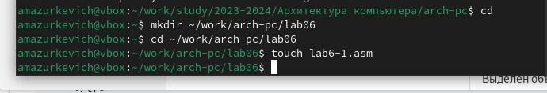{#fig:001 width=70%}

Введите в файл lab6-1.asm текст программы из листинга 6.1

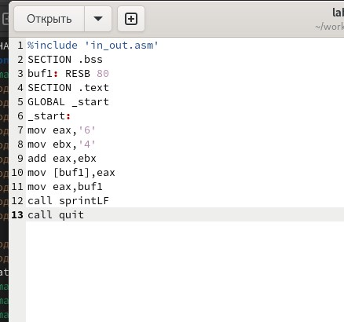{#fig:002 width=70%}

Создайте исполняемый файл и запустите его.

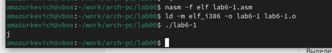{#fig:003 width=70%}

Далее изменим текст программы и вместо символов, запишем в регистры числа. Исправьте текст программы (Листинг 6.1) следующим образом: замените строки

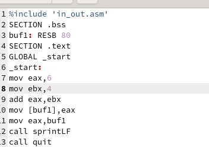{#fig:004 width=70%}

Создайте исполняемый файл и запустите его. Отображается ли символ? Нет, не отображается

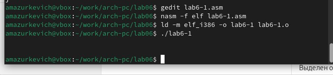{#fig:005 width=70%}

Создайте файл lab6-2.asm в каталоге ~/work/arch-pc/lab06 и введите в него текст программы из листинга 6.2.

{#fig:006 width=70%}

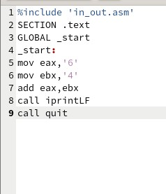{#fig:007 width=70%}

Создайте исполняемый файл и запустите его.

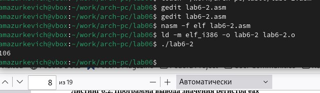{#fig:008 width=70%}

Аналогично предыдущему примеру изменим символы на числа. Замените строки

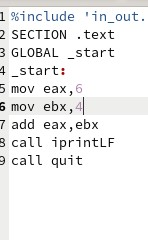{#fig:009 width=70%}

Создайте исполняемый файл и запустите его. Какой результат будет получен при исполнении программы? Резутьтат - 10

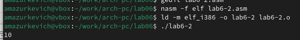{#fig:010 width=70%}

Замените функцию iprintLF на iprint. Создайте исполняемый файл и запустите его. Чем
отличается вывод функций iprintLF и iprint? Разница в переносе строки

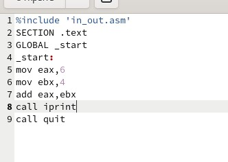{#fig:011 width=70%}

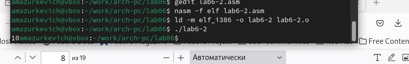{#fig:012 width=70%}

Создайте файл lab6-3.asm в каталоге ~/work/arch-pc/lab06

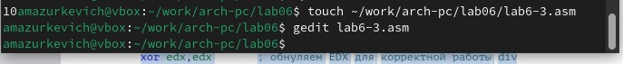{#fig:013 width=70%}

Внимательно изучите текст программы из листинга 6.3 и введите в lab6-3.asm.

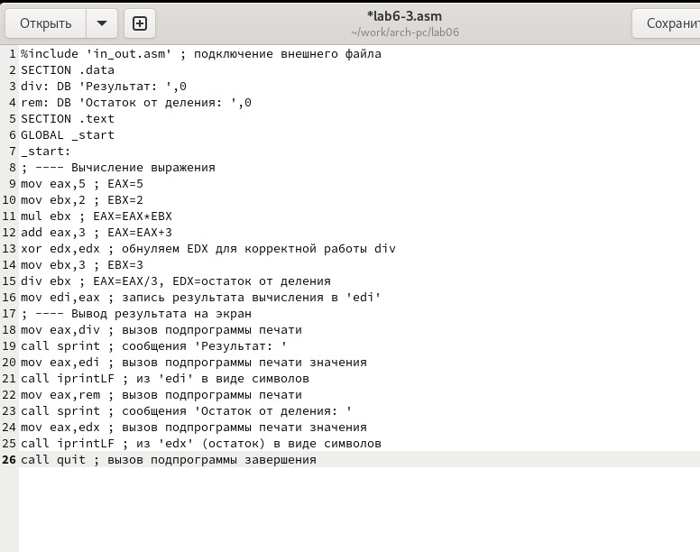{#fig:014 width=70%}

Создайте исполняемый файл и запустите его.

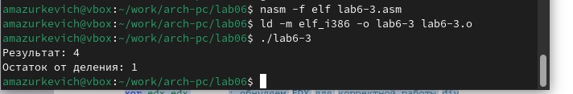{#fig:015 width=70%}

Измените текст программы для вычисления выражения 𝑓(𝑥) = (4 ∗ 6 + 2)/5

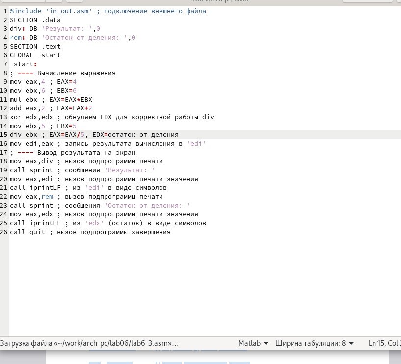{#fig:016 width=70%}

Создайте исполняемый файл и проверьте его работу

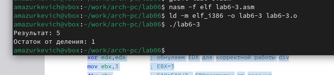{#fig:017 width=70%}

Создайте файл variant.asm в каталоге ~/work/arch-pc/lab06:

{#fig:018 width=70%}

Внимательно изучите текст программы из листинга 6.4 и введите в файл variant.asm.

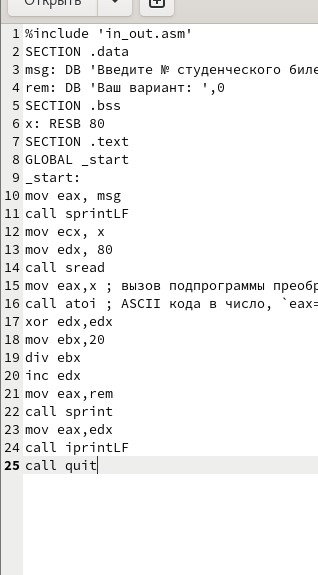{#fig:019 width=70%}

Проверьте работу файла, получите ваш вариант

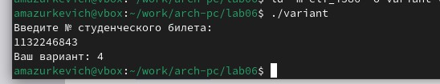{#fig:020 width=70%}

Включите в отчет по выполнению лабораторной работы ответы на следующие вопросы:
1. Какие строки листинга 6.4 отвечают за вывод на экран сообщения ‘Ваш вариант:’?
mov eax,rem
call sprint
2. Для чего используется следующие инструкции?
mov ecx, x
mov edx, 80
call sread 
Для чтения строки с данными, которые вводит пользователь

3. Для чего используется инструкция “call atoi”?
Используется для преобразования строки в целое
число. Принимает адрес строки в регистре eax и возвращаетполученное
число в регистре eax.

4. Какие строки листинга 6.4 отвечают за вычисления варианта?
Строка “xor edx,edx” обнуляет регистр edx перед делением.
“mov ebx,20” загружает значение 20 в ebx. “div ebx” деление eax на значение регистра ebx с сохранением
частного в регистре eax и остатка в регистре edx.

5. В какой регистр записывается остаток от деления при выполнении инструкции “div
ebx”?
Остаток от деления записывается в регистр edx.

6. Для чего используется инструкция “inc edx”?
Для увеличения значения в регистре edx
на 1. В данном случае увеличивает остаток от деления на 1

7. Какие строки листинга 6.4 отвечают за вывод на экран результата вычислений?
“mov eax,edx” передает значение остатка от деления в регистр eax.
“call iprintLF” вызывает процедуру iprintLF для вывода значения на
экран вместе с переводом строки.

САМОСТОЯТЕЛЬНАЯ РАБОТА
Написать программу вычисления выражения 𝑦 = 𝑓(𝑥). Программа должна выводить
выражение для вычисления, выводить запрос на ввод значения 𝑥, вычислять заданное выражение в зависимости от введенного 𝑥, выводить результат вычислений. Вид
функции 𝑓(𝑥) выбрать из таблицы 6.3 вариантов заданий в соответствии с номером
полученным при выполнении лабораторной работы. Создайте исполняемый файл и
проверьте его работу для значений 𝑥1 и 𝑥2 из 6.3.

Для начала создадим новый файл

{#fig:022 width=70%}

Пишем программу для вычисления функции

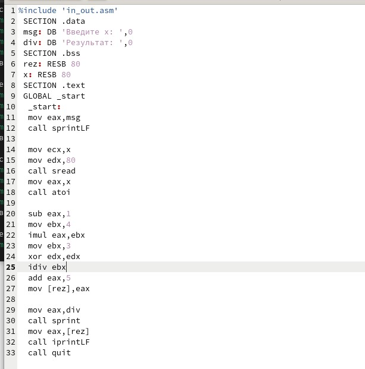{#fig:022 width=70%}

Проверяем для х=4

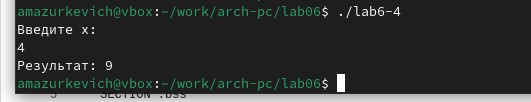{#fig:023 width=70%}

Проверяем для х=10

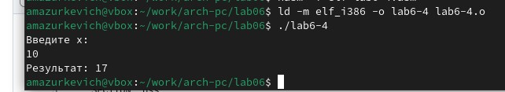{#fig:024 width=70%}
# Выводы

Здесь кратко описываются итоги проделанной работы.

# Список литературы{.unnumbered}

::: {#refs}
:::
