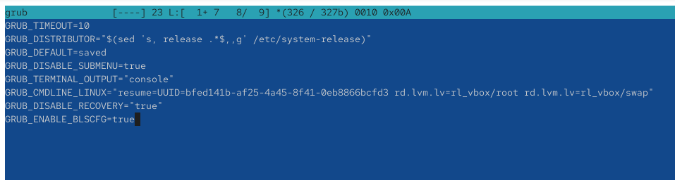
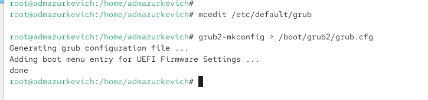
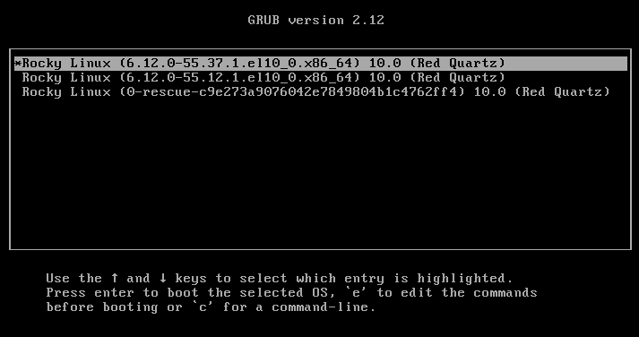
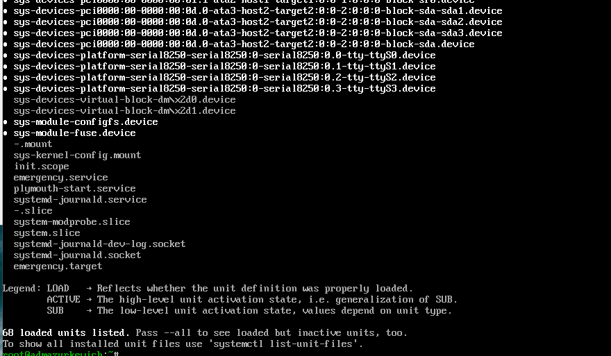
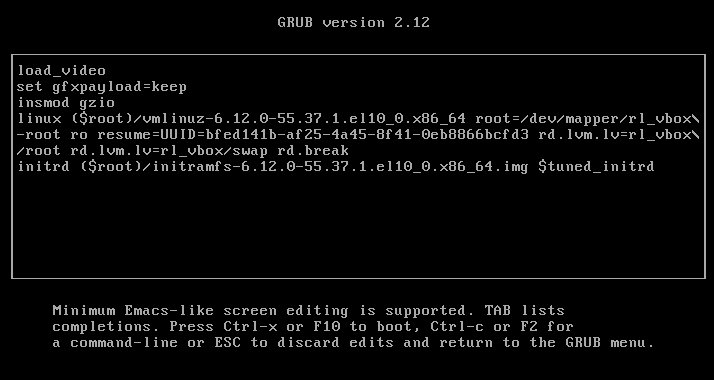
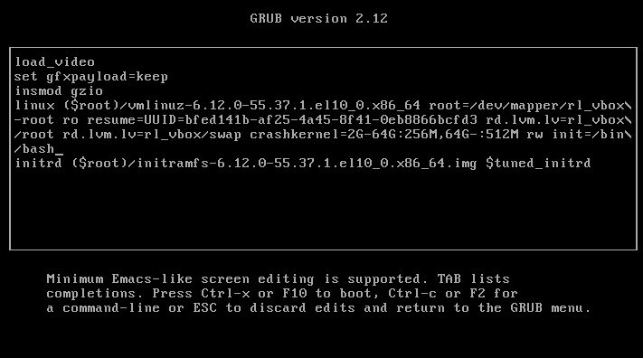
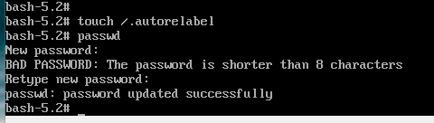

---
## Front matter
title: "Отчёт по лабораторной работе №11"
subtitle: "Управление загрузкой системы"
author: "Анастасия Мазуркевич"

## Generic otions
lang: ru-RU
toc-title: "Содержание"

## Bibliography
bibliography: bib/cite.bib
csl: pandoc/csl/gost-r-7-0-5-2008-numeric.csl

## Pdf output format
toc: true
toc-depth: 2
lof: true
lot: true
fontsize: 12pt
linestretch: 1.5
papersize: a4
documentclass: scrreprt
## I18n polyglossia
polyglossia-lang:
  name: russian
  options:
    - spelling=modern
    - babelshorthands=true
polyglossia-otherlangs:
  name: english
## I18n babel
babel-lang: russian
babel-otherlangs: english
## Fonts
mainfont: IBM Plex Serif
romanfont: IBM Plex Serif
sansfont: IBM Plex Sans
monofont: IBM Plex Mono
mathfont: STIX Two Math
mainfontoptions: Ligatures=Common,Ligatures=TeX,Scale=0.94
romanfontoptions: Ligatures=Common,Ligatures=TeX,Scale=0.94
sansfontoptions: Ligatures=Common,Ligatures=TeX,Scale=MatchLowercase,Scale=0.94
monofontoptions: Scale=MatchLowercase,Scale=0.94,FakeStretch=0.9
mathfontoptions:
## Biblatex
biblatex: true
biblio-style: "gost-numeric"
biblatexoptions:
  - parentracker=true
  - backend=biber
  - hyperref=auto
  - language=auto
  - autolang=other*
  - citestyle=gost-numeric
## Pandoc-crossref LaTeX customization
figureTitle: "Рис."
tableTitle: "Таблица"
listingTitle: "Листинг"
lofTitle: "Список иллюстраций"
lotTitle: "Список таблиц"
lolTitle: "Листинги"
## Misc options
indent: true
header-includes:
  - \usepackage{indentfirst}
  - \usepackage{float}
  - \floatplacement{figure}{H}
---

# Цель работы

Получить навыки работы с загрузчиком системы GRUB2.

# Ход выполнения

## Модификация параметров GRUB2

После получения прав администратора открыт файл конфигурации `/etc/default/grub` с помощью текстового редактора.  
В нём был установлен параметр отображения меню загрузки в течение 10 секунд — **GRUB_TIMEOUT=10**.  
Также проверены и при необходимости скорректированы дополнительные настройки загрузчика, включая параметры **GRUB_DISABLE_SUBMENU**, **GRUB_TERMINAL_OUTPUT** и **GRUB_CMDLINE_LINUX**.

{ #fig:001 width=70% }

После сохранения изменений была выполнена генерация нового конфигурационного файла GRUB с применением команды обновления.  
В процессе генерации система добавила пункт меню для **UEFI Firmware Settings**, что подтвердило корректное обновление настроек.

{ #fig:002 width=70% }

После перезагрузки на экране появилось меню GRUB с выбором версий ядра, что подтвердило успешное применение параметров и отображение меню загрузки.

{ #fig:003 width=70% }

## Режим восстановления (rescue.target)

Для входа в режим восстановления в меню GRUB была выбрана активная запись ядра, после чего открыт режим редактирования параметров загрузки.  
В конце строки, начинающейся с **linux**, был добавлен параметр **systemd.unit=rescue.target**.  
После продолжения загрузки система перешла в однопользовательский режим.

{ #fig:004 width=70% }

После загрузки был выполнен просмотр активных модулей и служб с помощью утилиты systemd.  
Отображён список базовых сервисов, необходимых для функционирования минимальной среды восстановления, а также переменные окружения.

{ #fig:005 width=70% }

## Аварийный режим (emergency.target)

Для проверки работы аварийного режима в параметрах загрузки ядра был указан параметр **systemd.unit=emergency.target**.  
После подтверждения изменений система загрузилась в аварийный режим с минимальным набором активных модулей.

{ #fig:006 width=70% }

В данном режиме были загружены только критически важные службы, включая модули инициализации, файловой системы и журналирования.  
Это подтвердило успешное переключение системы в аварийный режим.

{ #fig:007 width=70% }

## Сброс пароля root

Для восстановления доступа администратора при загрузке системы в меню GRUB выбран пункт текущего ядра и активирован режим редактирования.  
В конец строки параметров ядра был добавлен параметр **rd.break**, обеспечивающий остановку загрузки на этапе инициализации initramfs.

{ #fig:008 width=70% }

После перехода в среду initramfs произведена попытка повторного монтирования корневого раздела с правами записи и входа в системную среду.  
При этом утилиты **chroot** и **passwd** оказались недоступны, что подтвердило ограниченный функционал минимальной среды.

{ #fig:009 width=70% }

## Альтернативный способ сброса пароля root через GRUB

В дополнение к предыдущей попытке сброса пароля с использованием `rd.break`, был применён другой способ — непосредственное изменение параметров загрузки ядра для получения оболочки без загрузки полноценной системы.

**Порядок действий:**

1. На экране меню GRUB выбран пункт текущего ядра и нажата клавиша `e` для редактирования записи.  
2. В строке, начинающейся с `linux`, параметр `ro` был изменён на `rw`, а в конец строки добавлена команда `init=/bin/bash`.  
3. После применения параметров с помощью `Ctrl+X` система загрузилась напрямую в оболочку `bash`.

На экране ниже показан момент редактирования конфигурации загрузки:

{#fig:010 width=70%}

После загрузки в оболочку были выполнены операции, обеспечившие создание маркёра для пересборки контекстов SELinux и смену пароля root: создание файла `.autorelabel` и вызов утилиты `passwd`. В результате пароль был успешно изменён.

{#fig:011 width=70%}

**Итог:** в отличие от варианта с `rd.break`, где сброс пароля не получился из-за ограничений минимальной среды, данный метод позволил успешно изменить пароль root и восстановить доступ к системе.

# Контрольные вопросы

**1. Какой файл конфигурации следует изменить для применения общих изменений в GRUB2?**  
Необходимо изменить файл **/etc/default/grub**, в котором задаются основные параметры загрузчика, такие как тайм-аут, параметры командной строки ядра и настройки отображения меню.

**2. Как называется конфигурационный файл GRUB2, в котором вы применяете изменения для GRUB2?**  
Основной конфигурационный файл загрузчика находится по пути **/boot/grub2/grub.cfg**.  
Именно в нём хранятся все настройки, генерируемые на основе данных из `/etc/default/grub` и каталогов `/etc/grub.d/`.

**3. После внесения изменений в конфигурацию GRUB2, какую команду вы должны выполнить, чтобы изменения сохранились и воспринялись при загрузке системы?**  
Для применения изменений необходимо выполнить команду  
**grub2-mkconfig -o /boot/grub2/grub.cfg**,  
которая пересоздаёт файл конфигурации загрузчика с учётом новых параметров.

# Заключение

В ходе лабораторной работы были изучены методы настройки загрузчика **GRUB2** в операционной системе Linux.  
Были освоены приёмы редактирования конфигурационного файла `/etc/default/grub`, обновления параметров загрузки, а также способы входа в режимы **rescue** и **emergency** для устранения неполадок.  
Дополнительно рассмотрена процедура сброса пароля суперпользователя с использованием параметра **rd.break**.  
Полученные навыки позволяют администратору эффективно управлять процессом загрузки системы и выполнять восстановление работоспособности при критических ошибках.
