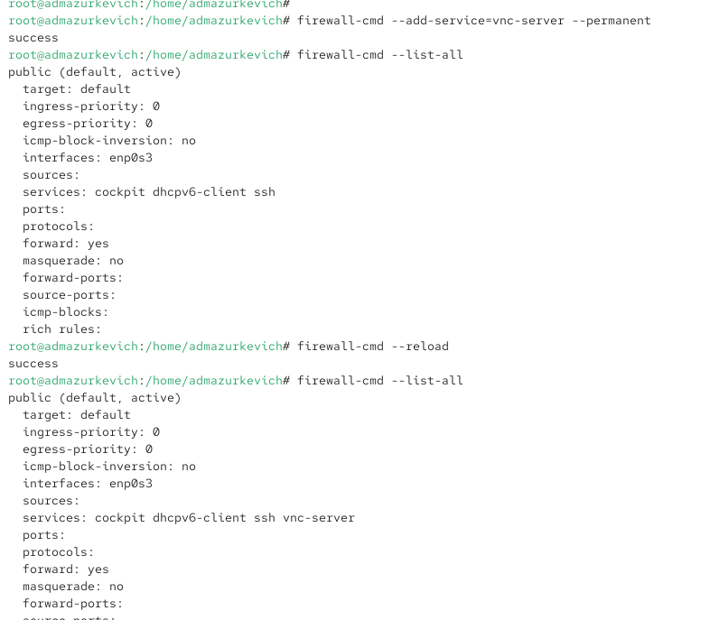
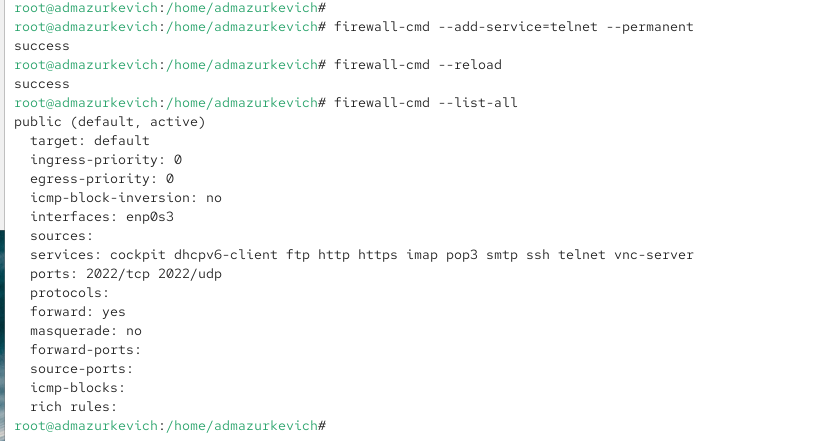

---
## Front matter
lang: ru-RU
title: Лабораторная работа №13
subtitle: Настройка межсетевого экрана firewalld
author:
  - Анастасия Мазуркевич
institute:
  - Российский университет дружбы народов, Москва, Россия
date: 07 ноября 2025
## Formatting pdf
toc: false
slide_level: 2
aspectratio: 169
section-titles: true
theme: metropolis
header-includes:
 - \metroset{progressbar=frametitle,sectionpage=progressbar,numbering=fraction}
---

# Цель работы

## Цель лабораторной работы

Получить навыки настройки пакетного фильтра в Linux с использованием firewalld и firewall-config.

# Ход выполнения

## Определение активной зоны

{ #fig:001 width=70% }

## Просмотр конфигурации зоны

{ #fig:002 width=70% }

## Добавление службы VNC

{ #fig:003 width=70% }

## Добавление VNC permanent + reload

{ #fig:004 width=70% }

## Добавление TCP-порта 2022

{ #fig:005 width=70% }

## Включение служб http/https/ftp

{ #fig:006 width=70% }

## Добавление порта 2022/udp

{ #fig:007 width=70% }

## Применение изменений (reload)

{ #fig:008 width=70% }

## Добавление служб telnet, imap, pop3, smtp

{ #fig:009 width=70% }

# Выводы по проделанной работе

## Вывод

В ходе лабораторной работы были изучены возможности firewalld:
- управление временными и постоянными правилами;
- добавление сервисов и портов;
- использование терминала и графического интерфейса firewall-config.

Полученные навыки позволяют контролировать сетевой доступ и обеспечивать безопасность системы в Linux.
