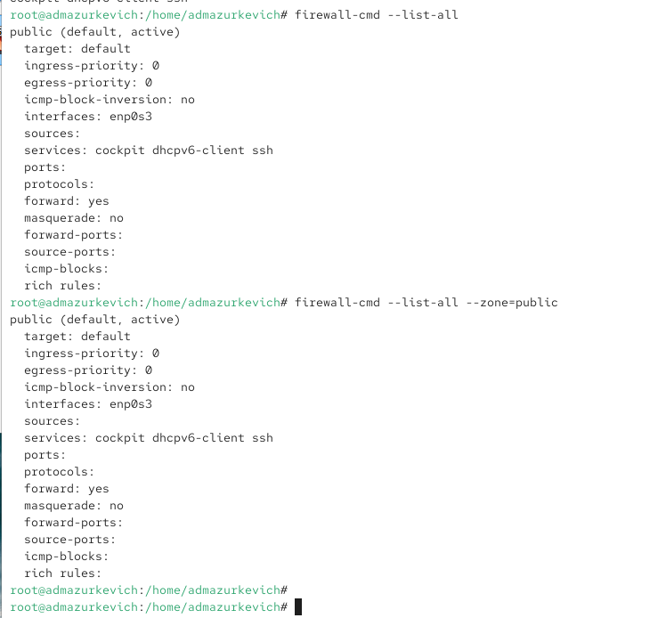
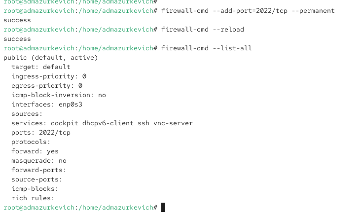
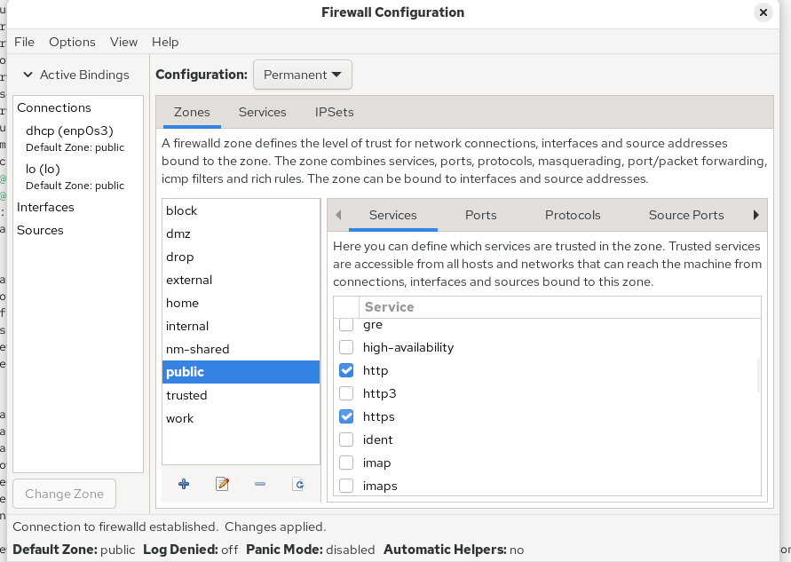
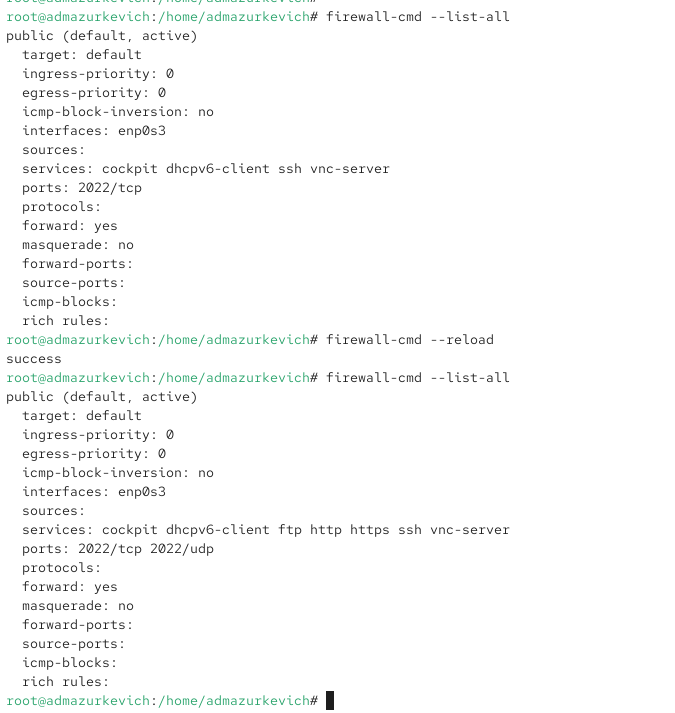

---
## Front matter
title: "Отчёт по лабораторной работе №13"
subtitle: "Фильтр пакетов"
author: "Анастасия Мазуркевич"

## Generic otions
lang: ru-RU
toc-title: "Содержание"

## Bibliography
bibliography: bib/cite.bib
csl: pandoc/csl/gost-r-7-0-5-2008-numeric.csl

## Pdf output format
toc: true
toc-depth: 2
lof: true
lot: true
fontsize: 12pt
linestretch: 1.5
papersize: a4
documentclass: scrreprt
## I18n polyglossia
polyglossia-lang:
  name: russian
  options:
    - spelling=modern
    - babelshorthands=true
polyglossia-otherlangs:
  name: english
## I18n babel
babel-lang: russian
babel-otherlangs: english
## Fonts
mainfont: IBM Plex Serif
romanfont: IBM Plex Serif
sansfont: IBM Plex Sans
monofont: IBM Plex Mono
mathfont: STIX Two Math
mainfontoptions: Ligatures=Common,Ligatures=TeX,Scale=0.94
romanfontoptions: Ligatures=Common,Ligatures=TeX,Scale=0.94
sansfontoptions: Ligatures=Common,Ligatures=TeX,Scale=MatchLowercase,Scale=0.94
monofontoptions: Scale=MatchLowercase,Scale=0.94,FakeStretch=0.9
mathfontoptions:
## Biblatex
biblatex: true
biblio-style: "gost-numeric"
biblatexoptions:
  - parentracker=true
  - backend=biber
  - hyperref=auto
  - language=auto
  - autolang=other*
  - citestyle=gost-numeric
## Pandoc-crossref LaTeX customization
figureTitle: "Рис."
tableTitle: "Таблица"
listingTitle: "Листинг"
lofTitle: "Список иллюстраций"
lotTitle: "Список таблиц"
lolTitle: "Листинги"
## Misc options
indent: true
header-includes:
  - \usepackage{indentfirst}
  - \usepackage{float}
  - \floatplacement{figure}{H}
---

# Цель работы

Получить навыки настройки пакетного фильтра в Linux.

# Ход выполнения

## Управление брандмауэром с помощью firewalld

После получения прав администратора через `su -` выполнена настройка межсетевого экрана.

### Просмотр активной конфигурации

Определена зона, используемая по умолчанию. Система возвращает `public`.  
Затем просмотрены доступные зоны и список всех поддерживаемых сервисов.  

{ #fig:001 width=70% }

Для сравнения получены сведения о текущей конфигурации зоны:  
как общим запросом (`firewall-cmd --list-all`), так и с указанием зоны (`firewall-cmd --list-all --zone=public`).  
Оба результата совпали, что подтверждает использование зоны `public`.

{ #fig:002 width=70% }

### Добавление службы VNC

В конфигурацию времени исполнения добавлен сервис `vnc-server`. После выполнения он появился в списке разрешённых.

{ #fig:003 width=70% }

После перезапуска службы `firewalld` запись пропала.  
Причина: добавление без параметра `--permanent` изменяет только конфигурацию *runtime*, которая очищается при перезапуске.

### Добавление VNC на постоянной основе

Сервис повторно добавлен, но уже с сохранением в конфигурационные файлы.  
После внесения изменений был выполнен `reload`, что применило настройки на активную конфигурацию.  
Теперь `vnc-server` присутствует постоянно.

{ #fig:004 width=70% }

### Добавление TCP-порта 2022

В конфигурацию записан порт `2022/tcp` с последующим `reload`.  
В результате в параметре *ports* появилась строка `2022/tcp`.

{ #fig:009 005=70% }

## Управление через графический интерфейс firewall-config

Инструмент GUI запущен командой `firewall-config`.  
В раскрывающемся меню выбрано значение *Permanent*, чтобы все изменения сохранялись.

Для зоны `public` включены сервисы `http`, `https`, `ftp`.

{ #fig:006 width=70% }

На вкладке *Ports* добавлен порт `2022` с протоколом `udp`.

{ #fig:007 width=60% }

После закрытия GUI изменения ещё не применены в runtime.  
Перезагрузка конфигурации активирует новые правила, и теперь они отображаются в списке.

{ #fig:008 width=70% }

## Самостоятельная часть

В конфигурацию межсетевого экрана добавлены службы `telnet`, `imap`, `pop3`, `smtp`.

- `telnet` был добавлен через командную строку с сохранением.
- `imap`, `pop3`, `smtp` добавлены через GUI.

После `reload` все службы отображаются в активной конфигурации зоны `public`.

{ #fig:009 width=70% }

# Контрольные вопросы

**1. Какая служба должна быть запущена перед началом работы с менеджером конфигурации брандмауэра firewall-config?**  
Перед использованием firewall-config должна быть запущена служба firewalld.

**2. Какая команда позволяет добавить UDP-порт 2355 в конфигурацию брандмауэра в зоне по умолчанию?**  
Добавление выполняется командой firewall-cmd с параметром добавления порта и протокола UDP в постоянную конфигурацию.

**3. Какая команда позволяет показать всю конфигурацию брандмауэра во всех зонах?**  
Для отображения полной конфигурации используется вывод всех зон.

**4. Какая команда позволяет удалить службу vnc-server из текущей конфигурации брандмауэра?**  
Удаление выполняется командой firewall-cmd с параметром удаления сервиса vnc-server.

**5. Какая команда позволяет активировать новую конфигурацию, добавленную опцией `--permanent`?**  
Для применения постоянных изменений используется перезагрузка конфигурации.

**6. Какой параметр позволяет проверить, что новая конфигурация была добавлена в текущую зону и теперь активна?**  
Проверка выполняется через вывод текущей конфигурации зоны.

**7. Какая команда позволяет добавить интерфейс eno1 в зону public?**  
Интерфейс добавляется в зону public с помощью параметра добавления интерфейса.

**8. Если добавить новый интерфейс в конфигурацию брандмауэра, пока не указана зона, в какую зону он будет добавлен?**  
Интерфейс будет помещён в зону по умолчанию, которой является public.

# Заключение

В ходе работы была изучена конфигурация межсетевого экрана на основе firewalld. Выполнены операции с временными и постоянными правилами, добавлены службы и порты, а также использованы оба способа управления — через терминал и графическую утилиту firewall-config. Полученные навыки позволяют уверенно настраивать сетевую безопасность в Linux, контролировать доступ к сервисам и адаптировать конфигурацию в соответствии с требованиями системы.
