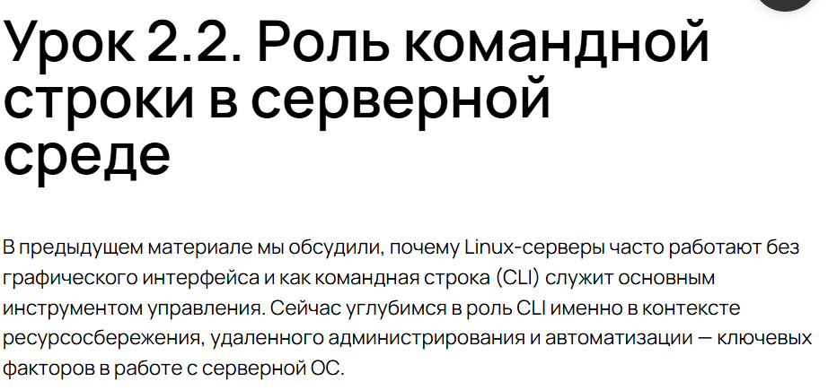
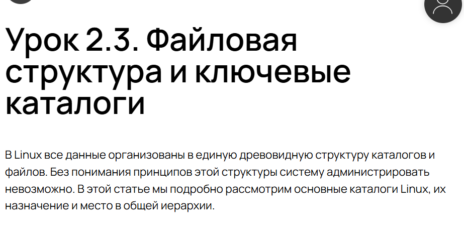
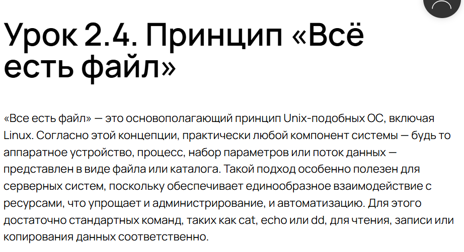
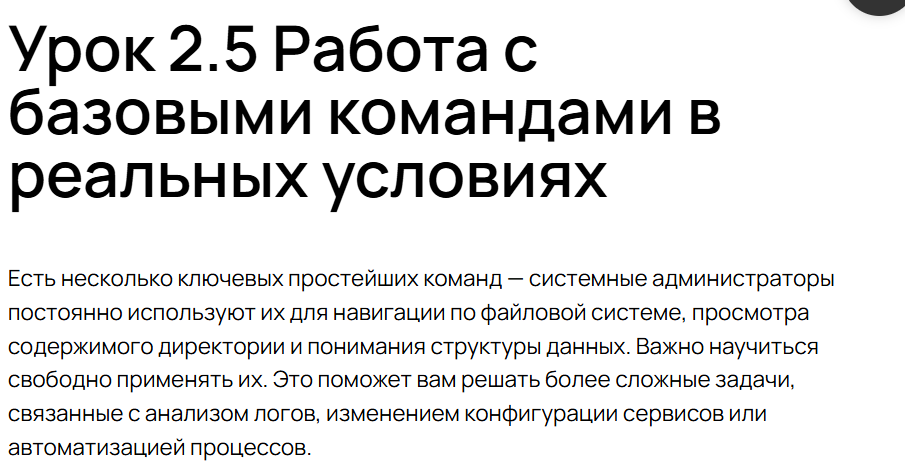
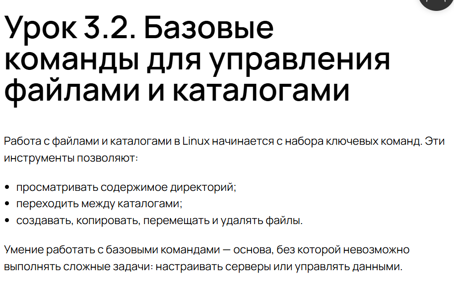
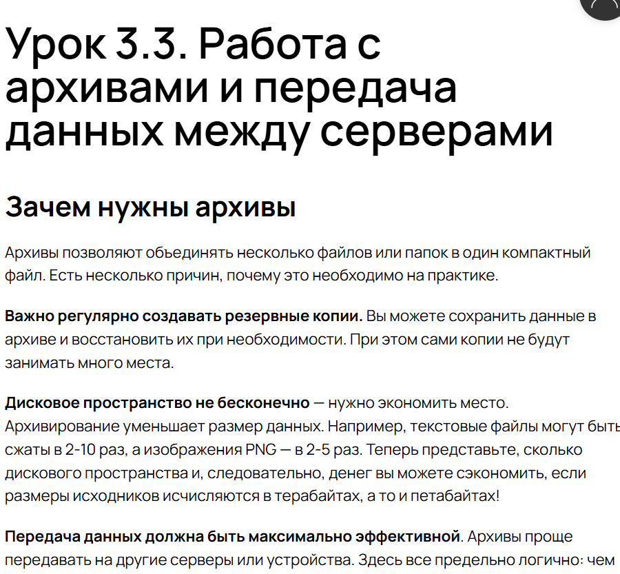

---
## Front matter
lang: ru-RU
title: Внешний курс
subtitle: Часть 1
  - Анастасия Мазуркевич
institute:
  - Российский университет дружбы народов, Москва, Россия
date: 16 ноября 2025

## i18n babel
babel-lang: russian
babel-otherlangs: english

## Formatting pdf
toc: false
slide_level: 2
aspectratio: 169
section-titles: true
theme: metropolis
header-includes:
 - \metroset{progressbar=frametitle,sectionpage=progressbar,numbering=fraction}
---

# Цель работы

## Цель курса

Освоить системное администрирвоание

# Ход выполнения

## Роль системного администратора Linux

{ #fig:001 width=70% }

## Роль командной строки

{ #fig:002 width=70% }

## Файловая структура и ключевые каталоги

{ #fig:003 width=70% }

## Всё есть файл

{ #fig:004 width=70% }

## Базовые команды

{ #fig:005 width=70% }

## Базовые команды для управления файлами и каталогами

{ #fig:006 width=70% }

## Работа с архивами и передача данных между серверами

{ #fig:007 width=70% }

## Основы автоматизации с помощью Bash-скриптов

{ #fig:007 width=70% }

# Выводы по проделанной работе

## Вывод

В ходе прохождения курса:  
- изучили основы администрирования и Linux;  
- освоили базовые команды.  

Полученные навыки позволяют администрировать системы
