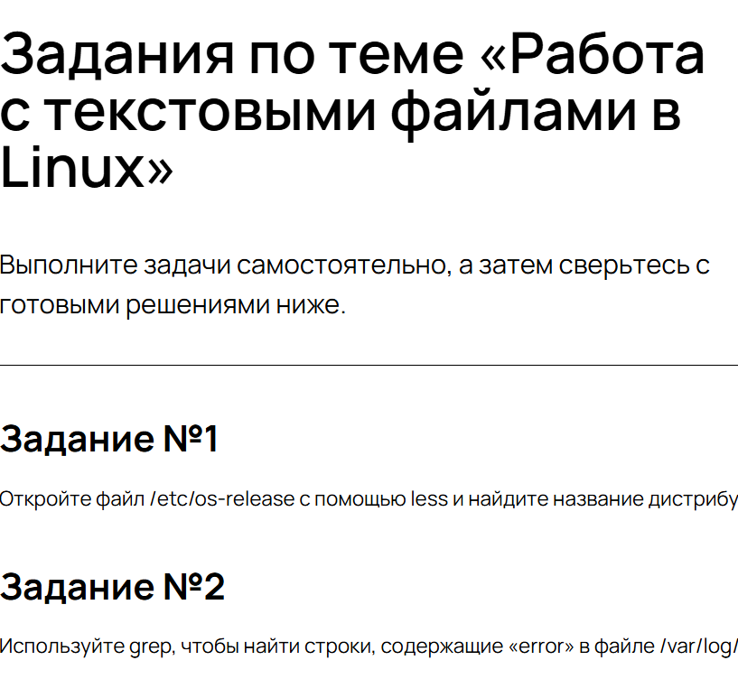
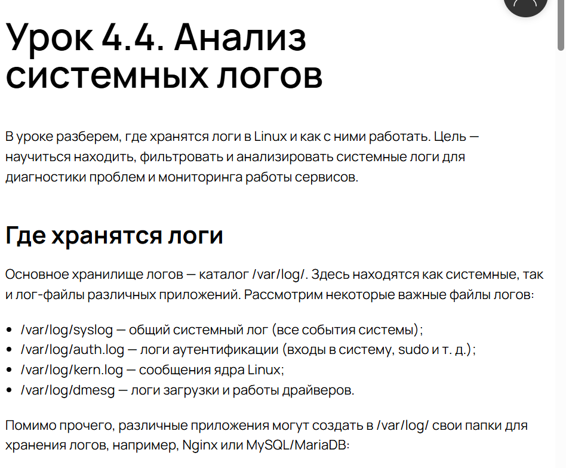
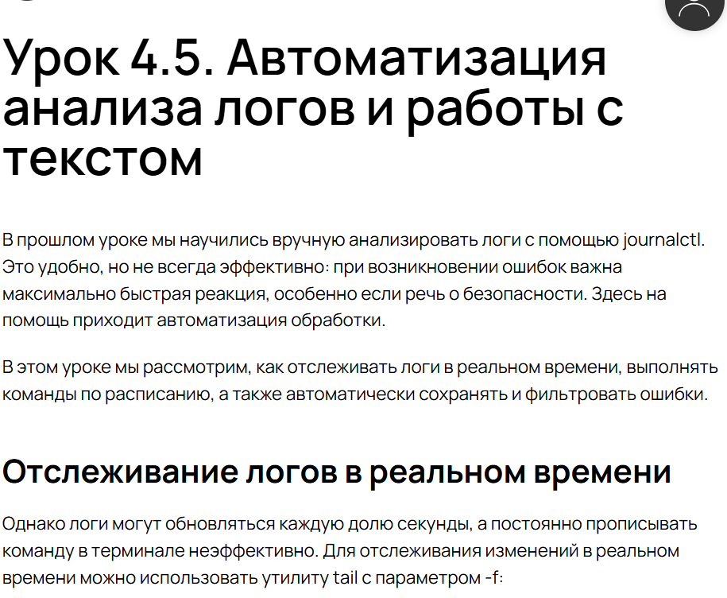
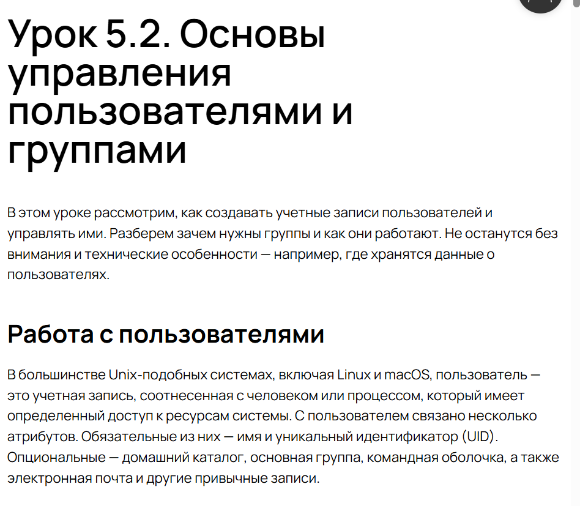
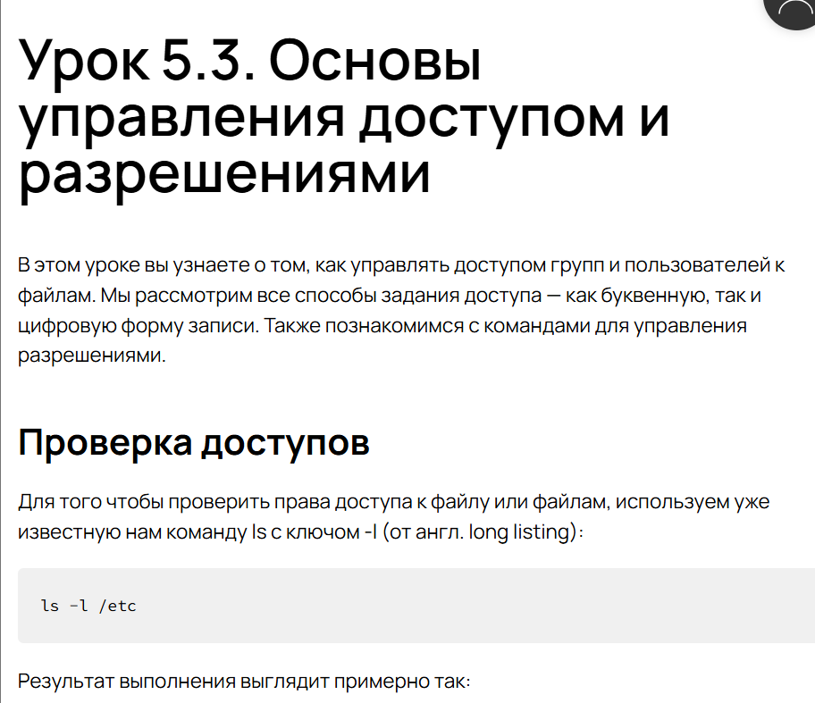
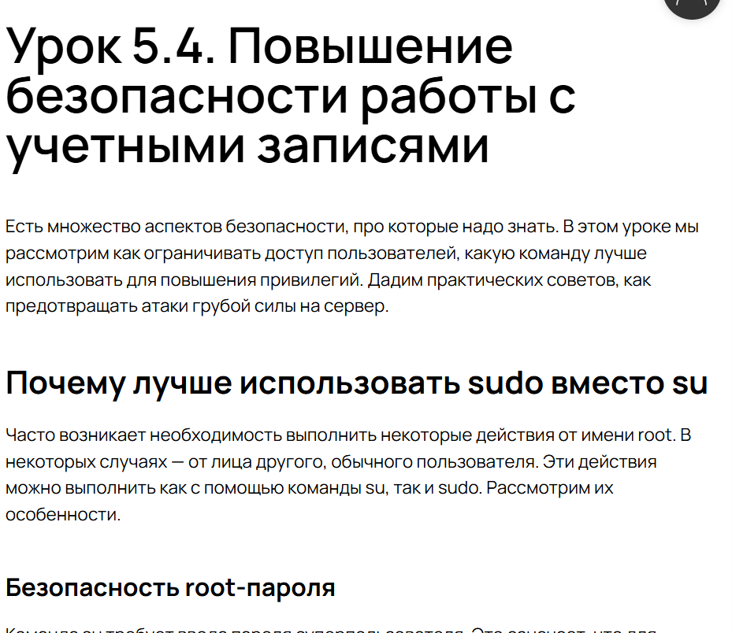
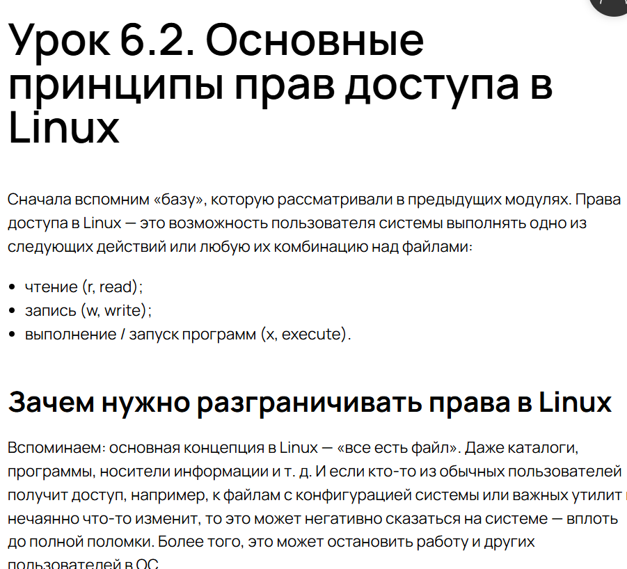
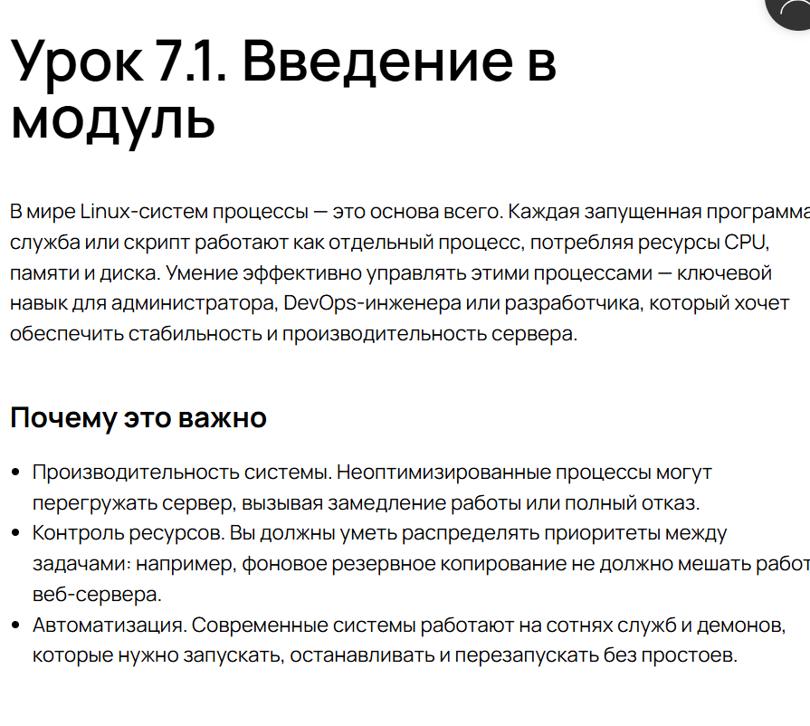

---
## Front matter
lang: ru-RU
title: Внешний курс
subtitle: Часть 2
  - Анастасия Мазуркевич
institute:
  - Российский университет дружбы народов, Москва, Россия
date: 17 ноября 2025

## i18n babel
babel-lang: russian
babel-otherlangs: english

## Formatting pdf
toc: false
slide_level: 2
aspectratio: 169
section-titles: true
theme: metropolis
header-includes:
 - \metroset{progressbar=frametitle,sectionpage=progressbar,numbering=fraction}
---

# Цель работы

## Цель курса

Освоить системное администрирвоание

# Ход выполнения

## Поиск справочной информации в Linux

{ #fig:001 width=70% }

## Работа с текстовыми файлами в Linux

{ #fig:003 width=70% }

## Анализ системных логов

{ #fig:004 width=70% }

## Автоматизация анализа логов и работы с текстом

{ #fig:005 width=70% }

## Основы управления пользователями и группами

{ #fig:006 width=70% }

## Основы управления доступом и разрешениями

{ #fig:007 width=70% }

## Повышение безопасности работы с учетными записями

{ #fig:008 width=70% }

## Управление доступом

{ #fig:009 width=70% }

## Управление процессами

{ #fig:010 width=70% }

# Выводы по проделанной работе

## Вывод

В ходе прохождения курса:  
- изучили поиск правочной информации в Linux;  
- освоили базовые команды.  

Полученные навыки позволяют администрировать системы
