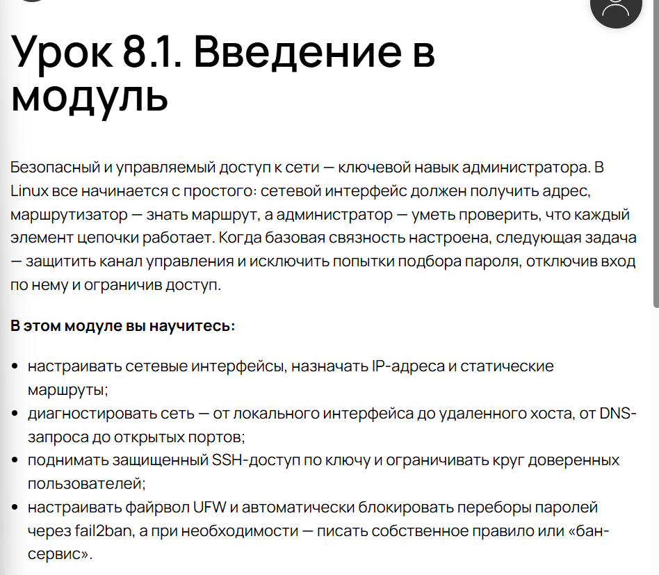
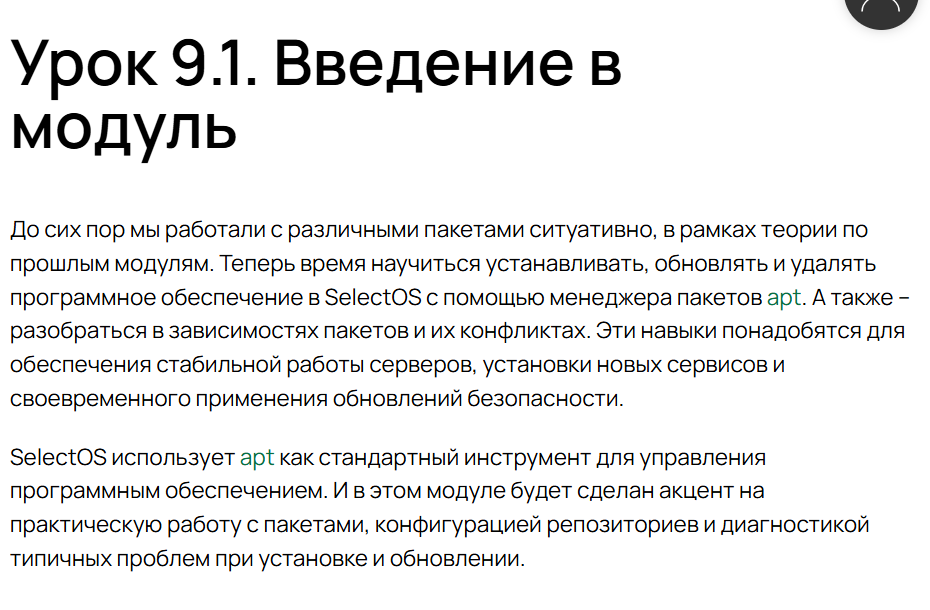
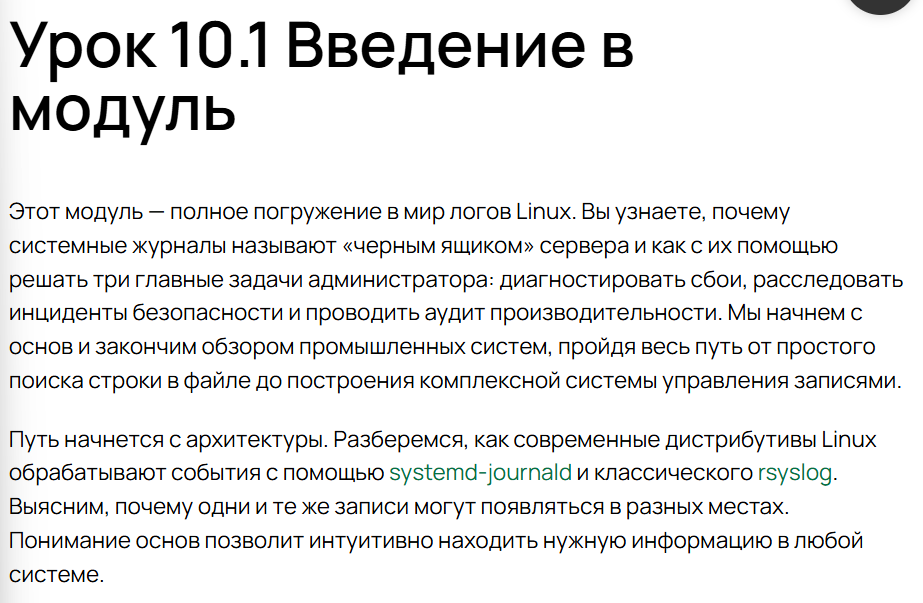
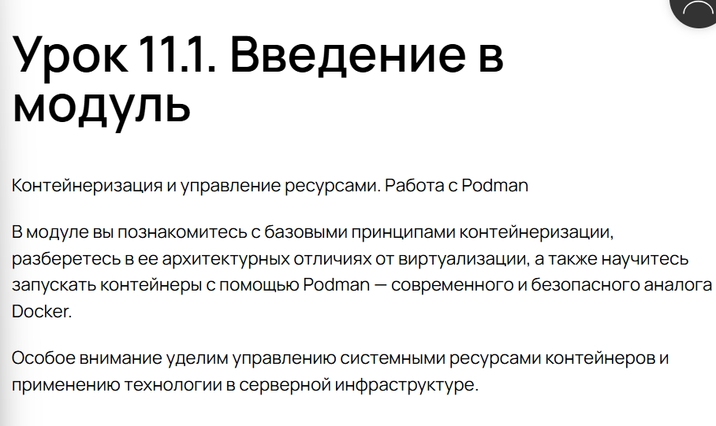
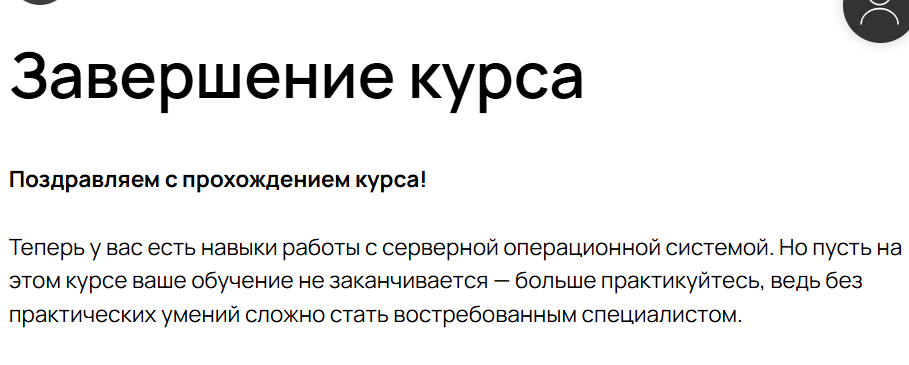

---
## Front matter
lang: ru-RU
title: Внешний курс
subtitle: Часть 3
  - Анастасия Мазуркевич
institute:
  - Российский университет дружбы народов, Москва, Россия
date: 16 ноября 2025

## i18n babel
babel-lang: russian
babel-otherlangs: english

## Formatting pdf
toc: false
slide_level: 2
aspectratio: 169
section-titles: true
theme: metropolis
header-includes:
 - \metroset{progressbar=frametitle,sectionpage=progressbar,numbering=fraction}
---

# Цель работы

## Цель курса

Освоить системное администрирвоание

# Ход выполнения

## Настройка сети и SSH

{ #fig:001 width=70% }

## Управление пакетами

{ #fig:002 width=70% }

## Управление логами

{ #fig:003 width=70% }

## Контейнеризация

{ #fig:004 width=70% }

## Завершение курса

{ #fig:004 width=70% }

# Выводы по проделанной работе

## Вывод

В ходе прохождения курса:  
- изучили основы администрирования и Linux;  
- освоили базовые команды;
- получили навыки работы с серверной ОС. 

Полученные навыки позволяют администрировать системы
