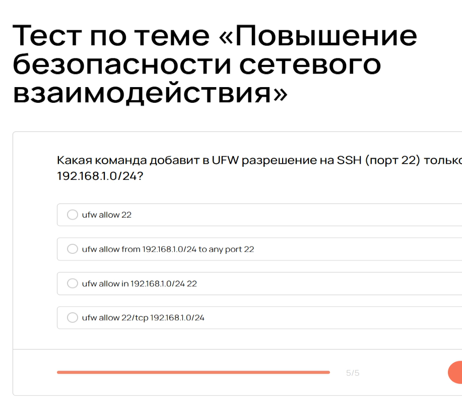
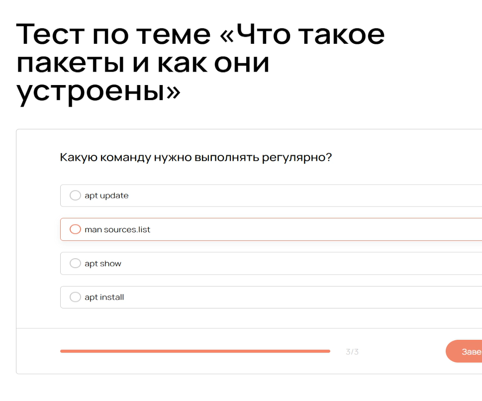
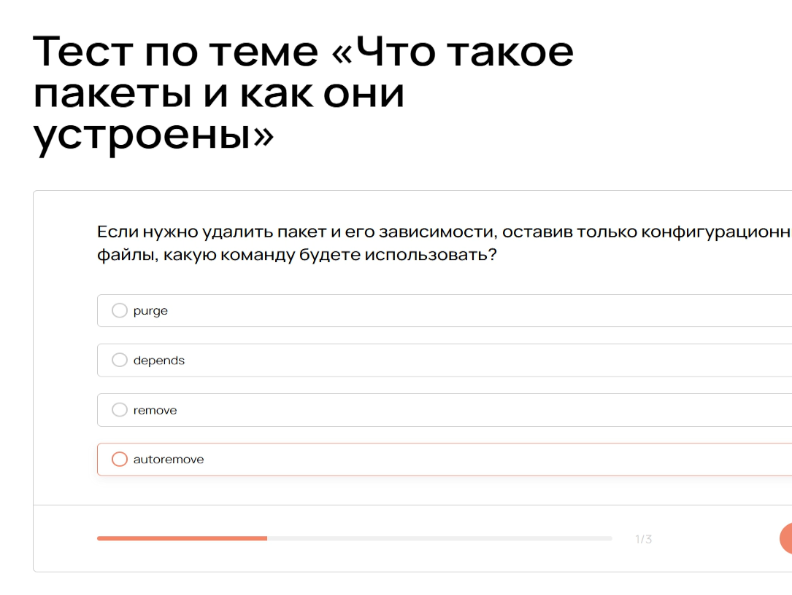
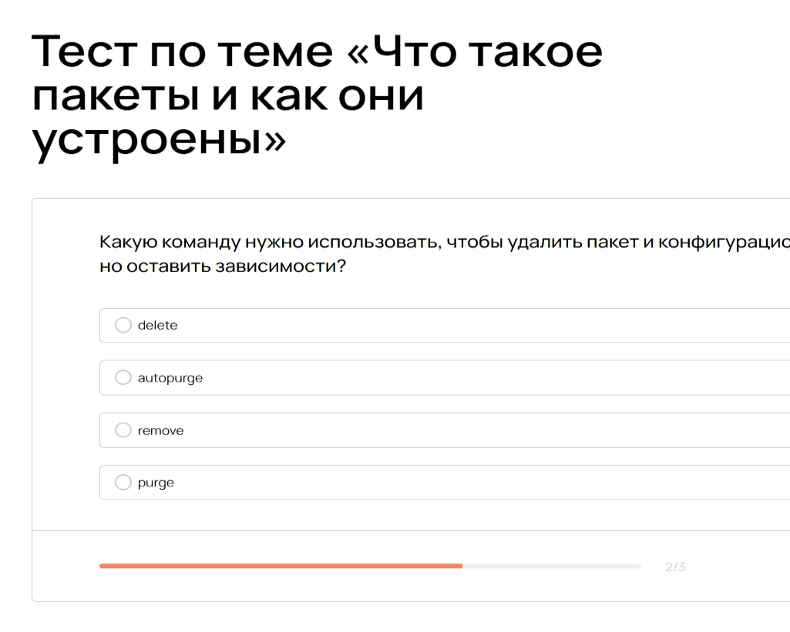

---
## Front matter
title: "Отчёт по прохождению внешнего курса: Системный администратор Linux с нуля"
subtitle: "Часть 3"
author: "Анастасия Мазуркевич"

## Generic otions
lang: ru-RU
toc-title: "Содержание"

## Bibliography
bibliography: bib/cite.bib
csl: pandoc/csl/gost-r-7-0-5-2008-numeric.csl

## Pdf output format
toc: true
toc-depth: 2
lof: true
lot: true
fontsize: 12pt
linestretch: 1.5
papersize: a4
documentclass: scrreprt
## I18n polyglossia
polyglossia-lang:
  name: russian
  options:
    - spelling=modern
    - babelshorthands=true
polyglossia-otherlangs:
  name: english
## I18n babel
babel-lang: russian
babel-otherlangs: english
## Fonts
mainfont: IBM Plex Serif
romanfont: IBM Plex Serif
sansfont: IBM Plex Sans
monofont: IBM Plex Mono
mathfont: STIX Two Math
mainfontoptions: Ligatures=Common,Ligatures=TeX,Scale=0.94
romanfontoptions: Ligatures=Common,Ligatures=TeX,Scale=0.94
sansfontoptions: Ligatures=Common,Ligatures=TeX,Scale=MatchLowercase,Scale=0.94
monofontoptions: Scale=MatchLowercase,Scale=0.94,FakeStretch=0.9
mathfontoptions:
## Biblatex
biblatex: true
biblio-style: "gost-numeric"
biblatexoptions:
  - parentracker=true
  - backend=biber
  - hyperref=auto
  - language=auto
  - autolang=other*
  - citestyle=gost-numeric
## Pandoc-crossref LaTeX customization
figureTitle: "Рис."
tableTitle: "Таблица"
listingTitle: "Листинг"
lofTitle: "Список иллюстраций"
lotTitle: "Список таблиц"
lolTitle: "Листинги"
## Misc options
indent: true
header-includes:
  - \usepackage{indentfirst}
  - \usepackage{float}
  - \floatplacement{figure}{H}
---

# Цель работы
Изучить основы системного администрирования и Linux

# Ход выполнения

## Основы сетевой конфигурации в Linux

Какой командой можно назначить IP-адрес вручную?
ip a add 192.168.122.2/24 dev eth0

{ #fig:001 width=70% }

Что делает директива auto eth0 в /etc/network/interfaces?
Верный ответ: Поднимает интерфейс автоматически при загрузке системы

{ #fig:002 width=70% }

Какая команда используется для удаления IP с интерфейса?
Верный ответ: ip a del 192.168.122.2/24 dev eth0

{ #fig:003 width=70% }

Что произойдет при перезагрузке, если IP-адрес был задан только через ip?
Верный ответ: IP-адрес исчезнет

{ #fig:004 width=70% }

Где задается шлюз по умолчанию в конфигурации интерфейса?
Верный ответ: В поле gateway в /etc/network/interfaces

{ #fig:005 width=70% }

## Базовая диагностика сети

Какая команда показывает открытые TCP-порты и процессы, которые их слушают?
Верный ответ: ss -tulnp

{ #fig:006 width=70% }

Какой флаг в ss включает отображение номеров портов и PID/имен процессов?
Верный ответ: -p

{ #fig:007 width=70% }

Что делает команда dig?
Верный ответ: Выполняет DNS-запрос и отображает IP-адреса

{ #fig:008 width=70% }

Какая команда может использоваться для проверки подключения к удаленному TCP-порту без передачи данных?
Верный ответ: nc -vz

{ #fig:009 width=70% }

## Настройка SSH-доступа и его защита

Какой порт использует SSH по умолчанию?
Верный ответ: 22

{ #fig:010 width=70% }

Где находится основной конфигурационный файл демона SSH-сервера?
Верный ответ: /etc/ssh/sshd_config

{ #fig:011 width=70% }

Какой командой можно временно остановить службу SSH (systemd)?
Верный ответ: systemctl stop ssh

{ #fig:012 width=70% }
 
Какой файл публичного ключа нужно добавить на сервер для авторизации по ключу?
Верный ответ: id_rsa.pub

{ #fig:013 width=70% }

Какой параметр в sshd_config отключает вход пользователя root по SSH?
Верный ответ: PermitRootLogin no

{ #fig:014 width=70% }

## Повышение безопасности сетевого взаимодействия

{ #fig:015 width=70% }

{ #fig:016 width=70% }

{ #fig:017 width=70% }

{ #fig:018 width=70% }

{ #fig:019 width=70% }

## модуль 9

{ #fig:020 width=70% }

{ #fig:021 width=70% }

{ #fig:022 width=70% }

{ #fig:023 width=70% }

{ #fig:024 width=70% }

{ #fig:025 width=70% }

{ #fig:026 width=70% }

{ #fig:027 width=70% }

{ #fig:028 width=70% }

{ #fig:029 width=70% }

## модуль 10

{ #fig:030 width=70% }

{ #fig:031 width=70% }

{ #fig:032 width=70% }

{ #fig:033 width=70% }

{ #fig:034 width=70% }

{ #fig:035 width=70% }

{ #fig:036 width=70% }

{ #fig:037 width=70% }

{ #fig:038 width=70% }

{ #fig:039 width=70% }

# Заключение

Освоили основы администрирования
